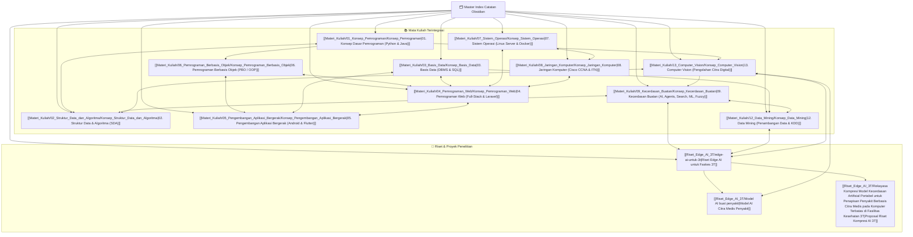

# 🗂️ Index Utama Catatan Obsidian (Knowledge Base System)

Selamat datang di Sistem Catatan Obsidian Terpusat. Dokumen ini merupakan peta navigasi utama (*Master Knowledge Index*) yang menghubungkan seluruh topik mata kuliah, materi dasar pemrograman, pemrograman berbasis objek (PBO), basis data, aplikasi web/mobile, sistem operasi, jaringan komputer, kecerdasan buatan, serta proyek riset.

> [!IMPORTANT]
> - Seluruh catatan terstruktur dengan rapi di bawah folder **`Materi_Kuliah/`** dan **`Riset_Edge_AI_3T/`**.
> - Berkas dari folder `vault-teman` **dikecualikan 100%** dari sistem indeks ini agar catatan pribadi Anda tetap terpisah.

---

## 🗺️ Peta Navigasi Utama (Master Mindmap)

---

## 📚 Ringkasan Akses Cepat Materi Kuliah

1. 💻 **[[Materi_Kuliah/01_Konsep_Pemrograman/Konsep_Pemrograman|01. Konsep Dasar Pemrograman]]**:
   - Fundamental Pemrograman (Variabel, Data Types, Control Flow, Functions, Memory) Python & Java.
   - Modul: [[Materi_Kuliah/01_Konsep_Pemrograman/Modul_MD/01_Dasar_Pemrograman_Python_Java|01. Dasar Pemrograman Python & Java]]

2. 🧩 **[[Materi_Kuliah/06_Pemrograman_Berbasis_Objek/Konsep_Pemrograman_Berbasis_Objek|06. Pemrograman Berbasis Objek (PBO)]]**:
   - Paradigma OOP (Class, Object, Encapsulation, Inheritance, Polymorphism, Abstraction) Java & Python.
   - Modul: [[Materi_Kuliah/06_Pemrograman_Berbasis_Objek/Modul_MD/01_Materi_OOP_Java_Python|01. Panduan Lengkap OOP Java & Python]]

3. ⚡ **[[Materi_Kuliah/02_Struktur_Data_dan_Algoritma/Konsep_Struktur_Data_dan_Algoritma|02. Struktur Data dan Algoritma]]**:
   - List, Stack, Queue, Tree, BST, Graph, Sorting, Min-Spanning Tree, Shortest Path.
   - Koleksi Modul Praktikum lengkap di [[Materi_Kuliah/02_Struktur_Data_dan_Algoritma/Praktikum-SDA-2025/1-List-Stack-and-Queue/1_List|Praktikum SDA 2025]].

4. 🗄️ **[[Materi_Kuliah/03_Basis_Data/Konsep_Basis_Data|03. Basis Data]]**:
   - DBMS Architecture, ERD/EER, Normalisasi (1NF-3NF/BCNF), Relational Algebra, SQL DDL/DML/TCL, Stored Procedures & Triggers.
   - Modul 1-11 di [[Materi_Kuliah/03_Basis_Data/Modul_MD/01_Pengantar_DBMS|Folder Modul Basis Data]].

5. 🌐 **[[Materi_Kuliah/04_Pemrograman_Web/Konsep_Pemrograman_Web|04. Pemrograman Web]]**:
   - HTML5, CSS3, ES6+ JS, jQuery, AJAX, PHP 8+ PDO, Security XSS/CSRF, MVC Laravel 12.
   - Modul 1-11 di [[Materi_Kuliah/04_Pemrograman_Web/Modul_MD/01_Pengantar_HTML5|Folder Modul Pemrograman Web]].

6. 📱 **[[Materi_Kuliah/05_Pengembangan_Aplikasi_Bergerak/Konsep_Pengembangan_Aplikasi_Bergerak|05. Pengembangan Aplikasi Bergerak]]**:
   - Kotlin OOP, Android Architecture, Thunkable (No-Code), Flutter (Dart), Jetpack Navigation, Room DB, Retrofit 2 REST API, Sensors, Google Play Publishing.
   - Modul 1-10 di [[Materi_Kuliah/05_Pengembangan_Aplikasi_Bergerak/Modul_MD/01_Pengenalan_Kotlin_dan_OOP|Folder Modul Mobile App Dev]].

7. ⚙️ **[[Materi_Kuliah/07_Sistem_Operasi/Konsep_Sistem_Operasi|07. Sistem Operasi]]**:
   - Process & Thread Management, CPU Scheduling (CFS), Mutual Exclusion, Deadlock, Memory Allocation (Paging/TLB), Virtual Memory & Swapping, Linux OOM Killer, Linux CLI Server Tools (`htop`, `ps`, `free`), serta Isolasi **Docker Container (Linux Namespaces & cgroups)**.
   - Modul 1-10 di [[Materi_Kuliah/07_Sistem_Operasi/Modul_MD/01_Pengantar_dan_Struktur_Sistem_Komputer|Folder Modul Sistem Operasi]].

8. 🌐 **[[Materi_Kuliah/08_Jaringan_Komputer/Konsep_Jaringan_Komputer|08. Jaringan Komputer]]**:
   - OSI 7 Layer vs TCP/IP 4 Layer, Enkapsulasi PDU, Media Fisik, MAC Address, Konversi Biner/Desimal/Hex, IPv4 & Subnetting VLSM/CIDR, IPv6 & ICMP, ARP & ND, TCP 3-Way Handshake vs UDP, DNS/HTTP/DHCP, Cisco IOS CLI, Security, dan Troubleshooting CLI.
   - Modul 1-10 di [[Materi_Kuliah/08_Jaringan_Komputer/Modul_MD/01_Pengantar_Jaringan_Komputer_dan_Perangkat|Folder Modul Jaringan Komputer]].

9. 🤖 **[[Materi_Kuliah/09_Kecerdasan_Buatan/Konsep_Kecerdasan_Buatan|09. Kecerdasan Buatan (AI)]]**:
   - Turing Test, Intelligent Agent & PEAS, Uninformed Search (BFS, DFS, DLS, UCS, IDS, BDS), Informed Search (A*, GBFS, Minimax, Alpha-Beta), Supervised Learning (Naive Bayes, k-NN, ANN / Deep Learning), Unsupervised Learning (K-Means, PCA), serta Reasoning & Logika Samar (Fuzzy FIS Sugeno/Tsukamoto/Mamdani).
   - Modul 1-8 di [[Materi_Kuliah/09_Kecerdasan_Buatan/Modul_MD/01_Konsep_Kecerdasan_Buatan|Folder Modul Kecerdasan Buatan]].

11. 📡 **[[Materi_Kuliah/11_Manajemen_Jaringan/Konsep_Manajemen_Jaringan|11. Manajemen Jaringan]]**:
   - Virtual LAN (VLAN), IEEE 802.1Q Tagging, Inter-VLAN Routing (Router-on-a-Stick), Sub-interface, Static Routing, Desain Topologi Enterprise & Redundansi (L3 Switch, HSRP/VRRP, EtherChannel/LACP).
   - Modul di [[Materi_Kuliah/11_Manajemen_Jaringan/Modul_MD/02_Virtual_LAN_VLAN_dan_InterVLAN_Routing|Folder Modul Manajemen Jaringan]].

12. ⛏️ **[[Materi_Kuliah/12_Data_Mining/Konsep_Data_Mining|12. Data Mining]]**:
   - Definisi Data Mining (Witten et al., Santosa, Han et al.), 5 Peran Utama Data Mining (Estimasi, Forecasting, Klasifikasi, Klusterisasi, Asosiasi), serta model & algoritma implementasi tiap metode.
   - Modul di [[Materi_Kuliah/12_Data_Mining/Modul_MD/01_Pengantar_dan_Peran_Data_Mining|Folder Modul Data Mining]].

13. 👁️ **[[Materi_Kuliah/13_Computer_Vision/Konsep_Computer_Vision|13. Computer Vision (Pengolahan Citra Digital)]]**:
   - Konsep Citra Digital, Sampling & Kuantisasi, Topologi Piksel, Operasi Aritmatika & Linieritas, Metrik Jarak, Aljabar Matriks Citra, Affine Transformation, Transformasi Intensitas (Negatif, Log, Gamma, Bit-Plane Slicing), Analisis Histogram & Equalization/Matching, serta Pemfilteran Spasial Linier & Non-linier (Box, Gaussian, Median Filter).
   - Modul di [[Materi_Kuliah/13_Computer_Vision/Modul_MD/01_Dasar_Pengolahan_Citra|Folder Modul Computer Vision]].

---

## 🔬 Riset & Proyek Penelitian Edge AI

- 📄 **[[Riset_Edge_AI_3T/edge-ai-untuk-3t|Overview Riset Edge AI 3T]]**: Arsitektur dan kompresi model AI (Quantization, Pruning) untuk perangkat terbatas di fasilitas kesehatan 3T.
- 🩺 **[[Riset_Edge_AI_3T/Model AI buat penyakit|Model AI Citra Medis]]**: Model pengenalan citra medis (TBC, Pneumonia, Retinopati).
- 📜 **[[Riset_Edge_AI_3T/Rekayasa Kompresi Model Kecerdasan Artifisial Portabel untuk Penapisan Penyakit Berbasis Citra Medis pada Komputer Terbatas di Fasilitas Kesehatan 3T|Proposal Penelitian 3T]]**: Dokumen proposal teknis penelitian.

---
*Navigasi antar berkas dapat diakses menggunakan tautan `[[...]]` pada setiap halaman catatan.*
