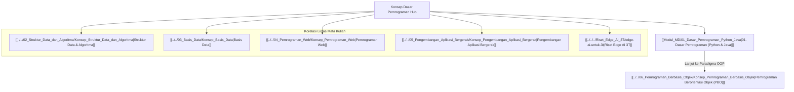

# Panduan Komprehensif Konsep Dasar Pemrograman (Programming Fundamentals Hub)

Dokumen ini merupakan berkas utama (*Knowledge Hub*) yang memetakan konsep dasar **Pemrograman Komputer (Programming Fundamentals)** menggunakan bahasa Python dan Java, serta keterkaitannya dengan paradigma [[../../06_Pemrograman_Berbasis_Objek/Konsep_Pemrograman_Berbasis_Objek|Pemrograman Berorientasi Objek (PBO)]], [[../../02_Struktur_Data_dan_Algoritma/Konsep_Struktur_Data_dan_Algoritma|Struktur Data & Algoritma]], [[../../03_Basis_Data/Konsep_Basis_Data|Basis Data]], [[../../04_Pemrograman_Web/Konsep_Pemrograman_Web|Pemrograman Web]], dan [[../../05_Pengembangan_Aplikasi_Bergerak/Konsep_Pengembangan_Aplikasi_Bergerak|Pengembangan Aplikasi Bergerak]].

> [!NOTE]
> Seluruh modul pada hub ini saling terhubung secara dua arah (*bidirectional links*) menggunakan Obsidian Wiki-Links `[[...]]`. Seluruh berkas dari `vault-teman` **dikecualikan 100%**.

---

## 🗺️ Peta Pembelajaran Konsep Pemrograman

---

## 📚 Modul Pembelajaran Konsep Pemrograman

- **[[Modul_MD/01_Dasar_Pemrograman_Python_Java|01. Dasar Pemrograman (Python & Java)]]**: Penjelasan mendalam mengenai fondasi pemrograman meliputi Variabel, Tipe Data Primitif vs Referensi, Operator, Control Flow (`if-else`, `switch/match`), Perulangan (`for`, `while`), Fungsi/Method, serta Manajemen Memori awal.

---

## 🔗 Hubungan Antar Berkas Catatan Utama

- 🔗 **[[../../06_Pemrograman_Berbasis_Objek/Konsep_Pemrograman_Berbasis_Objek|Pemrograman Berorientasi Objek]]**: Tahap lanjutan setelah menguasai sintaks dasar pemrograman untuk mengorganisasi kode ke dalam Class & Object.
- 🔗 **[[../../02_Struktur_Data_dan_Algoritma/Konsep_Struktur_Data_dan_Algoritma|Struktur Data & Algoritma]]**: Penerapan variabel, perulangan, dan rekursi untuk menyusun algoritma pencarian & pengurutan efisien.
- 🔗 **[[../../04_Pemrograman_Web/Konsep_Pemrograman_Web|Pemrograman Web]]**: Fondasi logika dasar untuk JavaScript (Client-Side) dan PHP (Server-Side).
- 🔗 **[[../../05_Pengembangan_Aplikasi_Bergerak/Konsep_Pengembangan_Aplikasi_Bergerak|Pengembangan Aplikasi Bergerak]]**: Dasar sintaksis kontrol flow pada Kotlin dan Dart (Flutter).

---
*Hub catatan ini dapat dipelajari secara bertahap melalui navigasi tautan `[[...]]` pada setiap modul.*
