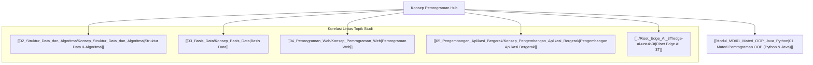

# Konsep Pemrograman: Pemrograman Berorientasi Objek (Python & Java)

Dokumen ini merupakan berkas utama (*Knowledge Hub*) yang memetakan konsep dasar **Pemrograman Berorientasi Objek (OOP)** menggunakan bahasa Python dan Java, serta keterkaitannya dengan struktur data, basis data, pengembangan web, aplikasi bergerak, dan kecerdasan buatan.

> [!NOTE]
> Seluruh modul pada hub ini saling terhubung secara dua arah (*bidirectional links*) menggunakan Obsidian Wiki-Links `[[...]]`. Seluruh berkas dari `vault-teman` **dikecualikan 100%**.

---

## 🗺️ Peta Pembelajaran Konsep Pemrograman

---

## 📚 Modul Pembelajaran Konsep Pemrograman

- **[[Modul_MD/01_Materi_OOP_Java_Python|01. Materi Pemrograman OOP (Python & Java)]]**: Penjelasan mendalam mengenai konsep dasar *Class*, *Object*, *Encapsulation*, *Inheritance*, *Polymorphism*, dan *Abstraction* pada bahasa Java dan Python.

---

## 🔗 Hubungan Antar Berkas Catatan Utama

- 🔗 **[[02_Struktur_Data_dan_Algoritma/Konsep_Struktur_Data_dan_Algoritma|Struktur Data & Algoritma]]**: Menerapkan kelas OOP untuk membangun struktur data tingkat lanjut seperti Linked List, Tree, dan Graph.
- 🔗 **[[03_Basis_Data/Konsep_Basis_Data|Basis Data]]**: Menghubungkan pemodelan objek OOP ke dalam skema basis data relasional.
- 🔗 **[[04_Pemrograman_Web/Konsep_Pemrograman_Web|Pemrograman Web]]**: Penerapan OOP pada server-side scripting PHP OOP dan arsitektur MVC framework Laravel.
- 🔗 **[[05_Pengembangan_Aplikasi_Bergerak/Konsep_Pengembangan_Aplikasi_Bergerak|Pengembangan Aplikasi Bergerak]]**: Penerapan OOP pada bahasa Kotlin dan Dart (Flutter) untuk pembangunan aplikasi mobile.
- 🔗 **[[../Riset_Edge_AI_3T/edge-ai-untuk-3t|Riset Edge AI 3T]]**: Implementasi skrip kompresi model AI menggunakan bahasa Python.

---
*Hub catatan ini dapat dipelajari secara bertahap melalui navigasi tautan `[[...]]` pada setiap modul.*
