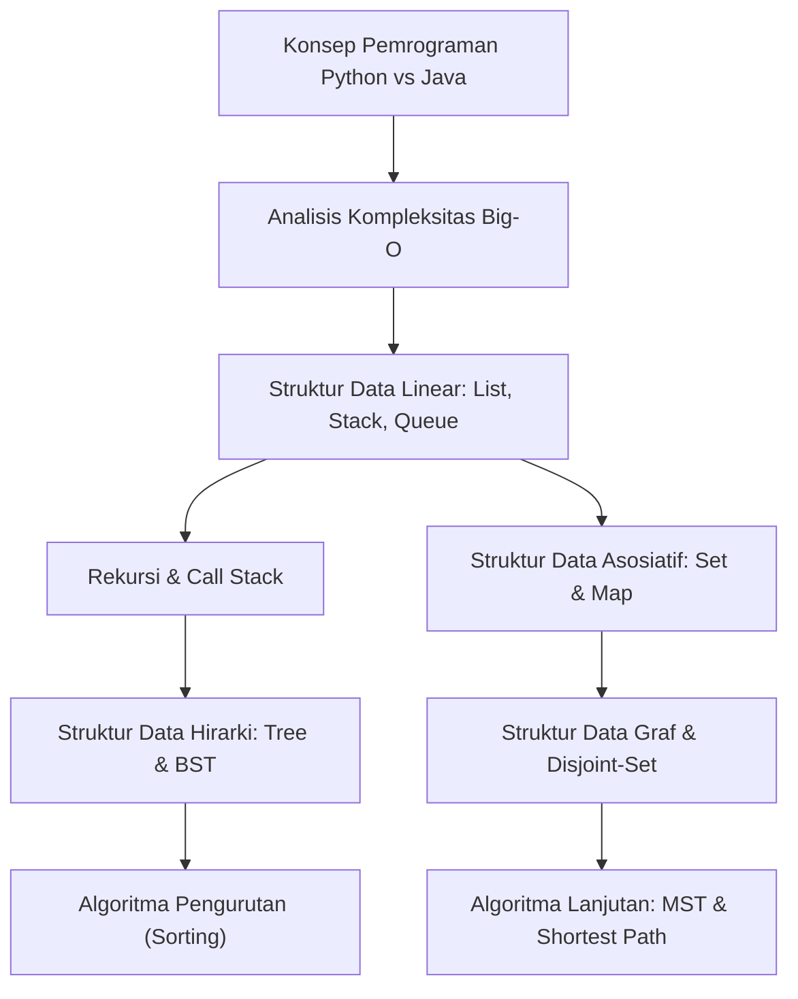

# Panduan Komprehensif Konsep Struktur Data dan Algoritma (SDA)

Dokumen ini disusun sebagai rangkuman dan referensi komprehensif yang membahas fondasi **Struktur Data dan Algoritma (SDA)**. Materi disadur dan dirangkum dari modul [Praktikum SDA 2025](Praktikum-SDA-2025/1-List-Stack-and-Queue/1_List.md) serta dikorelasikan dengan konsep sintaksis dasar pada [Konsep Pemrograman Python vs Java](Konsep_Pemrograman_Python_Java.md).

Tujuan utama dokumen ini adalah memberikan pemahaman yang mendalam namun intuitif mengenai cara kerja alokasi memori, organisasi data, serta efisiensi algoritma dalam menyelesaikan berbagai permasalahan komputasi.

> [!NOTE]
> Seluruh tautan materi pada dokumen ini terhubung langsung dengan repositori praktikum internal dan dokumen konsep pribadi, serta **dikecualikan secara ketat** dari berkas eksternal (`vault-teman`).

---

## 1. Analisis Kompleksitas Algoritma (Big-O Notation)

Suatu algoritma tidak hanya dituntut untuk **efektif** (menghasilkan jawaban yang benar), tetapi juga harus **mangkus / efisien** dalam hal waktu eksekusi (*Time Complexity*) dan penggunaan memori (*Space Complexity*).

Notasi **Big-O** ($O$) digunakan untuk mengukur batas atas (*upper bound*) dari pertumbuhan eksekusi algoritma seiring dengan bertambahnya ukuran data masukan ($N$).

*Materi Terkait:* [`1-analisis-kompleksitas.md`](Praktikum-SDA-2025/3-AnalisisKompleksitas/1-analisis-kompleksitas.md) | `[[1-analisis-kompleksitas]]`

### 📊 Hirarki Tingkat Kompleksitas (Dari Tercepat ke Terlambat)

| Notasi Big-O | Nama Kompleksitas | Deskripsi & Contoh Kasus |
| :--- | :--- | :--- |
| **$O(1)$** | **Konstan** | Waktu eksekusi tidak terpengaruh ukuran data. (Contoh: Akses elemen Array berdasarkan indeks, `push`/`pop` pada Stack). |
| **$O(\log N)$** | **Logaritmik** | Ukuran masalah berkurang setengah pada setiap langkah. (Contoh: *Binary Search*, Pencarian di BST yang seimbang). |
| **$O(N)$** | **Linear** | Waktu eksekusi berbanding lurus dengan jumlah data. (Contoh: Iterasi `for` tunggal, *Linear Search*). |
| **$O(N \log N)$** | **Linearitmik** | Kompleksitas standar untuk algoritma sorting yang efisien. (Contoh: *Merge Sort*, *Quick Sort*, *Heap Sort*). |
| **$O(N^2)$** | **Kuadratik** | Perulangan bersarang dua tingkat. (Contoh: *Bubble Sort*, *Selection Sort*, *Insertion Sort*). |
| **$O(2^N)$** | **Eksponensial** | Pertumbuhan berlipat ganda setiap penambahan 1 elemen. (Contoh: Rekursi Fibonacci naif, *Brute Force Subsets*). |
| **$O(N!)$** | **Faktorial** | Kompleksitas terbPopular dan paling tidak efisien. (Contoh: *Traveling Salesperson Problem (TSP)* dengan Brute Force). |

### 💡 Contoh Kode & Analisis

```java
// 1. Kompleksitas O(1) - Akses elemen array
int angka = arr[0]; 

// 2. Kompleksitas O(N) - Loop linear tunggal
for (int i = 0; i < N; i++) {
    System.out.println(arr[i]);
}

// 3. Kompleksitas O(N^2) - Nested Loop
for (int i = 0; i < N; i++) {
    for (int j = 0; j < N; j++) {
        System.out.println(i + " - " + j);
    }
}

// 4. Kompleksitas O(log N) - Iterasi membagi dua
int i = N;
while (i > 0) {
    i /= 2; // Setiap langkah N dibagi 2
}
```

---

## 2. Struktur Data Linear: List, Stack, dan Queue

Struktur data linear mengatur elemen secara berurutan. Pemilihan tipe struktur data yang tepat sangat mempengaruhi performa aplikasi.

*Materi Terkait:* [`1_List.md`](Praktikum-SDA-2025/1-List-Stack-and-Queue/1_List.md) | [`2_Stack.md`](Praktikum-SDA-2025/1-List-Stack-and-Queue/2_Stack.md) | [`3_Queue.md`](Praktikum-SDA-2025/1-List-Stack-and-Queue/3_Queue.md)

### A. List: Array List vs Linked List

| Karakteristik | Array List | Linked List |
| :--- | :--- | :--- |
| **Struktur Memori** | Blok memori kontigu (berurutan) | Node acak terhubung via Pointer / Referensi |
| **Akses Elemen (`get(i)`)** | ⚡ Sangat Cepat — $O(1)$ | 🐢 Lambat — Harus penelusuran dari Head $O(N)$ |
| **Sisip / Hapus Elemen** | 🐢 Lambat — Membutuhkan *shifting* elemen $O(N)$ | ⚡ Cepat — Cukup ubah pointer $O(1)$ jika lokasi ditemukan |
| **Efisiensi Alokasi** | Membutuhkan kapasitas cadangan (*re-allocation*) | Menggunakan memori presisi sesuai jumlah node $O(N)$ |

```java
// Implementasi Java
List<String> arrayList = new ArrayList<>(); // Array List
List<String> linkedList = new LinkedList<>(); // Linked List
```

### B. Stack (Tumpukan - LIFO)

Stack bekerja dengan prinsip **Last-In, First-Out (LIFO)**. Elemen yang terakhir dimasukkan adalah yang pertama kali dikeluarkan (seperti tumpukan piring).

- **`push(e)`**: Menambahkan elemen ke atas tumpukan — $O(1)$.
- **`pop()`**: Mengambil dan menghapus elemen teratas — $O(1)$.
- **`peek()`**: Melihat elemen teratas tanpa menghapusnya — $O(1)$.
- **Penggunaan Real-World**: Fitur *Undo/Redo* di editor, evaluasi ekspresi matematika (Infix to Postfix), serta penanganan *Call Stack* fungsi.

```java
Stack<Integer> stack = new Stack<>();
stack.push(10);
stack.push(20);
int top = stack.pop(); // Mengembalikan 20
```

### C. Queue (Antrean - FIFO)

Queue bekerja dengan prinsip **First-In, First-Out (FIFO)**. Elemen yang pertama masuk akan diproses lebih dulu (seperti antrean kasir).

- **`enqueue()` / `add()`**: Menambahkan elemen di belakang antrean — $O(1)$.
- **`dequeue()` / `poll()`**: Mengambil dan menghapus elemen terdepan — $O(1)$.
- **`peek()`**: Melihat elemen terdepan — $O(1)$.
- **Penggunaan Real-World**: Sistem antrean printer, manajemen *job/task scheduling*, dan algoritma penelusuran graf **BFS**.

```java
Queue<String> antrean = new LinkedList<>();
antrean.add("Pelanggan A");
antrean.add("Pelanggan B");
String dilayani = antrean.poll(); // Mengembalikan "Pelanggan A"
```

---

## 3. Rekursi & Pemrosesan Berulang

**Rekursi** adalah teknik di mana sebuah fungsi memanggil dirinya sendiri untuk menyelesaikan sub-masalah yang lebih kecil.

*Materi Terkait:* [`1_Rekursi.md`](Praktikum-SDA-2025/2-Rekursi/1_Rekursi.md) | `[[1_Rekursi]]`

### 🔑 Dua Komponen Wajib Fungsi Rekursif:
1. **Base Case (Kondisi Berhenti)**: Syarat di mana rekursi berhenti agar tidak terjadi perulangan tak terbatas (*infinite loop*).
2. **Recurrence Relation (Langkah Rekursif)**: Bagian fungsi yang memanggil dirinya sendiri dengan argumen yang terus mendekati *Base Case*.

```java
public class RekursiDemo {
    // Hitung Faktorial: N! = N * (N - 1)!
    public static int faktorial(int n) {
        if (n <= 1) return 1; // Base Case
        return n * faktorial(n - 1); // Recurrence Relation
    }
}
```

> [!WARNING]
> Setiap pemanggilan fungsi rekursif akan memakan ruang di **Call Stack** memori. Jika rekursi terlalu dalam tanpa menyentuh *Base Case*, program akan mengalami galat **`StackOverflowError`**.

---

## 4. Struktur Data Asosiatif: Set dan Map

Struktur data asosiatif digunakan untuk mengelola sekumpulan data berdasarkan keunikan atau hubungan pasangan Kunci-Nilai (*Key-Value*).

*Materi Terkait:* [`1_Set.md`](Praktikum-SDA-2025/4-Set-dan-Map/1_Set.md) | [`2_Map.md`](Praktikum-SDA-2025/4-Set-dan-Map/2_Map.md)

### A. Set (Kumpulan Elemen Unik)
Set menjamin bahwa tidak ada elemen duplikat di dalamnya.

- **`HashSet`**: Berbasis *Hash Table*. Tidak terurut, tetapi operasi `add`, `remove`, `contains` sangat cepat ($O(1)$ rata-rata).
- **`TreeSet`**: Berbasis *Red-Black Tree*. Elemen otomatis terurut secara ascending. Operasi ber-kompleksitas $O(\log N)$.

```java
Set<String> setUnik = new HashSet<>();
setUnik.add("Apel");
setUnik.add("Apel"); // Diabaikan karena duplikat
System.out.println(setUnik.size()); // Output: 1
```

### B. Map (Pasangan Key-Value)
Map menyimpan data berpasangan di mana setiap **Key** bersifat unik dan terhubung ke satu **Value**.

- **`HashMap`**: Implementasi populer berbasis tabel hash. Akses key $O(1)$.
- **`TreeMap`**: Key tersusun rapi terurut. Akses key $O(\log N)$.
- **Hashing & Kolisi**: Ketika dua key menghasilkan nilai hash yang sama (*Collision*), HashMap menanganinya dengan *Chaining* (Linked List / Tree node pada ember yang sama).

```java
Map<String, Integer> stok = new HashMap<>();
stok.put("Laptop", 15);
stok.put("Mouse", 50);

int jumlahLaptop = stok.get("Laptop"); // 15
```

---

## 5. Struktur Data Hirarki: Tree & Binary Search Tree (BST)

**Tree** adalah struktur data non-linear berhirarki yang terdiri dari **Node** yang terhubung oleh **Edge**.

*Materi Terkait:* [`1_Tree.md`](Praktikum-SDA-2025/5-Tree/1_Tree.md) | [`Binary-Search-Tree.md`](Praktikum-SDA-2025/6-BinaryTreeAndBinarySearchTree/Binary-Search-Tree.md)

### 🌲 Anatomi Tree
- **Root**: Node teratas dalam tree.
- **Parent & Child**: Node di atas dan anak node di bawahnya.
- **Leaf**: Node yang tidak memiliki anak.
- **Depth**: Jarak node dari Root.
- **Height**: Jarak terjauh node ke Leaf.

### ⚖️ Binary Search Tree (BST)
BST adalah Binary Tree dengan aturan khusus:
> Elemen di **Subtree Kiri < Node Induk < Elemen di Subtree Kanan**.

```text
        10
       /  \
      5    15
     / \     \
    2   7     20
```

- **Pencarian / Inserksi**: Rata-rata $O(\log N)$ jika pohon seimbang (*balanced*). Jika terdegenerasi menjadi garis lurus (skewed), kompleksitas memburuk menjadi $O(N)$.
- **Traversal Tree**:
  - **In-Order** (Kiri $\rightarrow$ Root $\rightarrow$ Kanan): Menghasilkan data terurut naik (Ascending).
  - **Pre-Order** (Root $\rightarrow$ Kiri $\rightarrow$ Kanan): Digunakan untuk mengkloning/menyalin tree.
  - **Post-Order** (Kiri $\rightarrow$ Kanan $\rightarrow$ Root): Digunakan untuk menghapus node/tree secara bottom-up.
  - **Level-Order (BFS)**: Penelusuran tingkat demi tingkat dari atas ke bawah.

---

## 6. Struktur Data Graf (Graph) & Disjoint-Set

### A. Graf (Graph)
Graf merepresentasikan hubungan kompleks antar objek (*Vertex/Node*) melalui sisi (*Edge*).

*Materi Terkait:* [`1_Graph.md`](Praktikum-SDA-2025/7-GraphAndDisjointSet/1_Graph.md) | `[[1_Graph]]`

- **Jenis Graf**: Graf Berarah (*Directed*), Graf Tak Berarah (*Undirected*), Berbobot (*Weighted*), Tanpa Bobot (*Unweighted*).
- **Representasi Graf**:

| Metode | Deskripsi | Memori | Cek Koneksi ($u, v$) |
| :--- | :--- | :--- | :--- |
| **Adjacency Matrix** | Array 2D `matrix[v][v]` | $O(V^2)$ | ⚡ $O(1)$ |
| **Adjacency List** | Array dari List tetangga | $O(V + E)$ | 🐢 $O(\text{Degree}(u))$ |
| **Edge List** | List berisi seluruh sisi | $O(E)$ | 🐢 $O(E)$ |

- **Traversal Graf**:
  - **BFS (Breadth-First Search)**: Menggunakan **Queue**. Menjelajahi tetangga terdekat terlebih dahulu (Cocok untuk pencarian jarak terpendek tanpa bobot).
  - **DFS (Depth-First Search)**: Menggunakan **Stack / Rekursi**. Menjelajahi satu cabang hingga terdalam sebelum backtracking.

### B. Disjoint-Set / Union-Find
Disjoint-Set melacak kumpulan elemen yang terbagi menjadi beberapa himpunan saling lepas (*disjoint sets*).

*Materi Terkait:* [`2_Disjoint-Set.md`](Praktikum-SDA-2025/7-GraphAndDisjointSet/2_Disjoint-Set.md) | `[[2_Disjoint-Set]]`

- **`find(x)`**: Menentukan representasi/parent utama dari elemen `x`.
- **`union(x, y)`**: Menggabungkan himpunan yang memuat `x` dan `y`.
- **Optimalisasi**:
  - **Path Compression**: Mengarahkan node langsung ke root saat pemanggilan `find()`.
  - **Union by Rank/Size**: Menggabungkan pohon yang lebih kecil ke bawah pohon yang lebih besar.
  - *Kompleksitas*: Hampir konstan $O(\alpha(N))$ (Fungsi Inverse Ackermann).

---

## 7. Algoritma Pengurutan (Sorting Algorithms)

Pengurutan data adalah operasi dasar penting dalam ilmu komputer.

*Materi Terkait:* [`1_BubbleSort.md`](Praktikum-SDA-2025/8-Sorting/1_BubbleSort.md) | [`1_Efficient-Sorting.md`](Praktikum-SDA-2025/9-EfficientSorting/1_Efficient-Sorting.md)

### 📈 Perbandingan Algoritma Pengurutan

| Algoritma | Rata-rata Waktu | Terburuk (*Worst Case*) | Memori Tambahan | Stabilitas | Tipe Strategi |
| :--- | :--- | :--- | :--- | :--- | :--- |
| **Bubble Sort** | $O(N^2)$ | $O(N^2)$ | $O(1)$ | ✅ Stabil | Tukar elemen berdekatan |
| **Selection Sort** | $O(N^2)$ | $O(N^2)$ | $O(1)$ | ❌ Tidak | Cari nilai terkecil |
| **Insertion Sort** | $O(N^2)$ | $O(N^2)$ | $O(1)$ | ✅ Stabil | Sisip elemen ke posisi pas |
| **Merge Sort** | $O(N \log N)$ | $O(N \log N)$ | $O(N)$ | ✅ Stabil | Divide & Conquer |
| **Quick Sort** | $O(N \log N)$ | $O(N^2)$ | $O(\log N)$ | ❌ Tidak | Partitioning berbasis Pivot |
| **Heap Sort** | $O(N \log N)$ | $O(N \log N)$ | $O(1)$ | ❌ Tidak | Menggunakan Max-Heap |

> [!TIP]
> - Gunakan **Insertion Sort** untuk dataset sangat kecil atau data yang sudah hampir terurut.
> - Gunakan **Merge Sort** jika butuh jaminan waktu $O(N \log N)$ dan stabilitas pengurutan.
> - Gunakan **Quick Sort** untuk efisiensi eksekusi di memori tanpa alokasi array baru yang besar.

---

## 8. Algoritma Graf Lanjutan (Advanced Graph Algorithms)

### A. Minimum Spanning Tree (MST)
MST adalah himpunan bagian dari sisi-sisi graf berbobot tak berarah yang menghubungkan seluruh simpul tanpa membentuk siklus (*cycle*) dengan **total bobot seminimal mungkin**.

*Materi Terkait:* [`1_Minimum-Spanning-Tree.md`](Praktikum-SDA-2025/10-AlgoritmaLanjutan/1_Minimum-Spanning-Tree.md)

1. **Algoritma Prim**:
   - Berbasis *Node* (Greedy).
   - Memperluas MST dengan memilih edge berbobot terkecil yang terhubung ke node yang sudah dikunjungi menggunakan **Priority Queue**.
   - Kompleksitas: $O(E \log V)$.

2. **Algoritma Kruskal**:
   - Berbasis *Edge* (Greedy).
   - Mengurutkan seluruh edge berdasarkan bobot, lalu menambahkan edge satu per satu jika tidak membentuk siklus dengan bantuan **Disjoint-Set (Union-Find)**.
   - Kompleksitas: $O(E \log E)$.

---

### B. Algoritma Jalur Terpendek (Shortest Path)
Mencari lintasan dengan total bobot terkecil antar simpul.

*Materi Terkait:* [`2_Shortest-Path.md`](Praktikum-SDA-2025/10-AlgoritmaLanjutan/2_Shortest-Path.md)

1. **Algoritma Dijkstra**:
   - Mencari jalur terpendek dari satu sumber (*Single-Source Shortest Path*).
   - **Syarat**: Bobot edge tidak boleh negatif ($\ge 0$).
   - Kompleksitas: $O((V + E) \log V)$ menggunakan Min-Priority Queue.

2. **Algoritma Bellman-Ford**:
   - Menangani grafik dengan **bobot negatif**.
   - Mampu mendeteksi *Negative Weight Cycle*.
   - Kompleksitas: $O(V \cdot E)$.

3. **Algoritma Floyd-Warshall**:
   - Mencari jalur terpendek antara **semua pasangan simpul** (*All-Pairs Shortest Path*).
   - Menggunakan pendekatan *Dynamic Programming* dengan matriks 2D.
   - Kompleksitas: $O(V^3)$.

---

## 🔗 Peta Keterkaitan Dokumen (Knowledge Map)



---
*Dokumen rangkuman ini dibuat secara terotomatisasi dan dapat diperbarui secara berkala sesuai dengan perkembangan materi Praktikum Struktur Data dan Algoritma.*
