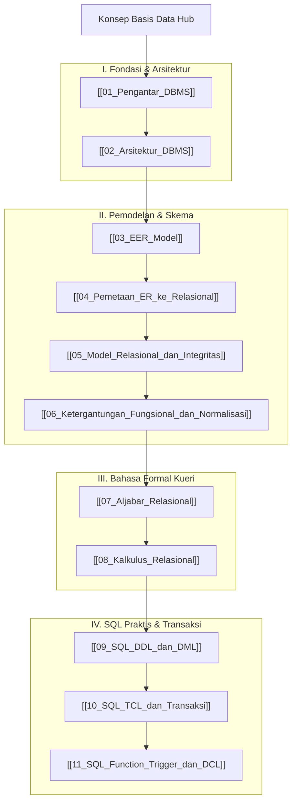

# Panduan Komprehensif Konsep Basis Data (Database Concepts Hub)

Dokumen ini merupakan berkas utama (*Knowledge Hub*) yang memetakan seluruh modul pembelajaran **Sistem Basis Data**. Seluruh materi disusun secara sistematis dan dikorelasikan dengan konsep praktikum pada [[Konsep_Struktur_Data_dan_Algoritma]] serta [[Konsep_Pemrograman_Python_Java]].

> [!NOTE]
> Seluruh modul pada hub ini saling terhubung secara dua arah (*bidirectional links*) menggunakan Obsidian Wiki-Links `[[...]]`. Seluruh berkas dari `vault-teman` **dikecualikan 100%**.

---

## 🗺️ Peta Pembelajaran Basis Data

---

## 📚 Daftar Lengkap Modul Pembelajaran Basis Data

### Part I: Fondasi Sistem & Arsitektur
1. **[[01_Pengantar_DBMS]]**: Membahas konsep hierarki data (DIKW), tipe data (Structured, Semi, Unstructured), fungsi utama DBMS, peran pengguna (DBA, Designer, End-user), serta evaluasi keuntungan memakai DBMS.
2. **[[02_Arsitektur_DBMS]]**: Membahas *Three-Schema Architecture* (External, Conceptual, Internal), Independensi Data Logis dan Fisik, bahasa basis data (DDL, DML, DCL, TCL), serta arsitektur Client-Server.

### Part II: Pemodelan Data & Normalisasi
3. **[[03_EER_Model]]**: Membahas *Enhanced Entity-Relationship (EER)*, Superclass/Subclass, Pewarisan Atribut, Spesialisasi vs Generalisasi, serta Batasan Disjoint/Overlap dan Total/Partial.
4. **[[04_Pemetaan_ER_ke_Relasional]]**: Algoritma 7+1 langkah mengonversi ERD/EER konseptual menjadi skema tabel relasional (Strong/Weak entity, 1:1, 1:N, M:N, Multivalued, dan 4 opsi pemetaan EER Subclass).
5. **[[05_Model_Relasional_dan_Integritas]]**: Membahas struktur relasi (Tupel, Atribut, Domain), hirarki kunci (Super Key, Candidate Key, Primary Key, Foreign Key), serta 4 Aturan Integritas Data.
6. **[[06_Ketergantungan_Fungsional_dan_Normalisasi]]**: Menganalisis Ketergantungan Fungsional ($FD$), Anomali Data (Insert, Delete, Update Anomaly), serta tahapan bentuk normal 1NF, 2NF, 3NF, dan BCNF.

### Part III: Bahasa Formal Kueri (Query Formalisms)
7. **[[07_Aljabar_Relasional]]**: Bahasa kueri prosedural menggunakan operator Unaris ($\sigma$ Selection, $\pi$ Projection), Teori Himpunan ($\cup, \cap, -, \times$), Join ($\bowtie$), Division ($\div$), serta Pohon Kueri.
8. **[[08_Kalkulus_Relasional]]**: Bahasa kueri deklaratif non-prosedural (*Tuple Relational Calculus / TRC* dan *Domain Relational Calculus / DRC*) dengan Kuantifier Logika ($\exists, \forall$).

### Part IV: Implementasi SQL & Transaksi
9. **[[09_SQL_DDL_dan_DML]]**: Sintaks SQL DDL (`CREATE`, `ALTER`, `DROP`), DML (`INSERT`, `UPDATE`, `DELETE`, `SELECT`), Filtering, Agregasi, `GROUP BY`, `HAVING`, dan jenis-jenis `JOIN`.
10. **[[10_SQL_TCL_dan_Transaksi]]**: Konsep Transaksi, Properti ACID, perintah TCL (`COMMIT`, `ROLLBACK`, `SAVEPOINT`), Diagram Status Transaksi, dan Isolation Levels.
11. **[[11_SQL_Function_Trigger_dan_DCL]]**: *Stored Functions & Procedures*, *Database Triggers* (BEFORE/AFTER, Audit Logging), serta keamanan hak akses DCL (`GRANT` & `REVOKE`).

---

## 🔗 Hubungan Antar Berkas Catatan Utama

- 🔗 **[[Konsep_Struktur_Data_dan_Algoritma]]**: Rangkuman struktur data memori (List, Tree, Graph, Sorting, Priority Queue) yang melandasi cara kerja internal storage engine pada DBMS.
- 🔗 **[[Konsep_Pemrograman_Python_Java]]**: Referensi sintaksis pemrograman backend (Python/Java) yang digunakan untuk menghubungkan aplikasi client ke DBMS via driver SQL.

---
*Hub catatan ini dapat dipelajari secara bertahap melalui navigasi tautan `[[...]]` pada setiap modul.*
