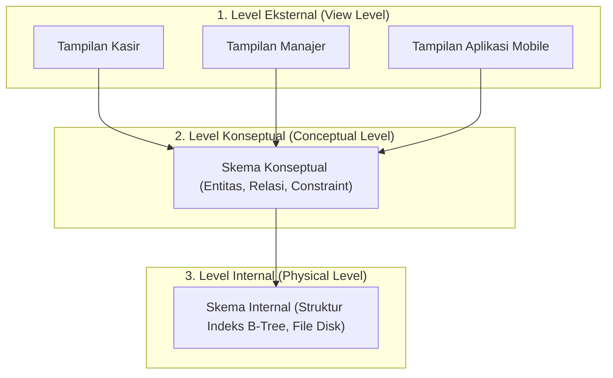

# 2. Arsitektur Sistem DBMS dan Independensi Data

Navigasi: Modul Sebelumnya: [[01_Pengantar_DBMS]] | [[Konsep_Basis_Data]] | Modul Berikutnya: [[03_EER_Model]]

---

Untuk memisahkan antara aplikasi pengguna dengan cara data disimpan secara fisik di komputer, standar ANSI/SPARC menetapkan **Arsitektur Tiga Skema** (*Three-Schema Architecture*).

---

## 2.1. Arsitektur Tiga Skema (Three-Schema Architecture)

Arsitektur ini membagi skema basis data menjadi tiga tingkatan terpisah:

### Penjelasan Tingkatan Skema:
1. **Level Eksternal (View Level)**: Menampilkan subset data spesifik yang relevan bagi pengguna tertentu. Pengguna tidak perlu melihat struktur keseluruhan tabel di basis data.
2. **Level Konseptual (Conceptual Level)**: Menggambarkan struktur keseluruhan basis data untuk seluruh pengguna. Berisi deskripsi entitas, tipe data, hubungan (*relationship*), dan batasan integritas (*constraints*).
3. **Level Internal (Physical Level)**: Menggambarkan detail penyimpanan fisik basis data di dalam media penyimpanan, termasuk struktur file, indeks pencarian, dan alokasi memori.

---

## 2.2. Independensi Data (Data Independence)

**Independensi Data** adalah kemampuan untuk mengubah skema di satu tingkat tanpa harus mengubah skema di tingkat yang lebih tinggi di atasnya.

 Terdapat dua jenis independensi data:

- **Independensi Data Logis (*Logical Data Independence*)**:
  - Kemampuan untuk mengubah skema konseptual tanpa perlu mengubah skema eksternal atau program aplikasi.
  - *Contoh*: Menambahkan kolom baru `alamat_email` pada tabel `Mahasiswa` tidak akan merusak aplikasi lama yang hanya membaca kolom `NIM` dan `Nama`.

- **Independensi Data Fisik (*Physical Data Independence*)**:
  - Kemampuan untuk mengubah skema internal tanpa perlu mengubah skema konseptual.
  - *Contoh*: Mengubah struktur indeks pencarian dari *Hash Index* ke *B-Tree Index* atau memindahkan file data ke disk SSD baru tidak akan mengubah query SQL konseptual.

---

## 2.3. Bahasa dalam DBMS (DBMS Languages)

DBMS menyediakan bahasa khusus yang disesuaikan dengan kebutuhan pengguna dan tingkatan skema yang dikelola:

| Bahasa | Singkatan | Fungsi | Contoh Sintaks SQL |
| :--- | :--- | :--- | :--- |
| **Data Definition Language** | **DDL** | Mendefinisikan dan merubah skema konseptual serta struktur tabel. | `CREATE TABLE`, `ALTER`, `DROP` |
| **Data Manipulation Language** | **DML** | Memproses, membaca, dan memperbarui baris data di dalam tabel. | `SELECT`, `INSERT`, `UPDATE`, `DELETE` |
| **Data Control Language** | **DCL** | Mengatur keamanan dan hak akses pengguna terhadap data. | `GRANT`, `REVOKE` |
| **Transaction Control Language**| **TCL** | Mengelola eksekusi transaksi basis data. | `COMMIT`, `ROLLBACK`, `SAVEPOINT` |

---

## 2.4. Arsitektur Client-Server Basis Data

Sebagian besar DBMS modern berjalan menggunakan model **Client-Server**:

- **Two-Tier Architecture**: Aplikasi client langsung berhubungan dengan server DBMS menggunakan driver database (seperti JDBC atau ODBC).
- **Three-Tier Architecture**: Client berkomunikasi dengan **Application Server / Web Server** terlebih dahulu, kemudian Application Server yang mengelola pemrosesan logika bisnis dan berhubungan ke DBMS Server.
  - *Catatan*: Model *Three-Tier* adalah standar utama pada aplikasi web dan mobile modern karena lebih aman dan efisien dalam mengelola koneksi.

---

Navigasi: Modul Sebelumnya: [[01_Pengantar_DBMS]] | [[Konsep_Basis_Data]] | Modul Berikutnya: [[03_EER_Model]]
