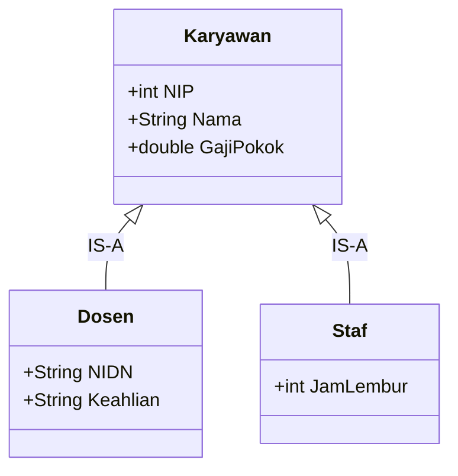

# 3. Model Enhanced Entity-Relationship (EER)

Navigasi: Modul Sebelumnya: [[02_Arsitektur_DBMS]] | [[Konsep_Basis_Data]] | Modul Berikutnya: [[04_Pemetaan_ER_ke_Relasional]]

---

Model **Enhanced Entity-Relationship (EER)** adalah perluasan dari pemodelan ER tradisional yang menambahkan konsep **Superclass/Subclass**, **Spesialisasi**, **Generalisasi**, dan **Pewarisan Atribut (*Attribute Inheritance*)**.

---

## 3.1. Superclass dan Subclass

- **Superclass**: Entitas induk yang memuat atribut-atribut umum dari sebuah kelompok entitas.
- **Subclass**: Entitas anak yang mewarisi seluruh atribut dan relasi dari Superclass, serta dapat memiliki atribut khusus milik sendiri.

 Hubungan antara Subclass dan Superclass disebut hubungan **IS-A** (misal: *Dosen **IS-A** Karyawan*).

---

## 3.2. Spesialisasi vs Generalisasi

- **Spesialisasi (*Specialization*)**: 
  - Pendekatan **Top-Down**.
  - Memecah satu Superclass menjadi beberapa Subclass berdasarkan perbedaan atribut atau relasi khusus.
  - *Contoh*: Entitas `Kendaraan` di-spesialisasi menjadi Subclass `Mobil` (memiliki atribut `KapasitasPenumpang`) dan `Truk` (memiliki atribut `KapasitasMuatanTon`).

- **Generalisasi (*Generalization*)**:
  - Pendekatan **Bottom-Up**.
  - Menggabungkan beberapa entitas terpisah yang memiliki atribut serupa menjadi satu Superclass umum.
  - *Contoh*: Entitas `Mobil` dan `Motor` digabungkan menjadi Superclass `Kendaraan`.

---

## 3.3. Batasan Spesialisasi (Constraints on Specialization)

Proses spesialisasi/generalisasi diatur oleh dua jenis batasan:

### 1. Batasan Pemisahan (*Disjointness Constraint*)
Menentukan apakah anggota Superclass dapat menjadi anggota di lebih dari satu Subclass secara bersamaan:

- **Disjoint (`d`)**: Anggota Superclass **hanya boleh menjadi anggota maksimal 1 Subclass**.
  - *Contoh*: Karyawan hanya bisa ber-tipe *Tetap* ATAU *Kontrak* (tidak bisa keduanya sekaligus).
- **Overlapping (`o`)**: Anggota Superclass **boleh menjadi anggota lebih dari 1 Subclass sekaligus**.
  - *Contoh*: Seseorang di universitas bisa menjadi *Mahasiswa* sekaligus *Asisten Laboratorium*.

### 2. Batasan Kelengkapan (*Completeness Constraint*)
Menentukan apakah setiap entitas di Superclass wajib terdaftar dalam Subclass:

- **Total Specialization**: Setiap entitas Superclass **WAJIB** menjadi anggota salah satu Subclass.
- **Partial Specialization**: Entitas Superclass **BOLEH** tidak menjadi anggota Subclass manapun.

---

## 3.4. Rangkuman Kombinasi Batasan EER

| Kombinasi Batasan | Aturan Anggota Superclass |
| :--- | :--- |
| **`d, Total`** | Wajib masuk Subclass dan **tepat satu** Subclass. |
| **`d, Partial`** | Boleh tidak masuk Subclass, namun jika masuk **maksimal satu** Subclass. |
| **`o, Total`** | Wajib masuk Subclass dan **boleh lebih dari satu** Subclass. |
| **`o, Partial`** | Bebas berada di beberapa Subclass atau tidak sama sekali. |

---

## 3.5. Hierarki Spesialisasi vs Lattice (Multiple Inheritance)

- **Specialization Hierarchy**: Setiap Subclass hanya memiliki **satu Superclass** (*Single Inheritance*).
- **Specialization Lattice**: Sebuah Subclass memiliki **lebih dari satu Superclass** (*Multiple Inheritance*).
  - *Contoh*: Entitas `AsistenDosen` merupakan Subclass yang mewarisi atribut dari Superclass `Mahasiswa` sekaligus Superclass `Karyawan`.

---

Navigasi: Modul Sebelumnya: [[02_Arsitektur_DBMS]] | [[Konsep_Basis_Data]] | Modul Berikutnya: [[04_Pemetaan_ER_ke_Relasional]]
