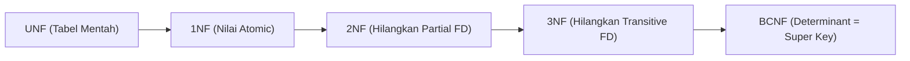

# 6. Ketergantungan Fungsional dan Normalisasi Basis Data

Navigasi: Modul Sebelumnya: [[05_Model_Relasional_dan_Integritas]] | [[Konsep_Basis_Data]] | Modul Berikutnya: [[07_Aljabar_Relasional]]

---

**Normalisasi** adalah proses mendesain skema tabel relasional dengan memecah tabel yang terduplikasi secara acak menjadi beberapa tabel terstruktur untuk menghilangkan redundansi dan mencegah **Anomali Data**.

---

## 6.1. Tiga Jenis Anomali Data

Skema basis data yang buruk akan menimbulkan tiga masalah operasional:

1. **Insertion Anomaly**: Ketidakmampuan menambahkan baris data baru karena kekurangan informasi atribut lain yang belum tersedia.
2. **Deletion Anomaly**: Menghapus satu data berakibat ikut terhapusnya data penting lain yang tidak seharusnya hilang.
3. **Update Anomaly**: Mengubah satu data mengharuskan pembaruan di banyak baris secara serentak, yang berisiko menimbulkan inkonsistensi jika ada baris yang terlewat.

---

## 6.2. Ketergantungan Fungsional (Functional Dependency - FD)

Ketergantungan Fungsional $X \rightarrow Y$ menyatakan bahwa atribut $X$ menentukan secara pasti nilai atribut $Y$. (Jika dua baris memiliki nilai $X$ yang sama, maka nilai $Y$ pada kedua baris tersebut pasti sama).

- **$X$** disebut **Determinant** (Penentu).
- **$Y$** disebut **Dependent** (Yang ditentukan).
- *Contoh*: `NIM` $\rightarrow$ `Nama_Mahasiswa`.

---

## 6.3. Tahapan Bentuk Normal (Normal Forms)



### 1. First Normal Form (1NF)
Sebuah relasi memenuhi **1NF** jika dan hanya jika seluruh nilai atribut bersifat **Atomic** (tunggal, tidak berupa grup berulang atau koma/array dalam satu sel).
- *Solusi 1NF*: Pisahkan atribut bernilai banyak atau grup berulang menjadi baris individu terpisah.

### 2. Second Normal Form (2NF)
Sebuah relasi memenuhi **2NF** jika:
1. Sudah memenuhi **1NF**.
2. **Tidak ada Ketergantungan Parsial (*Partial Dependency*)**: Seluruh atribut non-kunci harus bergantung sepenuhnya pada **keseluruhan Primary Key** (terutama pada Primary Key komposit yang terdiri dari beberapa kolom).

### 3. Third Normal Form (3NF)
Sebuah relasi memenuhi **3NF** jika:
1. Sudah memenuhi **2NF**.
2. **Tidak ada Ketergantungan Transitif (*Transitive Dependency*)**: Atribut non-kunci tidak boleh menentukan atribut non-kunci lainnya ($X \rightarrow Y \rightarrow Z$).

```text
Contoh Transitif:
NIM -> Kode_Prodi -> Nama_Prodi

Solusi 3NF (Dipecah menjadi 2 Tabel):
1. Tabel Mahasiswa (NIM, Nama, Kode_Prodi)
2. Tabel ProgramStudi (Kode_Prodi, Nama_Prodi)
```

### 4. Boyce-Codd Normal Form (BCNF)
BCNF adalah bentuk 3NF yang lebih ketat. Sebuah relasi memenuhi **BCNF** jika untuk setiap ketergantungan fungsional $X \rightarrow Y$, maka **$X$ WAJIB merupakan Super Key**.

---

## 6.4. Syarat Hasil Dekomposisi

Proses pemecahan (*dekomposisi*) tabel saat normalisasi harus memenuhi 2 syarat mutlak:

1. **Lossless Join Decomposition**: Saat tabel-tabel hasil pecahan di-`JOIN` kembali, hasil baris data yang didapatkan harus **sama persis** dengan tabel asli tanpa menghasilkan baris semu (*spurious tuples*).
2. **Dependency Preservation**: Seluruh ketergantungan fungsional ($FD$) tetap dapat diperiksa pada tabel terpisah tanpa harus melakukan operasi `JOIN`.

---

Navigasi: Modul Sebelumnya: [[05_Model_Relasional_dan_Integritas]] | [[Konsep_Basis_Data]] | Modul Berikutnya: [[07_Aljabar_Relasional]]
