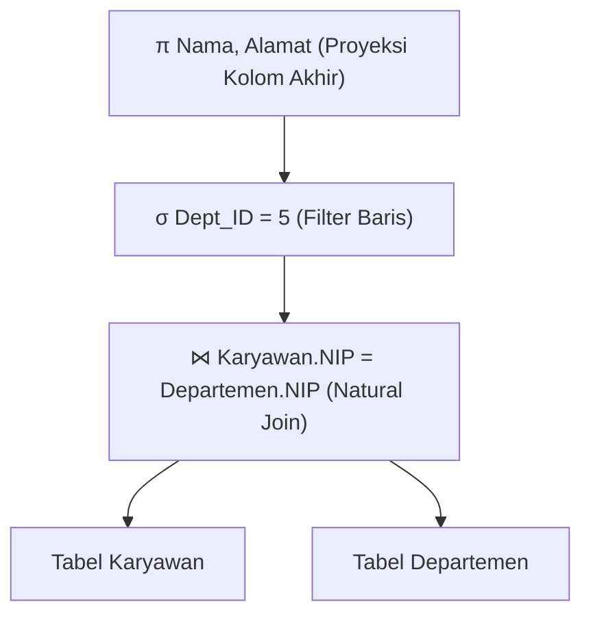

# 7. Aljabar Relasional (Relational Algebra)

Navigasi: Modul Sebelumnya: [[06_Ketergantungan_Fungsional_dan_Normalisasi]] | [[Konsep_Basis_Data]] | Modul Berikutnya: [[08_Kalkulus_Relasional]]

---

**Aljabar Relasional** adalah bahasa kueri prosedural (*prosedural query language*) yang terdiri dari sekumpulan operator matematika untuk memanipulasi relasi. Setiap operator menerima satu atau dua relasi sebagai input dan menghasilkan relasi baru sebagai output.

---

## 7.1. Operator Unaris (Unary Operators)

Operator unaris bekerja pada **satu relasi tunggal**:

### 1. Selection ($\sigma$) - Penyaringan Baris
Mengambil baris/tupel yang memenuhi kondisi predikat logika tertentu.
- **Notasi**: $\sigma_{\text{kondisi}}(R)$
- **Contoh**: $\sigma_{\text{Gaji} > 5000000}(\text{Karyawan})$ 
  - *Arti*: Ambil semua baris dari tabel Karyawan yang memiliki Gaji lebih dari 5 juta.

### 2. Projection ($\pi$) - Penyaringan Kolom
Mengambil kolom/atribut tertentu dan otomatis **menghilangkan duplikasi baris**.
- **Notasi**: $\pi_{\text{kolom}_1, \text{kolom}_2}(R)$
- **Contoh**: $\pi_{\text{Nama}, \text{Alamat}}(\text{Karyawan})$
  - *Arti*: Tampilkan hanya kolom Nama dan Alamat dari tabel Karyawan.

### 3. Rename ($\rho$) - Mengubah Nama Relasi / Atribut
Memberikan nama baru pada relasi hasil atau nama atributnya.
- **Notasi**: $\rho_{S(B_1, B_2, \dots)}(R)$

---

## 7.2. Operator Teori Himpunan (Set Theory Operators)

Memerlukan syarat **Union Compatibility** (dua relasi harus memiliki jumlah atribut yang sama dan tipe data domain yang bersesuaian):

| Operator | Simbol | Fungsi |
| :--- | :---: | :--- |
| **Union** | $\cup$ | Menggabungkan seluruh baris unik dari relasi $R$ dan $S$. |
| **Intersection** | $\cap$ | Mengambil baris yang ada di relasi $R$ sekaligus di relasi $S$. |
| **Set Difference** | $-$ | Mengambil baris yang ada di relasi $R$ tetapi tidak ada di relasi $S$. |
| **Cartesian Product**| $\times$ | Mengombinasikan setiap baris dari relasi $R$ dengan setiap baris dari relasi $S$. |

---

## 7.3. Operator Biner & Join ($\bowtie$)

Operator Join menggabungkan dua relasi berdasarkan kondisi keterhubungan tertentu:

- **Theta Join ($R \bowtie_{\theta} S$)**: Penggabungan *Cartesian Product* yang disaring berdasarkan kondisi $\theta$.
- **Natural Join ($R \bowtie S$)**: Join berbasis atribut yang memiliki nama sama pada kedua relasi. Kolom yang duplikat otomatis dihilangkan.
- **Left Outer Join ($R \text{ } ⟕ \text{ } S$)**: Menampilkan seluruh baris dari relasi kiri $R$. Jika tidak ada pasangan yang cocok pada relasi kanan $S$, nilai kolom diisi `NULL`.
- **Right Outer Join ($R \text{ } ⟖ \text{ } S$)**: Menampilkan seluruh baris dari relasi kanan $S$.
- **Full Outer Join ($R \text{ } ⟗ \text{ } S$)**: Menampilkan seluruh baris dari kedua relasi (kiri dan kanan).

---

## 7.4. Operator Pembagian (Division Operator $\div$)

Operator **Division ($R \div S$)** digunakan untuk menyelesaikan kueri yang mengandung kata kunci **"UNTUK SEMUA"** (*FOR ALL*).

- *Contoh Kasus*: Mencari `Mahasiswa` yang mengambil **SEMUA** `MataKuliah` wajib semester ini.

---

## 7.5. Pohon Kueri (Query Tree Representation)

Kueri SQL yang ditulis oleh pengguna akan dikonversi oleh *Query Optimizer* DBMS menjadi **Pohon Kueri Aljabar Relasional** untuk menentukan urutan eksekusi yang paling efisien:

---

Navigasi: Modul Sebelumnya: [[06_Ketergantungan_Fungsional_dan_Normalisasi]] | [[Konsep_Basis_Data]] | Modul Berikutnya: [[08_Kalkulus_Relasional]]
