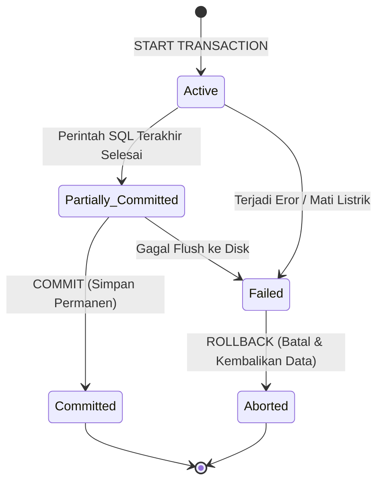

# 10. SQL Transaction Control Language (TCL) dan Manajemen Transaksi

Navigasi: Modul Sebelumnya: [[09_SQL_DDL_dan_DML]] | [[Konsep_Basis_Data]] | Modul Berikutnya: [[11_SQL_Function_Trigger_dan_DCL]]

---

**Transaksi** adalah sekumpulan perintah manipulasi data SQL (seperti `INSERT`, `UPDATE`, `DELETE`) yang dieksekusi sebagai **satu kesatuan unit kerja tunggal** (*logical unit of work*).

---

## 10.1. Prinsip ACID Transaksi

Setiap transaksi basis data dijamin keandalannya oleh empat properti **ACID**:

- **Atomicity (Keutuhan)**:
  - **"All or Nothing"** — Seluruh perintah di dalam transaksi harus berhasil 100%, atau dibatalkan seluruhnya jika terjadi kesalahan.
- **Consistency (Konsistensi)**:
  - Transaksi harus membawa basis data dari satu status valid ke status valid lainnya sesuai aturan integritas data.
- **Isolation (Isolasi)**:
  - Transaksi yang dieksekusi secara serentak (*concurrent*) tidak boleh saling mengganggu transaksi lain sebelum perubahan di-`COMMIT`.
- **Durability (Ketahanan)**:
  - Setelah transaksi berhasil di-`COMMIT`, perubahan data bersifat permanen dan tidak akan hilang meskipun sistem mati mendadak (*crash*).

---

## 10.2. Perintah Transaction Control Language (TCL)

Perintah TCL digunakan untuk mengelola siklus transaksi:

```sql
-- 1. Mulai Transaksi
START TRANSACTION;

-- 2. Perintah DML 1: Potong Saldo Rekening A
UPDATE Rekening SET Saldo = Saldo - 500000 WHERE No_Rek = 'A101';

-- 3. Buat Titik Pemulihan Parsial (Savepoint)
SAVEPOINT SetelahPotongA;

-- 4. Perintah DML 2: Tambah Saldo Rekening B
UPDATE Rekening SET Saldo = Saldo + 500000 WHERE No_Rek = 'B202';

-- Jika terjadi eror di langkah 4, kembalikan ke titik savepoint:
-- ROLLBACK TO SetelahPotongA;

-- 5. Simpan Perubahan Secara Permanen
COMMIT;
```

---

## 10.3. Diagram Status Transaksi (Transaction States)



---

## 10.4. Tingkat Isolasi Transaksi (Isolation Levels)

Untuk mengatur keseimbangan antara kinerja *concurrency* dan keamanan data, ANSI SQL menetapkan 4 **Tingkat Isolasi**:

| Isolation Level | Dirty Read | Non-Repeatable Read | Phantom Read |
| :--- | :---: | :---: | :---: |
| **`READ UNCOMMITTED`** | ❌ Terjadi | ❌ Terjadi | ❌ Terjadi |
| **`READ COMMITTED`** |  Aman | ❌ Terjadi | ❌ Terjadi |
| **`REPEATABLE READ`** |  Aman |  Aman | ❌ Terjadi |
| **`SERIALIZABLE`** |  Aman Penuh |  Aman Penuh |  Aman Penuh |

### Fenomena Masalah Concurrency:
- **Dirty Read**: Membaca data yang sedang diubah oleh transaksi lain tetapi belum di-`COMMIT`.
- **Non-Repeatable Read**: Membaca baris data yang sama dua kali, namun nilainya berubah karena transaksi lain melakukan `UPDATE` dan `COMMIT` di antara dua pembacaan tersebut.
- **Phantom Read**: Baris data baru tiba-tiba muncul saat query ulang dilakukan karena transaksi lain melakukan `INSERT` dan `COMMIT`.

---

Navigasi: Modul Sebelumnya: [[09_SQL_DDL_dan_DML]] | [[Konsep_Basis_Data]] | Modul Berikutnya: [[11_SQL_Function_Trigger_dan_DCL]]
