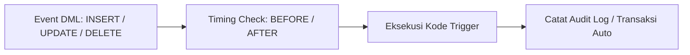

# 11. SQL Stored Function, Trigger, dan Data Control Language (DCL)

Navigasi: Modul Sebelumnya: [[10_SQL_TCL_dan_Transaksi]] | [[Konsep_Basis_Data]]

---

## 11.1. Stored Function dan Stored Procedure

**Stored Function / Procedure** adalah kumpulan perintah SQL terkompilasi yang disimpan di server basis data dan dapat dipanggil berulang kali (*reusable*).

### A. Stored Function
Mengembalikan **satu nilai tunggal** (*return value*) dan dapat dipanggil langsung di dalam query `SELECT`.

```sql
-- Membuat Function Hitung Diskon
DELIMITER //
CREATE FUNCTION HitungDiskon(harga DECIMAL(10,2), persen INT) 
RETURNS DECIMAL(10,2)
DETERMINISTIC
BEGIN
    RETURN harga - (harga * (persen / 100));
END //
DELIMITER ;

-- Pemanggilan dalam Query SELECT
SELECT Nama_Produk, Harga, HitungDiskon(Harga, 10) AS Harga_Diskon 
FROM Produk;
```

---

## 11.2. Database Triggers

**Trigger** adalah blok kode SQL yang dieksekusi secara otomatis (*fired*) oleh DBMS sebagai respon terhadap kejadian (*event*) DML tertentu (`INSERT`, `UPDATE`, atau `DELETE`) pada tabel tertentu.



### Kegunaan Utama Trigger:
1. **Audit Logging**: Mencatat riwayat pembaruan atau penghapusan data (siapa yang mengubah data dan kapan).
2. **Validasi Aturan Bisnis**: Membatalkan transaksi jika tidak memenuhi batasan khusus.
3. **Pembaruan Otomatis**: Otomatis mengurangi jumlah stok barang saat tabel `Penjualan` diisi.

```sql
-- Contoh Trigger: Mencatat Log Penghapusan Mahasiswa
CREATE TRIGGER AuditHapusMahasiswa
AFTER DELETE ON Mahasiswa
FOR EACH ROW
BEGIN
    INSERT INTO Log_Audit (Aksi, NIM_Dihapus, Waktu)
    VALUES ('DELETE', OLD.NIM, NOW());
END;
```

---

## 11.3. Data Control Language (DCL)

DCL digunakan oleh Database Administrator (DBA) untuk mengelola hak akses pengguna dan menjaga keamanan data.

```sql
-- 1. Membuat Pengguna Baru
CREATE USER 'staf_kasir'@'localhost' IDENTIFIED BY 'Password123!';

-- 2. Memberikan Hak Akses (GRANT)
GRANT SELECT, INSERT ON TokoDB.Penjualan TO 'staf_kasir'@'localhost';

-- 3. Memperbarui Hak Akses Server
FLUSH PRIVILEGES;

-- 4. Mencabut Hak Akses (REVOKE)
REVOKE INSERT ON TokoDB.Penjualan FROM 'staf_kasir'@'localhost';
```

---

Navigasi: Modul Sebelumnya: [[10_SQL_TCL_dan_Transaksi]] | [[Konsep_Basis_Data]]
