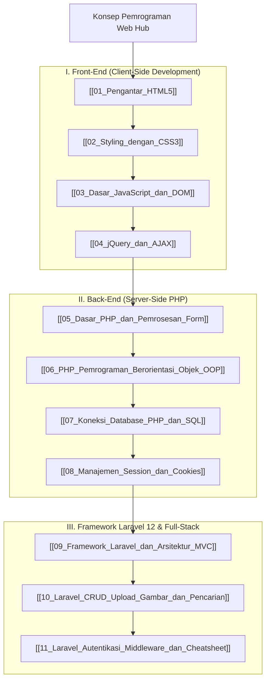

# Panduan Komprehensif Konsep Pemrograman Web (Web Development Hub)

Dokumen ini merupakan berkas utama (*Knowledge Hub*) yang memetakan seluruh modul pembelajaran **Pemrograman Web** (Client-Side & Server-Side Web Development). Seluruh materi disusun secara sistematis dan dikorelasikan dengan [[Konsep_Pemrograman_Python_Java]], [[Konsep_Struktur_Data_dan_Algoritma]], serta [[Konsep_Basis_Data]].

> [!NOTE]
> Seluruh modul pada hub ini saling terhubung secara dua arah (*bidirectional links*) menggunakan Obsidian Wiki-Links `[[...]]`. Seluruh berkas dari `vault-teman` **dikecualikan 100%**.

---

## 🗺️ Peta Pembelajaran Pemrograman Web (Mindmap)

---

## 📚 Daftar Lengkap Modul Pembelajaran Pemrograman Web

### Part I: Front-End Development (Client-Side)
1. **[[01_Pengantar_HTML5]]**: Struktur dasar dokumen HTML5, elemen semantik (`<header>`, `<nav>`, `<main>`, `<article>`), form & tipe input modern, serta tag multimedia (`<video>` & `<audio>`).
2. **[[02_Styling_dengan_CSS3]]**: Tiga metode CSS, selektor CSS, konsep Box Model (`margin`, `border`, `padding`), sistem layout modern Flexbox & Grid, dan Responsive Web Design (Media Queries).
3. **[[03_Dasar_JavaScript_dan_DOM]]**: Variabel ES6 (`const`, `let`), tipe data, fungsi & arrow function, manipulasi DOM (`querySelector`, `classList`), dan Event Listener.
4. **[[04_jQuery_dan_AJAX]]**: Library jQuery, pemrosesan asinkronus AJAX, metode `$.ajax()`, Fetch API modern (`async / await`), dan pertukaran data JSON tanpa page reload.

### Part II: Back-End Development (Server-Side PHP)
5. **[[05_Dasar_PHP_dan_Pemrosesan_Form]]**: Server-side scripting PHP, variabel superglobal (`$_GET`, `$_POST`), pemrosesan form GET vs POST, validasi input & sanitasi pencegahan XSS.
6. **[[06_PHP_Pemrograman_Berorientasi_Objek_OOP]]**: Class, Object, Constructor, Access Modifiers (`public`, `protected`, `private`), Inheritance (`extends`), Interface, dan Traits.
7. **[[07_Koneksi_Database_PHP_dan_SQL]]**: Integrasi PHP ke MySQL via PDO (PHP Data Objects), pencegahan kerentanan **SQL Injection** menggunakan *Prepared Statements*, dan operasi CRUD lengkap.
8. **[[08_Manajemen_Session_dan_Cookies]]**: State management HTTP stateless, Cookie (`setcookie()`), Session (`session_start()`), skenario Login/Auth Guard, Logout, serta keamanan CSRF & Session Hijacking.

### Part III: Framework Laravel 12 & Full-Stack Development
9. **[[09_Framework_Laravel_dan_Arsitektur_MVC]]**: Instalasi Laravel 12, arsitektur MVC, Artisan CLI, Routing (`web.php`), Controller, Blade Templating Engine, Migration, dan Eloquent ORM.
10. **[[10_Laravel_CRUD_Upload_Gambar_dan_Pencarian]]**: Tutorial praktis langkah-demi-langkah membangun aplikasi Student Management: Model & Migration, Form Upload Gambar (`$request->file->move()`), Fitur Pencarian (`where` & `orWhere`), Edit, dan Delete.
11. **[[11_Laravel_Autentikasi_Middleware_dan_Cheatsheet]]**: Auth Scaffolding (Breeze & Jetstream Livewire), Middleware & Guard (`auth`), Relasi Eloquent (`hasMany`, `belongsTo`), dan Artisan CLI Cheatsheet Lengkap.

---

## 🔗 Hubungan Antar Berkas Catatan Utama

- 🔗 **[[Konsep_Basis_Data]]**: Menjelaskan teori pemodelan relasional, normalisasi, dan kueri SQL yang dieksekusi oleh layer database pada aplikasi web (PDO / Eloquent).
- 🔗 **[[Konsep_Pemrograman_Python_Java]]**: Referensi komparatif paradigma pemrograman (OOP, variabel, control flow) yang dipraktikkan pada sisi backend (PHP & JavaScript).
- 🔗 **[[Konsep_Struktur_Data_dan_Algoritma]]**: Landasan efisiensi algoritma pemrosesan data (array manipulation, JSON parsing, sorting) pada sisi client/server.

---
*Hub catatan ini dapat dipelajari secara bertahap melalui navigasi tautan `[[...]]` pada setiap modul.*
