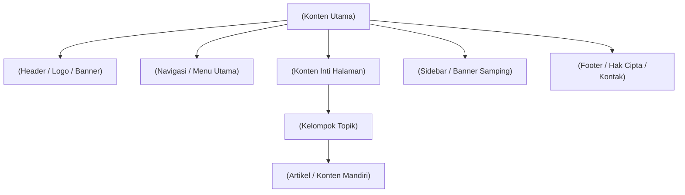

# 1. Pengantar HTML5 (Hypertext Markup Language)

Navigasi: [[Konsep_Pemrograman_Web]] | Modul Berikutnya: [[02_Styling_dengan_CSS3]]

---

**HTML (Hypertext Markup Language)** adalah bahasa pemrogram penanda (*markup language*) standar yang digunakan untuk membuat dan menyusun struktur halaman web yang ditampilkan pada peramban (*web browser*).

---

## 1.1. Struktur Dasar Dokumen HTML5

Setiap dokumen HTML5 dibangun atas elemen-elemen hierarki dasar sebagai berikut:

```html
<!DOCTYPE html>
<html lang="id">
<head>
    <meta charset="UTF-8">
    <meta name="viewport" content="width=device-width, initial-scale=1.0">
    <title>Judul Halaman Web</title>
</head>
<body>
    <h1>Selamat Datang di Pemrograman Web</h1>
    <p>Ini adalah paragraf pertama dalam halaman web.</p>
</body>
</html>
```

### Rincian Tag Utama:
- **`<!DOCTYPE html>`**: Deklarasi tipe dokumen untuk memberi tahu browser bahwa dokumen menggunakan standar HTML5.
- **`<html>`**: Elemen akar (*root element*) yang membungkus seluruh konten web.
- **`<head>`**: Bagian dokumen yang memuat metadata, judul peramban, serta tautan ke berkas CSS dan JavaScript (tidak tampil langsung di halaman utama).
- **`<body>`**: Bagian dokumen yang memuat seluruh konten visual yang dilihat pengguna (teks, gambar, tabel, form, video).

---

## 1.2. Elemen Semantik HTML5

HTML5 memprioritaskan penggunaan **Elemen Semantik** (*Semantic Elements*), yaitu tag yang dengan jelas menggambarkan makna dan struktur kontennya baik kepada peramban maupun mesin pencari (SEO).



| Tag Semantik | Deskripsi dan Penggunaan |
| :--- | :--- |
| **`<header>`** | Bagian kepala halaman, biasanya memuat judul situs, logo, atau bilah pencarian. |
| **`<nav>`** | Bagian yang membungkus tautan navigasi utama (*menu bar*). |
| **`<main>`** | Membungkus konten unik utama dari dokumen (hanya ada satu `<main>` per halaman). |
| **`<article>`** | Konten mandiri yang dapat didistribusikan secara independen (misal: postingan blog, berita). |
| **`<section>`** | Pengelompokan bagian dokumen berdasarkan topik tertentu. |
| **`<aside>`** | Konten sampingan seperti *sidebar*, daftar tautan terkait, atau iklan. |
| **`<footer>`** | Catatan kaki halaman yang memuat informasi hak cipta, penulis, atau tautan hukum. |

---

## 1.3. Elemen Form dan Tipe Input

Formulir (*Form*) digunakan untuk menerima masukan data dari pengguna (seperti pendaftaran, login, atau pencarian).

```html
<form action="proses.php" method="POST">
    <label for="nama">Nama Lengkap:</label>
    <input type="text" id="nama" name="nama" required placeholder="Masukkan nama...">

    <label for="email">Alamat Email:</label>
    <input type="email" id="email" name="email" required>

    <label for="kategori">Pilihan Kategori:</label>
    <select id="kategori" name="kategori">
        <option value="umum">Umum</option>
        <option value="mahasiswa">Mahasiswa</option>
    </select>

    <button type="submit">Kirim Data</button>
</form>
```

### Tipe Input Modern HTML5:
- **`text`**: Masukan teks satu baris biasa.
- **`password`**: Masukan kata sandi (karakter disembunyikan dalam bentuk titik).
- **`email`**: Memvalidasi format alamat email secara otomatis.
- **`number`**: Membatasi masukan hanya angka dengan opsi min/max.
- **`date`**: Menampilkan kalender pemilih tanggal (*date picker*).
- **`file`**: Pengunggahan berkas dari komputer pengguna.

---

## 1.4. Elemen Multimedia (Audio & Video)

HTML5 menyediakan dukungan pemutaran multimedia secara bawaan tanpa memerlukan plugin tambahan:

```html
<!-- Pemutar Video -->
<video width="640" height="360" controls poster="sampul.jpg">
    <source src="video.mp4" type="video/mp4">
    Peramban Anda tidak mendukung elemen video.
</video>

<!-- Pemutar Audio -->
<audio controls autoplay loop>
    <source src="musik.mp3" type="audio/mpeg">
    Peramban Anda tidak mendukung elemen audio.
</audio>
```

---

Navigasi: [[Konsep_Pemrograman_Web]] | Modul Berikutnya: [[02_Styling_dengan_CSS3]]
