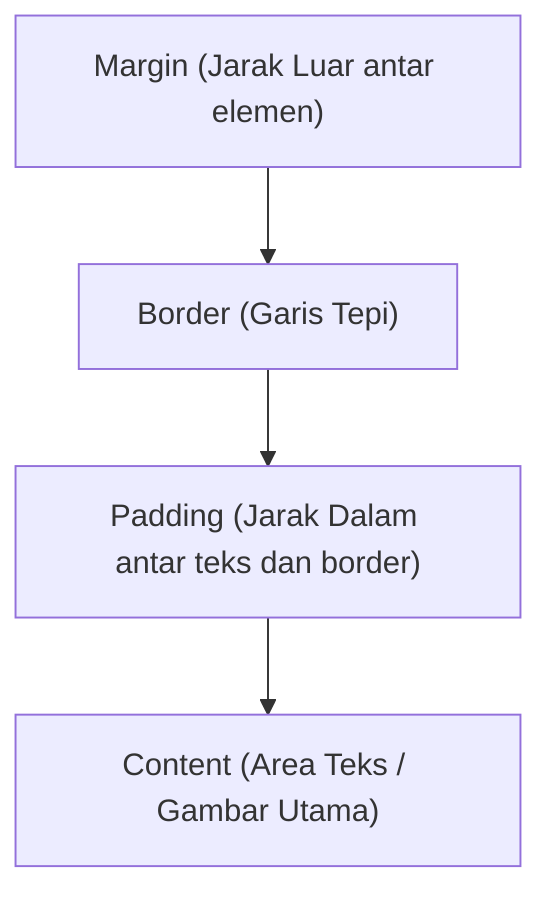

# 2. Styling Halaman Web dengan CSS3 (Cascading Style Sheets)

Navigasi: Modul Sebelumnya: [[01_Pengantar_HTML5]] | [[Konsep_Pemrograman_Web]] | Modul Berikutnya: [[03_Dasar_JavaScript_dan_DOM]]

---

**CSS (Cascading Style Sheets)** adalah bahasa aturan gaya yang digunakan untuk mengatur tampilan visual, tata letak (*layout*), warna, font, dan pemformatan elemen HTML pada halaman web.

---

## 2.1. Tiga Cara Menerapkan CSS

1. **Inline CSS**: Ditulis langsung di dalam atribut `style` pada tag HTML. (Kurang disarankan untuk tata kelola skala besar).
   ```html
   <h1 style="color: blue; font-size: 24px;">Judul Halaman</h1>
   ```
2. **Internal CSS**: Ditulis di dalam tag `<style>` pada bagian `<head>` dokumen HTML.
   ```html
   <style>
       p { color: #333; line-height: 1.6; }
   </style>
   ```
3. **External CSS (Disarankan)**: Ditulis di dalam berkas terpisah ber-ekstensi `.css` dan dihubungkan via tag `<link>`.
   ```html
   <link rel="stylesheet" href="style.css">
   ```

---

## 2.2. Selektor CSS (CSS Selectors)

Selektor menentukan elemen HTML mana yang akan diberi gaya visual.

```css
/* 1. Selektor Elemen / Tag */
p {
    font-family: Arial, sans-serif;
}

/* 2. Selektor Kelas (Class Selector) - Diawali titik (.) */
.kartu-produk {
    background-color: #ffffff;
    border-radius: 8px;
    padding: 16px;
}

/* 3. Selektor ID (ID Selector) - Diawali tagar (#) */
#tombol-utama {
    background-color: #007bff;
    color: white;
}

/* 4. Pseudo-Class (Kondisi Khusus Elemen) */
.btn:hover {
    background-color: #0056b3;
    cursor: pointer;
}
```

---

## 2.3. Konsep CSS Box Model

Setiap elemen HTML dianggap sebagai kotak (*box*) oleh peramban. **Box Model** terdiri dari 4 lapisan:



```css
/* Mengatur Box Model agar perhitungan lebar lebih presisi */
* {
    box-sizing: border-box;
    margin: 0;
    padding: 0;
}

.kotak {
    width: 300px;
    padding: 20px;
    border: 2px solid #ccc;
    margin: 15px;
}
```

---

## 2.4. Sistem Layout Modern: Flexbox dan Grid

### A. CSS Flexbox (Satu Dimensi - Baris atau Kolom)
Sangat efisien untuk menyelaraskan elemen secara horizontal atau vertikal dalam satu arah.

```css
.container-flex {
    display: flex;
    justify-content: space-between; /* Pengaturan jarak horizontal */
    align-items: center;            /* Pengaturan perataan vertikal */
    flex-direction: row;            /* Arah elemen (row / column) */
}
```

### B. CSS Grid (Dua Dimensi - Baris dan Kolom Sekaligus)
Digunakan untuk membangun tata letak halaman yang kompleks berbasis kisi-kisi (*grid*).

```css
.container-grid {
    display: grid;
    grid-template-columns: repeat(3, 1fr); /* 3 Kolom sama lebar */
    gap: 20px;                            /* Jarak antar sel grid */
}
```

---

## 2.5. Responsive Web Design dengan Media Queries

**Media Queries** memungkinkan tampilan web menyesuaikan secara otomatis berdasarkan ukuran layar perangkat (*Desktop*, *Tablet*, atau *Smartphone*).

```css
/* Gaya Tampilan Standar Desktop */
.sidebar {
    width: 30%;
    float: left;
}

/* Gaya Tampilan Perangkat Ponsel (Lebar Layar <= 768px) */
@media (max-width: 768px) {
    .sidebar {
        width: 100%;
        float: none;
    }
}
```

---

Navigasi: Modul Sebelumnya: [[01_Pengantar_HTML5]] | [[Konsep_Pemrograman_Web]] | Modul Berikutnya: [[03_Dasar_JavaScript_dan_DOM]]
