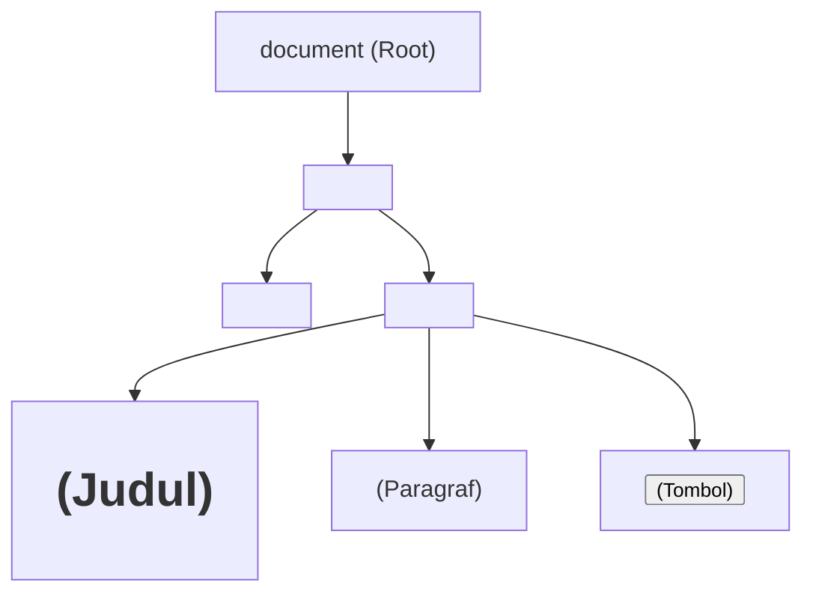

# 3. Dasar JavaScript dan Manipulasi DOM (Document Object Model)

Navigasi: Modul Sebelumnya: [[02_Styling_dengan_CSS3]] | [[Konsep_Pemrograman_Web]] | Modul Berikutnya: [[04_jQuery_dan_AJAX]]

---

**JavaScript (JS)** adalah bahasa pemrograman tingkat tinggi, terinterpretasi, dan dinamis yang digunakan untuk memberikan interaktivitas, logika, dan pemrosesan dinamis pada sisi klien (*client-side web development*).

---

## 3.1. Variabel dan Tipe Data Modern (ES6+)

JavaScript modern menggunakan `let` dan `const` untuk mendeklarasikan variabel ber-cakupan blok (*block scope*):

```javascript
// 1. const: Untuk nilai konstan yang tidak boleh diubah nilainya
const API_URL = "https://api.example.com/v1";

// 2. let: Untuk variabel yang nilainya dapat diperbarui
let skor = 100;
skor += 50;

// 3. Tipe Data Dasar
let nama = "Budi";           // String
let umur = 20;               // Number
let isAktif = true;          // Boolean
let daftarHobi = ["Membaca", "Coding"]; // Array
let profil = { nim: "123", jurusan: "Informatika" }; // Object
```

---

## 3.2. Fungsi dan Arrow Function (ES6)

Fungsi digunakan untuk membungkus blok kode agar dapat dipanggil kembali (*reusable*):

```javascript
// 1. Deklarasi Fungsi Tradisional
function hitungTotal(harga, jumlah) {
    return harga * jumlah;
}

// 2. Arrow Function (Sintaks Modern Singkat)
const hitungTotalModern = (harga, jumlah) => harga * jumlah;

console.log(hitungTotalModern(15000, 3)); // Output: 45000
```

---

## 3.3. Manipulasi DOM (Document Object Model)

**Document Object Model (DOM)** adalah antarmuka pemrograman yang merepresentasikan struktur dokumen HTML sebagai pohon objek (*tree of nodes*). JavaScript dapat mengubah teks, gaya CSS, maupun struktur elemen HTML secara dinamis.



### 🛠️ Metode Seleksi dan Manipulasi Elemen:

```javascript
// 1. Mengambil Elemen dari HTML
const judul = document.querySelector("#judul-utama");
const tombol = document.querySelector(".btn-submit");

// 2. Mengubah Isi Teks atau HTML
judul.textContent = "Judul Baru Dihasilkan oleh JS";

// 3. Mengubah Gaya CSS
judul.style.color = "red";
judul.style.fontSize = "32px";

// 4. Memanipulasi Kelas CSS
judul.classList.add("aktif");
judul.classList.remove("tersembunyi");
```

---

## 3.4. Penanganan Kejadian (Event Handling)

JavaScript merespon tindakan pengguna (seperti klik tombol, pengetikan keyboard, atau pengiriman form) menggunakan **Event Listener**.

```html
<button id="tombol-sapa">Sapa Pengguna</button>
<p id="pesan-sapaan"></p>

<script>
    const btn = document.querySelector("#tombol-sapa");
    const output = document.querySelector("#pesan-sapaan");

    // Menambahkan Event Listener 'click'
    btn.addEventListener("click", function() {
        output.textContent = "Halo! Selamat belajar JavaScript.";
        output.style.color = "green";
    });
</script>
```

### Event Populer pada Browser:
- **`click`**: Dikirim saat elemen diklik.
- **`submit`**: Dikirim saat formulir dikirimkan.
- **`keyup` / `keydown`**: Dikirim saat tombol keyboard ditekan/dilepas.
- **`change`**: Dikirim saat nilai elemen masukan (`<select>` / `<input>`) berubah.

---

Navigasi: Modul Sebelumnya: [[02_Styling_dengan_CSS3]] | [[Konsep_Pemrograman_Web]] | Modul Berikutnya: [[04_jQuery_dan_AJAX]]
