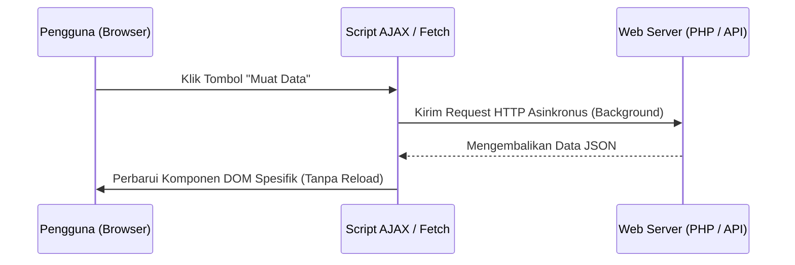

# 4. Library jQuery dan Pemrosesan Asinkronus (AJAX)

Navigasi: Modul Sebelumnya: [[03_Dasar_JavaScript_dan_DOM]] | [[Konsep_Pemrograman_Web]] | Modul Berikutnya: [[05_Dasar_PHP_dan_Pemrosesan_Form]]

---

## 4.1. Library jQuery

**jQuery** adalah pustaka JavaScript yang dirancang dengan filosofi *"Write Less, Do More"*. jQuery mempermudah manipulasi DOM, penanganan event, animasi, dan pemanggilan AJAX lintas peramban (*cross-browser compatibility*).

```javascript
// Perbandingan Sintaksis: Vanilla JS vs jQuery

// 1. Vanilla JavaScript
document.querySelector("#tombol").addEventListener("click", function() {
    document.querySelector(".teks").style.display = "none";
});

// 2. jQuery (Lebih Ringkas)
$("#tombol").click(function() {
    $(".teks").hide();
});
```

### Operasi DOM Populer dengan jQuery:
- **`$("#id")` / `$(".kelas")`**: Memilih elemen berdasarkan selektor CSS.
- **`.text("Isi")` / `.html("<b>Isi</b>")`**: Mengubah isi teks atau markup HTML.
- **`.val()`**: Mengambil atau mengubah nilai elemen formulir.
- **`.css("color", "red")`**: Mengubah properti gaya CSS.

---

## 4.2. Pengantar AJAX (Asynchronous JavaScript and XML)

**AJAX** adalah teknik pengembangan web yang memungkinkan peramban berkomunikasi dengan server web (mengirim dan menerima data) secara **Asinkronus** di latar belakang **tanpa perlu memuat ulang seluruh halaman web (*page refresh*)**.



---

## 4.3. Implementasi AJAX dengan jQuery `$.ajax()`

```javascript
$.ajax({
    url: "get_user_data.php",    // URL endpoint server
    type: "GET",                 // Metode HTTP (GET / POST)
    dataType: "json",            // Format data yang diharapkan
    data: { id: 101 },           // Parameter masukan
    success: function(response) {
        // Eksekusi jika request berhasil
        $("#nama-user").text(response.nama);
        $("#email-user").text(response.email);
    },
    error: function(xhr, status, error) {
        // Eksekusi jika terjadi kesalahan
        console.error("Terjadi Kesalahan AJAX:", error);
    }
});
```

---

## 4.4. Modern JavaScript Fetch API (`async / await`)

Dalam JavaScript modern (ES6+), pemrosesan asinkronus telah memiliki API bawaan bernama **Fetch API** menggunakan pola `async / await` yang lebih bersih tanpa ketergantungan pada jQuery:

```javascript
// Fungsi Asinkronus Pengambilan Data API
async function ambilDataMahasiswa() {
    try {
        const response = await fetch("https://api.example.com/mahasiswa/101");
        
        if (!response.ok) {
            throw new Error("HTTP Error! Status: " + response.status);
        }
        
        const data = await response.json();
        console.log("Data Diterima:", data);
        
        // Perbarui DOM
        document.querySelector("#nama-user").textContent = data.nama;
    } catch (error) {
        console.error("Gagal Mengambil Data:", error);
    }
}

// Pemanggilan Fungsi
ambilDataMahasiswa();
```

---

Navigasi: Modul Sebelumnya: [[03_Dasar_JavaScript_dan_DOM]] | [[Konsep_Pemrograman_Web]] | Modul Berikutnya: [[05_Dasar_PHP_dan_Pemrosesan_Form]]
