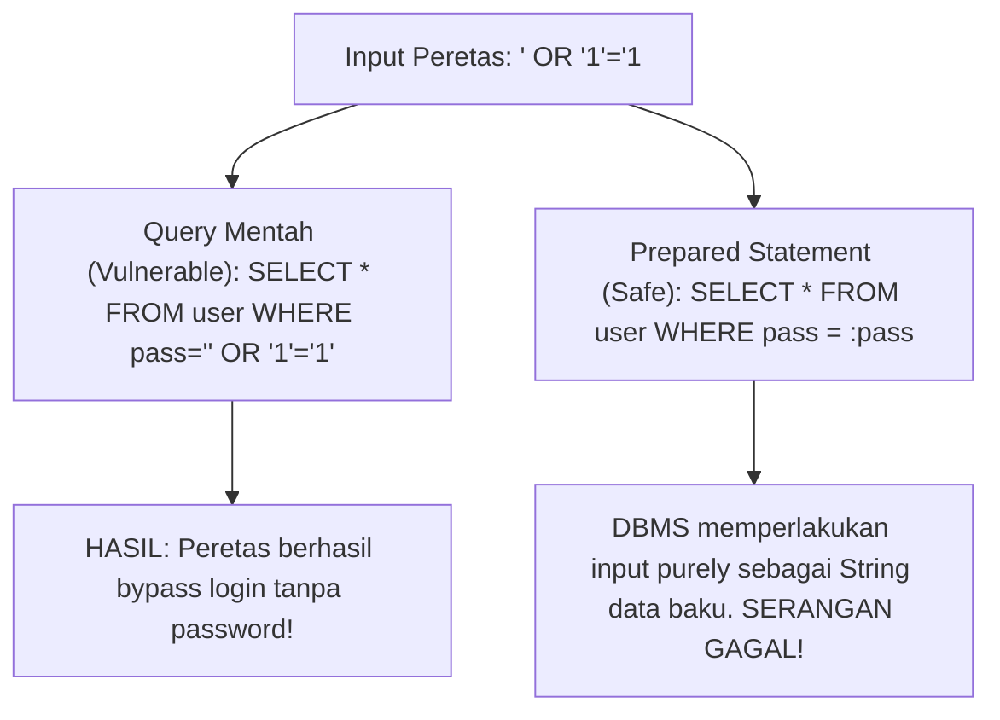

# 7. Koneksi Database PHP dan Pemrosesan SQL (PDO & Prepared Statements)

Navigasi: Modul Sebelumnya: [[06_PHP_Pemrograman_Berorientasi_Objek_OOP]] | [[Konsep_Pemrograman_Web]] | Modul Berikutnya: [[08_Manajemen_Session_dan_Cookies]]

---

Untuk membuat aplikasi web dinamis, PHP harus terhubung ke sistem basis data (seperti MySQL/PostgreSQL) untuk melakukan operasi **CRUD** (Create, Read, Update, Delete).

---

## 7.1. Mengapa Menggunakan PDO (PHP Data Objects)?

PHP menyediakan dua cara utama terhubung ke MySQL: **MySQLi** dan **PDO (PHP Data Objects)**. 

### Keunggulan PDO dibanding MySQLi:
1. **Multi-Database Support**: PDO mendukung 12 jenis sistem basis data berbeda (MySQL, PostgreSQL, SQLite, Oracle, SQL Server), sehingga mempermudah jika terjadi migrasi database.
2. **Keamanan Bawaan**: PDO mempermudah penggunaan **Prepared Statements** untuk mencegah bahaya kerentanan **SQL Injection**.
3. **Penanganan Eror Bertipe Exception**: Memudahkan debugging dengan penyaringan `try-catch` berbasis `PDOException`.

---

## 7.2. Membuka Koneksi Database dengan PDO

```php
<?php
$host = "localhost";
$db   = "db_akademik";
$user = "root";
$pass = "";
$charset = "utf8mb4";

$dsn = "mysql:host=$host;dbname=$db;charset=$charset";
$options = [
    PDO::ATTR_ERRMODE            => PDO::ERRMODE_EXCEPTION, // Lempar Exception jika ada eror SQL
    PDO::ATTR_DEFAULT_FETCH_MODE => PDO::FETCH_ASSOC,       // Format data kembalian berupa Array Asosiatif
    PDO::ATTR_EMULATE_PREPARES   => false,                  // Matikan emulasi untukPrepared Statement sejati
];

try {
    $pdo = new PDO($dsn, $user, $pass, $options);
    // Koneksi Berhasil
} catch (\PDOException $e) {
    die("Koneksi Database Gagal: " . $e->getMessage());
}
?>
```

---

## 7.3. Pencegahan SQL Injection dengan Prepared Statements

**SQL Injection** adalah serangan keamanan di mana peretas menyisipkan perintah kueri SQL berbahaya melalui input form untuk merusak atau mencuri isi database.



---

## 7.4. Operasi CRUD Lengkap dengan Prepared Statements

### A. Read (Membaca Data dengan `SELECT`)

```php
// Menggunakan Named Placeholders (:nim)
$stmt = $pdo->prepare("SELECT * FROM Mahasiswa WHERE Kode_Prodi = :prodi AND IPK >= :ipk");
$stmt->execute([
    'prodi' => 101,
    'ipk'   => 3.50
]);

$daftar_mahasiswa = $stmt->fetchAll(); // Mengambil seluruh baris

foreach ($daftar_mahasiswa as $mhs) {
    echo "NIM: " . $mhs['NIM'] . " - Nama: " . $mhs['Nama'] . "<br>";
}
```

### B. Create (Menambah Data dengan `INSERT`)

```php
$sql = "INSERT INTO Mahasiswa (NIM, Nama, Email, IPK, Kode_Prodi) 
        VALUES (:nim, :nama, :email, :ipk, :prodi)";
$stmt = $pdo->prepare($sql);

$status = $stmt->execute([
    'nim'   => 'M0520099',
    'nama'  => 'Rudi Hermawan',
    'email' => 'rudi@mail.com',
    'ipk'   => 3.65,
    'prodi' => 101
]);

if ($status) {
    echo "Data berhasil ditambahkan! ID Auto-Increment: " . $pdo->lastInsertId();
}
```

### C. Update (Mengubah Data)

```php
$sql = "UPDATE Mahasiswa SET IPK = :ipk WHERE NIM = :nim";
$stmt = $pdo->prepare($sql);
$stmt->execute(['ipk' => 3.80, 'nim' => 'M0520099']);

echo "Jumlah baris diperbarui: " . $stmt->rowCount();
```

### D. Delete (Menghapus Data)

```php
$sql = "DELETE FROM Mahasiswa WHERE NIM = :nim";
$stmt = $pdo->prepare($sql);
$stmt->execute(['nim' => 'M0520099']);
```

---

Navigasi: Modul Sebelumnya: [[06_PHP_Pemrograman_Berorientasi_Objek_OOP]] | [[Konsep_Pemrograman_Web]] | Modul Berikutnya: [[08_Manajemen_Session_dan_Cookies]]
