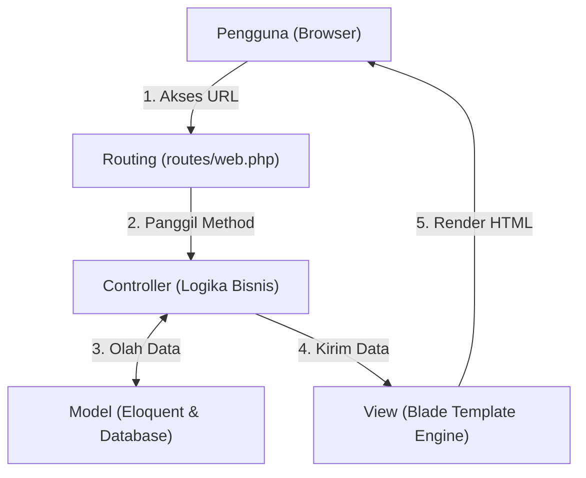

# 9. Framework Laravel 12 dan Arsitektur Model-View-Controller (MVC)

Navigasi: Modul Sebelumnya: [[08_Manajemen_Session_dan_Cookies]] | [[Konsep_Pemrograman_Web]] | Modul Berikutnya: [[10_Laravel_CRUD_Upload_Gambar_dan_Pencarian]]

---

**Laravel** adalah framework aplikasi web berbasis PHP yang paling populer di dunia. Laravel mengusung filosofi *expressive and elegant syntax* yang mempermudah pengembang dalam membangun aplikasi web modern, aman, dan berskala besar.

---

## 9.1. Mengapa Menggunakan Laravel?

1. **Sintaksis Ekspresif & Rapi**: Menulis kode web menjadi lebih intuitif dan terstruktur.
2. **Arsitektur MVC (Model-View-Controller)**: Memisahkan logika bisnis, antarmuka tampilan, dan struktur data secara bersih.
3. **Ekosistem Lengkap & Modern**: Menyediakan fitur bawaan seperti *Routing*, *ORM Eloquent*, *Migration*, *Templating Blade*, *Middleware*, dan *Authentication Scaffolding*.
4. **Keamanan Bawaan**: Otomatis melindungi aplikasi dari ancaman kerentanan web seperti **SQL Injection** (via Eloquent), **CSRF** (via Token `@csrf`), dan **XSS** (via Blade escaping `{{ }}`).

---

## 9.2. Persyaratan Sistem dan Instalasi Laravel 12

Sebelum membuat project Laravel, pastikan komputer Anda telah terinstal **PHP 8.2+**, **Composer** (package manager PHP), serta **Node.js & NPM** (untuk kompilasi asset frontend).

### 🛠️ Langkah Membuat Project Baru:

```bash
# 1. Membuat project Laravel versi 12 stabil terbaru via Composer
composer create-project laravel/laravel example-app

# 2. Masuk ke direktori project
cd example-app

# 3. Memeriksa versi Laravel yang terpasang
php artisan --version

# 4. Menjalankan local development server Laravel
php artisan serve
```
*Aplikasi web dapat diakses melalui browser pada alamat:* `http://localhost:8000`

### ⚙️ Perintah Manajemen Server Artisan:
- **`php artisan down`**: Mengaktifkan mode pemeliharaan (*Under Maintenance*). Pengunjung akan melihat halaman pemeliharaan sementara.
- **`php artisan up`**: Mengembalikan aplikasi web ke status aktif normal (*online*).

---

## 9.3. Struktur Folder Utama Laravel

```text
example-app/
├── app/
│   ├── Http/
│   │   ├── Controllers/     <-- Tempat menyimpan logika controller aplikasi
│   │   └── Middleware/      <-- Penyaring HTTP request
│   └── Models/              <-- Tempat menyimpan kelas Model (Eloquent)
├── config/                  <-- Berkas konfigurasi aplikasi (database, app, mail)
├── database/
│   ├── migrations/          <-- Berkas pembuatan skema tabel database
│   └── seeders/             <-- Berkas pengisi data awal (dummy data)
├── public/                  <-- Root web (berkas index.php, CSS, JS, Gambar publik)
├── resources/
│   └── views/               <-- Berkas tampilan antarmuka (Blade Template .blade.php)
├── routes/
│   └── web.php              <-- Berkas pendaftaran rute URL aplikasi web
└── .env                     <-- Berkas konfigurasi variabel lingkungan (Koneksi DB)
```

---

## 9.4. Arsitektur Model-View-Controller (MVC)

Laravel menerapkan pola arsitektur **MVC** untuk memisahkan komponen aplikasi:



1. **Model (`app/Models/`)**: Mengelola interaksi dengan database, definisi tabel, dan aturan relasi data.
2. **View (`resources/views/`)**: Mengatur tampilan antarmuka HTML yang disajikan ke pengguna.
3. **Controller (`app/Http/Controllers/`)**: Menghubungkan Model dan View, memproses input form, serta mengelola logika bisnis aplikasi.

---

## 9.5. Routing (Penentuan Rute URL)

Seluruh rute aplikasi web didaftarkan di dalam berkas **`routes/web.php`**.

```php
<?php
use Illuminate\Support\Facades\Route;
use App\Http\Controllers\HomeController;
use App\Http\Controllers\ProdukController;

// 1. Route Sederhana Mengembalikan Teks / View
Route::get('/', function () {
    return view('welcome');
});

// 2. Route dengan Parameter URL
Route::get('/user/{id}', function ($id) {
    return "Profil Pengguna ID: " . $id;
});

// 3. Route Mengarahkan ke Controller Method (Disarankan)
Route::get('/home', [HomeController::class, 'index'])->name('home');

// 4. Resource Route (Otomatis mendaftarkan 7 rute CRUD sekaligus)
Route::resource('produk', ProdukController::class);
?>
```

---

## 9.6. Controller (Pengelola Logika Aplikasi)

Controller dibuat menggunakan perintah **Artisan CLI**:

```bash
# Membuat Controller Kosong
php artisan make:controller HomeController

# Membuat Controller Lengkap dengan 7 Method Resource CRUD
php artisan make:controller ProdukController --resource

# Membuat Controller sekaligus Model & Migration sekaligus
php artisan make:controller ProdukController --resource --model=Produk
```

### Contoh Kode Controller (`app/Http/Controllers/HomeController.php`):

```php
namespace App\Http\Controllers;

use Illuminate\Http\Request;
use App\Models\Student;

class HomeController extends Controller
{
    // Method untuk menampilkan halaman utama
    public function index()
    {
        $data = Student::all(); // Ambil seluruh data dari Model
        return view('home', compact('data')); // Kirim data ke view 'home.blade.php'
    }

    // Method menampilkan detail berdasarkan ID
    public function show($id)
    {
        $student = Student::findOrFail($id);
        return view('detail', compact('student'));
    }
}
```

---

## 9.7. Mesin Template Blade (Blade Templating Engine)

Blade adalah mesin template bawaan Laravel dengan ekstensi berkas `.blade.php`.

### A. Komponen Pewarisan Layout (`resources/views/layouts/app.blade.php`)

```html
<!DOCTYPE html>
<html lang="id">
<head>
    <meta charset="UTF-8">
    <title>@yield('title', 'Aplikasi Laravel')</title>
</head>
<body>
    <nav>
        <a href="{{ route('home') }}">Home</a>
    </nav>

    <div class="container">
        @yield('content') {{-- Tempat menyisipkan konten spesifik --}}
    </div>
</body>
</html>
```

### B. View Anak (`resources/views/home.blade.php`)

```html
@extends('layouts.app')

@section('title', 'Halaman Utama')

@section('content')
    <h1>Daftar Siswa</h1>

    {{-- Sintaks Direktif Blade --}}
    @if(session('success'))
        <div class="alert alert-success">
            {{ session('success') }}
        </div>
    @endif

    <ul>
    @forelse($data as $student)
        <li>{{ $student->name }} - {{ $student->email }}</li>
    @empty
        <li>Belum ada data siswa.</li>
    @endforelse
    </ul>
@endsection
```

---

Navigasi: Modul Sebelumnya: [[08_Manajemen_Session_dan_Cookies]] | [[Konsep_Pemrograman_Web]] | Modul Berikutnya: [[10_Laravel_CRUD_Upload_Gambar_dan_Pencarian]]
