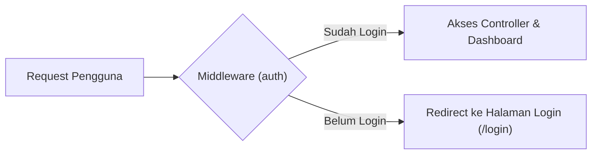

# 11. Laravel Autentikasi, Middleware, Relasi Eloquent, dan Cheatsheet Lengkap

Navigasi: Modul Sebelumnya: [[10_Laravel_CRUD_Upload_Gambar_dan_Pencarian]] | [[Konsep_Pemrograman_Web]]

---

## 11.1. Perancah Autentikasi (Authentication Scaffolding)

Laravel menyediakan perancah autentikasi bawaan yang siap pakai (seperti **Laravel Jetstream** atau **Laravel Breeze**) untuk mengimplementasikan fitur Pendaftaran User (*Registration*), Login, Logout, Verifikasi Email, Dua Faktor (2FA), dan Manajemen Sesi.

### 🚀 Penginstalan Jetstream (dengan Livewire):

```bash
# 1. Install package Jetstream via Composer
composer require laravel/jetstream

# 2. Install perancah Jetstream dengan stack Livewire
php artisan jetstream:install livewire

# 3. Install dan kompilasi asset frontend NPM
npm install
npm run dev

# 4. Jalankan migrasi tabel user dan session
php artisan migrate
```

---

## 11.2. Middleware (Penyaring Request HTTP)

**Middleware** bertindak sebagai mekanisme penyaringan *request* HTTP yang mengevaluasi izin akses sebelum permintaan mencapai Controller.



### 💡 Contoh Penggunaan Middleware di Route:

```php
use App\Http\Controllers\DashboardController;

// Rute yang Hanya Diharuskan Bagi Pengguna yang Sudah Login
Route::middleware(['auth'])->group(function () {
    Route::get('/dashboard', [DashboardController::class, 'index'])->name('dashboard');
    Route::get('/settings', [DashboardController::class, 'settings'])->name('settings');
});
```

---

## 11.3. Relasi Data Eloquent ORM

Eloquent mempermudah pengorganisasian hubungan antar tabel relasional menggunakan fungsi PHP:

### 1. One-to-Many (`hasMany` & `belongsTo`)
Satu `Prodi` memiliki banyak `Student`.

```php
// app/Models/Prodi.php
class Prodi extends Model {
    public function students() {
        return $this->hasMany(Student::class);
    }
}

// app/Models/Student.php
class Student extends Model {
    public function prodi() {
        return $this->belongsTo(Prodi::class);
    }
}
```

### 2. Many-to-Many (`belongsToMany`)
Satu `Student` dapat mengambil banyak `MataKuliah`.

```php
// app/Models/Student.php
class Student extends Model {
    public function matakuliahs() {
        return $this->belongsToMany(MataKuliah::class, 'krs');
    }
}
```

---

## 11.4. Cheatsheet Ringkas Artisan CLI Laravel 12

### 🛠️ Perintah Utama & Server:
```bash
# Membuat project Laravel versi stabil terbaru
composer create-project laravel/laravel example-app

# Menjalankan server lokal Laravel (http://localhost:8000)
php artisan serve

# Memeriksa versi Laravel terpasang
php artisan --version

# Aktifkan mode pemeliharaan (Under Maintenance)
php artisan down

# Kembalikan aplikasi ke mode online
php artisan up

# Hapus seluruh cache aplikasi & rute
php artisan optimize:clear
```

### 📦 Perintah Pembuatan Komponen (`make`):
```bash
# Membuat Controller Kosong
php artisan make:controller ProdukController

# Membuat Controller Resource Lengkap + Model + Migration sekaligus
php artisan make:controller ProdukController --resource --model=Produk

# Membuat Model & File Migration
php artisan make:model Student -m

# Membuat Middleware Baru
php artisan make:middleware CheckRole

# Membuat Factory & Seeder Data Dummy
php artisan make:factory StudentFactory
php artisan make:seeder StudentSeeder
```

### 🗄️ Perintah Database Migration & Seeding:
```bash
# Jalankan seluruh migrasi baru
php artisan migrate

# Batalkan migrasi terakhir (Rollback)
php artisan migrate:rollback

# Reset & Eksekusi ulang seluruh migrasi dari awal
php artisan migrate:fresh

# Jalankan seeder pengisi data dummy
php artisan db:seed
```

---

Navigasi: Modul Sebelumnya: [[10_Laravel_CRUD_Upload_Gambar_dan_Pencarian]] | [[Konsep_Pemrograman_Web]]
