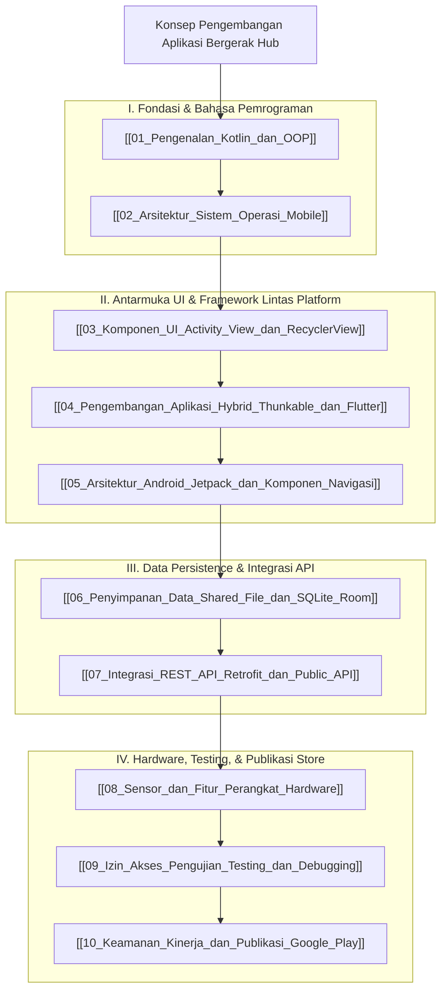

# Panduan Komprehensif Konsep Pengembangan Aplikasi Bergerak (Mobile App Development Hub)

Dokumen ini merupakan berkas utama (*Knowledge Hub*) yang memetakan seluruh modul pembelajaran **Pengembangan Aplikasi Bergerak (Mobile Application Development)**. Seluruh materi disusun secara sistematis dan dikorelasikan dengan [[04_Pemrograman_Web/Konsep_Pemrograman_Web|Konsep_Pemrograman_Web]], [[03_Basis_Data/Konsep_Basis_Data|Konsep_Basis_Data]], [[01_Konsep_Pemrograman/Konsep_Pemrograman_Python_Java|Konsep_Pemrograman_Python_Java]], serta [[02_Struktur_Data_dan_Algoritma/Konsep_Struktur_Data_dan_Algoritma|Konsep_Struktur_Data_dan_Algoritma]].

> [!NOTE]
> Seluruh modul pada hub ini saling terhubung secara dua arah (*bidirectional links*) menggunakan Obsidian Wiki-Links `[[...]]`. Seluruh berkas dari `vault-teman` **dikecualikan 100%**.

---

## 🗺️ Peta Pembelajaran Pengembangan Aplikasi Bergerak (Mindmap)

---

## 📚 Daftar Lengkap Modul Pembelajaran Mobile App Development

### Part I: Fondasi & Bahasa Pemrograman
1. **[[01_Pengenalan_Kotlin_dan_OOP]]**: Sejarah & keunggulan Kotlin, sintaksis dasar, variabel (`val` vs `var`), **Null Safety** (`?`, `?.`, `?:`), fungsi, serta Pemrograman Berorientasi Objek (Class, Data Class, Inheritance).
2. **[[02_Arsitektur_Sistem_Operasi_Mobile]]**: Perkembangan OS Mobile, 5 lapisan Arsitektur Android (Linux Kernel, HAL, ART/Dalvik, Native Libs, Java API Framework), dan struktur direktori project Android Studio (Manifest & Gradle).

### Part II: Antarmuka UI & Framework Lintas Platform
3. **[[03_Komponen_UI_Activity_View_dan_RecyclerView]]**: Siklus hidup Activity (`onCreate` $\rightarrow$ `onDestroy`), hirarki View & ViewGroup (LinearLayout, ConstraintLayout), serta komponen **RecyclerView** (Adapter, ViewHolder, LayoutManager).
4. **[[04_Pengembangan_Aplikasi_Hybrid_Thunkable_dan_Flutter]]**:
   - Perbandingan Native vs Hybrid vs Web Apps.
   - **No-Code Platform Thunkable (thunkable.com)**: Drag-and-drop UI, visual block logic, dan alur ekspor ke iOS/Android.
   - **Framework Flutter (Dart)**: Filosofi *Everything is a Widget*, `StatelessWidget` vs `StatefulWidget`, dan **contoh kode Flutter lengkap** (`main.dart`, `ListView`, state management).
5. **[[05_Arsitektur_Android_Jetpack_dan_Komponen_Navigasi]]**:
   - Android Jetpack Architecture Components (ViewModel, LiveData, MVVM).
   - **Jetpack Navigation Component**: `NavHostFragment`, `NavController`, `NavGraph`, pengiriman argumen aman dengan **SafeArgs**, dan **Jetpack Compose Navigation**.

### Part III: Data Persistence & Integrasi REST API
6. **[[06_Penyimpanan_Data_Shared_File_dan_SQLite_Room]]**:
   - Opsi penyimpanan data: **SharedPreferences / Jetpack DataStore** (Key-Value), Internal & External File Storage (Scoped Storage).
   - **Database SQLite & Room Persistence Library**: `@Entity`, `@Dao`, `@Database`, dan implementasi database relasional lokal.
7. **[[07_Integrasi_REST_API_Retrofit_dan_Public_API]]**:
   - **Koneksi dengan Pemrograman Web**: Perbandingan konsumsi REST API di Web Front-End (`fetch()` / AJAX di [[04_Pemrograman_Web/Modul_MD/04_jQuery_dan_AJAX|04_jQuery_dan_AJAX]]) vs Mobile Client.
   - **Implementasi Retrofit 2 CRUD Lengkap**: `@GET`, `@POST`, `@PUT`, `@DELETE`, Gson Converter, `ApiService`, Singleton `ApiClient`.
   - **Konsumsi API Publik**: Implementasi kueri publik JSONPlaceholder API.

### Part IV: Hardware, Testing, & Publikasi Store
8. **[[08_Sensor_dan_Fitur_Perangkat_Hardware]]**: 3 kategori sensor Android (Motion, Position, Environment), serta arsitektur `SensorManager`, `SensorEventListener`, dan kode pembacaan Accelerometer.
9. **[[09_Izin_Akses_Pengujian_Testing_dan_Debugging]]**: Normal vs Dangerous Permissions, Runtime Permission Check (Android 6.0+), Debugging (Logcat, Breakpoints, Profiler), serta Testing (Unit Test dengan JUnit & UI Test dengan Espresso).
10. **[[10_Keamanan_Kinerja_dan_Publikasi_Google_Play]]**: Obfuscation kode dengan ProGuard / R8, perbandingan APK vs Android App Bundle (AAB), alur rilis Google Play Console, dan strategi monetisasi (AdMob, In-App Purchases, Subscriptions).

---

## 🔗 Hubungan Antar Berkas Catatan Utama

- 🔗 **[[04_Pemrograman_Web/Konsep_Pemrograman_Web|Konsep_Pemrograman_Web]]**: Menyediakan server backend REST API (Laravel / PHP) yang dikonsumsi oleh aplikasi mobile via Retrofit/HTTP Request.
- 🔗 **[[03_Basis_Data/Konsep_Basis_Data|Konsep_Basis_Data]]**: Teori pemodelan database relasional yang dipraktikkan pada penyusunan Room ORM / SQLite lokal di perangkat mobile.
- 🔗 **[[01_Konsep_Pemrograman/Konsep_Pemrograman_Python_Java|Konsep_Pemrograman_Python_Java]]**: Dasar sintaksis pemrograman berorientasi objek yang menjadi fondasi bahasa Kotlin & Dart.

---
*Hub catatan ini dapat dipelajari secara bertahap melalui navigasi tautan `[[...]]` pada setiap modul.*
