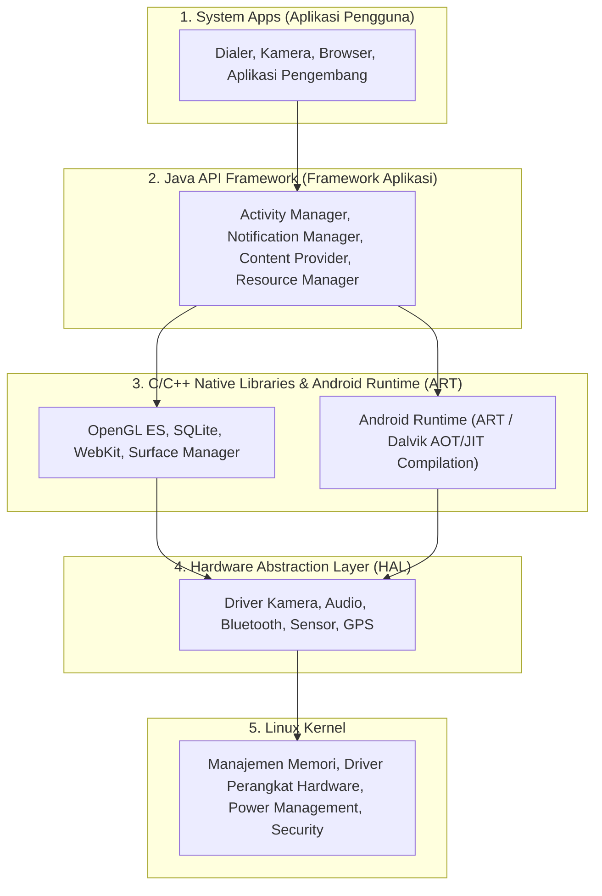

# 2. Arsitektur Sistem Operasi Mobile dan Android System

Navigasi: Modul Sebelumnya: [[01_Pengenalan_Kotlin_dan_OOP]] | [[Konsep_Pengembangan_Aplikasi_Bergerak]] | Modul Berikutnya: [[03_Komponen_UI_Activity_View_dan_RecyclerView]]

---

Perkembangan perangkat bergerak (*mobile devices*) ditandai oleh evolusi sistem operasi, dari sistem berkapasitas terbatas (seperti Symbian dan BlackBerry OS) hingga dominasi platform modern berbasis layar sentuh: **Android** (Google) dan **iOS** (Apple).

---

## 2.1. Arsitektur Perangkat Lunak Android (Android Software Stack)

Sistem Operasi Android dibangun di atas lapisan (*layer*) arsitektur perangkat lunak berbasis Linux Kernel:



### Rincian Lapisan Arsitektur Android:
1. **Linux Kernel**: Lapisan terbawah yang mengelola manajemen memori fisik, sistem keamanan sandbox, manajemen daya baterai, dan driver hardware.
2. **Hardware Abstraction Layer (HAL)**: Antarmuka standar yang menghubungkan modul driver Linux ke kerangka kerja API tingkat tinggi.
3. **Android Runtime (ART)**: Lingkungan eksekusi tempat aplikasi Android berjalan. ART menggunakan kompilasi **AOT (Ahead-of-Time)** dan **JIT (Just-in-Time)** untuk mengonversi byte-code menjadi instruksi mesin secara efisien.
4. **Native C/C++ Libraries**: Pustaka kinerja tinggi untuk fungsi grafis (OpenGL), basis data lokal (SQLite), dan rendering web (WebKit).
5. **Java API Framework**: Himpunan API berorientasi objek yang disediakan untuk pengembang aplikasi (misal: `ActivityManager`, `ContentProvider`).

---

## 2.2. Anatomi Struktur Project Android (Android Studio)

Sebuah project aplikasi Android terdiri dari tiga bagian utama:

```text
MyApplication/
├── app/
│   ├── manifests/
│   │   └── AndroidManifest.xml   <-- Berkas konfigurasi utama (Komponen, Izin Akses, Intent)
│   ├── java/com/example/myapp/
│   │   └── MainActivity.kt       <-- Kode sumber logika Kotlin
│   └── res/                      <-- Berkas Sumber Daya (Resources)
│       ├── layout/               <-- Berkas tata letak XML (activity_main.xml)
│       ├── drawable/             <-- Berkas gambar visual / ikon vector
│       ├── values/               <-- Berkas konstanta (strings.xml, colors.xml, themes.xml)
│       └── mipmap/               <-- Ikon peluncur aplikasi (App Launcher Icons)
└── Gradle Scripts/
    ├── build.gradle (Project)   <-- Konfigurasi build tingkat project
    └── build.gradle (Module)    <-- Dependensi pustaka external & SDK target
```

### Berkas Kunci Android:
- **`AndroidManifest.xml`**: Mendaftarkan seluruh komponen aplikasi (`Activity`, `Service`), izin akses sistem (*Permissions*), dan antarmuka awal peluncuran (*Main Activity*).
- **`build.gradle (Module: app)`**: Mengatur versi kompilasi `compileSdk`, `minSdk`, `targetSdk`, serta dependensi pustaka pihak ketiga.

---

Navigasi: Modul Sebelumnya: [[01_Pengenalan_Kotlin_dan_OOP]] | [[Konsep_Pengembangan_Aplikasi_Bergerak]] | Modul Berikutnya: [[03_Komponen_UI_Activity_View_dan_RecyclerView]]
