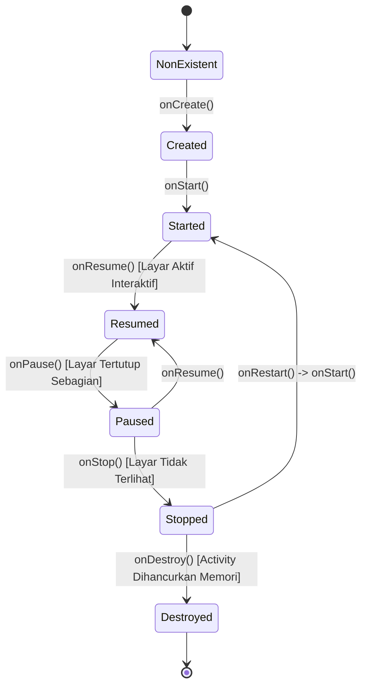
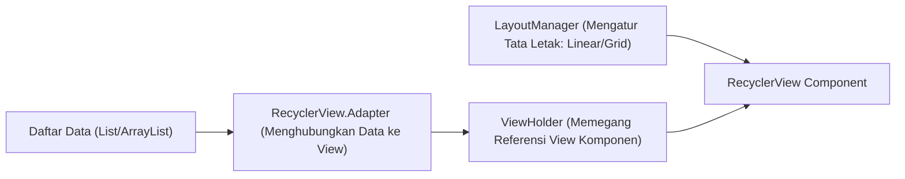

# 3. Komponen UI: Activity Lifecycle, View Layouts, dan RecyclerView

Navigasi: Modul Sebelumnya: [[02_Arsitektur_Sistem_Operasi_Mobile]] | [[Konsep_Pengembangan_Aplikasi_Bergerak]] | Modul Berikutnya: [[04_Pengembangan_Aplikasi_Hybrid_Thunkable_dan_Flutter]]

---

## 3.1. Siklus Hidup Activity (Activity Lifecycle)

**Activity** adalah komponen tunggal yang menyajikan layar antarmuka pengguna (UI). Selama pengguna bernavigasi, Activity bergerak melalui berbagai status siklus hidup (*lifecycle states*).



### Rincian Method Callback Lifecycle:
- **`onCreate()`**: Wajib diimplementasikan. Inisialisasi awal seperti memuat tata letak XML (`setContentView`), biding komponen UI, dan insialisasi variabel.
- **`onStart()`**: Activity menjadi terlihat oleh pengguna tetapi belum siap berinteraksi.
- **`onResume()`**: Activity berada di latar depan (*foreground*) dan siap menerima masukan pengguna.
- **`onPause()`**: Activity kehilangan fokus sebagian (misal: muncul dialog izin akses).
- **`onStop()`**: Activity tidak lagi terlihat di layar.
- **`onDestroy()`**: Callback terakhir sebelum Activity dihancurkan dari memori sistem.

---

## 3.2. Komponen Hierarchy UI: View vs ViewGroup

Antarmuka Android dibangun berbasis hirarki **View** dan **ViewGroup**:

- **View**: Elemen UI tunggal seperti teks, tombol, atau gambar (`TextView`, `Button`, `ImageView`, `EditText`).
- **ViewGroup**: Wadah (*container*) tidak terlihat yang mengatur posisi dan tata letak kumpulan View anak-anaknya.

### 📐 Jenis-Jenis Layout Utama:
1. **`LinearLayout`**: Menyusun elemen anak secara sejajar dalam satu arah (Horizontal atau Vertikal).
2. **`RelativeLayout`**: Menyusun elemen anak relatif terhadap posisi elemen lain atau batas layar induk.
3. **`ConstraintLayout`**: Layout modern fleksibel berbasis batasan (*constraints*) yang direkomendasikan untuk menghindari tata letak bersarang (*nested layout*) demi performa rendering yang cepat.

---

## 3.3. Menampilkan Daftar Data Berkinerja Tinggi: RecyclerView

**RecyclerView** adalah ViewGroup tingkat lanjut yang dirancang untuk menampilkan daftar data dalam jumlah besar secara efisien dengan **mendaur ulang (*recycle*)** komponen tampilan yang bergeser ke luar layar.



### 🛠️ Tiga Komponen Utama RecyclerView:
1. **`Adapter`**: Menyiapkan dan mengikat data (*binding*) dari List ke dalam item tampilan RecyclerView.
2. **`ViewHolder`**: Memegang referensi komponen View individu pada tiap item daftar untuk mempercepat akses tanpa `findViewById()` berulang.
3. **`LayoutManager`**: Mengatur susunan item (misal: `LinearLayoutManager` untuk daftar vertikal, `GridLayoutManager` untuk tampilan grid).

### Kode Adapter RecyclerView (`StudentAdapter.kt`):

```kotlin
import android.view.LayoutInflater
import android.view.View
import android.view.ViewGroup
import android.widget.TextView
import androidx.recyclerview.widget.RecyclerView

data class Student(val nim: String, val nama: String)

class StudentAdapter(private val listStudent: List<Student>) : 
    RecyclerView.Adapter<StudentAdapter.StudentViewHolder>() {

    // 1. ViewHolder memegang referensi komponen UI
    class StudentViewHolder(itemView: View) : RecyclerView.ViewHolder(itemView) {
        val tvNim: TextView = itemView.findViewById(R.id.tvNim)
        val tvNama: TextView = itemView.findViewById(R.id.tvNama)
    }

    // 2. Membuat instance ViewHolder baru saat dibutuhkan
    override fun onCreateViewHolder(parent: ViewGroup, viewType: Int): StudentViewHolder {
        val view = LayoutInflater.from(parent.context)
            .inflate(R.layout.item_student, parent, false)
        return StudentViewHolder(view)
    }

    // 3. Mengikat data pada baris indeks tertentu
    override fun onBindViewHolder(holder: StudentViewHolder, position: Int) {
        val student = listStudent[position]
        holder.tvNim.text = student.nim
        holder.tvNama.text = student.nama
    }

    override fun getItemCount(): Int = listStudent.size
}
```

---

Navigasi: Modul Sebelumnya: [[02_Arsitektur_Sistem_Operasi_Mobile]] | [[Konsep_Pengembangan_Aplikasi_Bergerak]] | Modul Berikutnya: [[04_Pengembangan_Aplikasi_Hybrid_Thunkable_dan_Flutter]]
