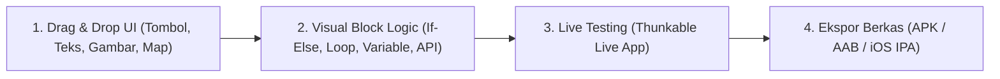
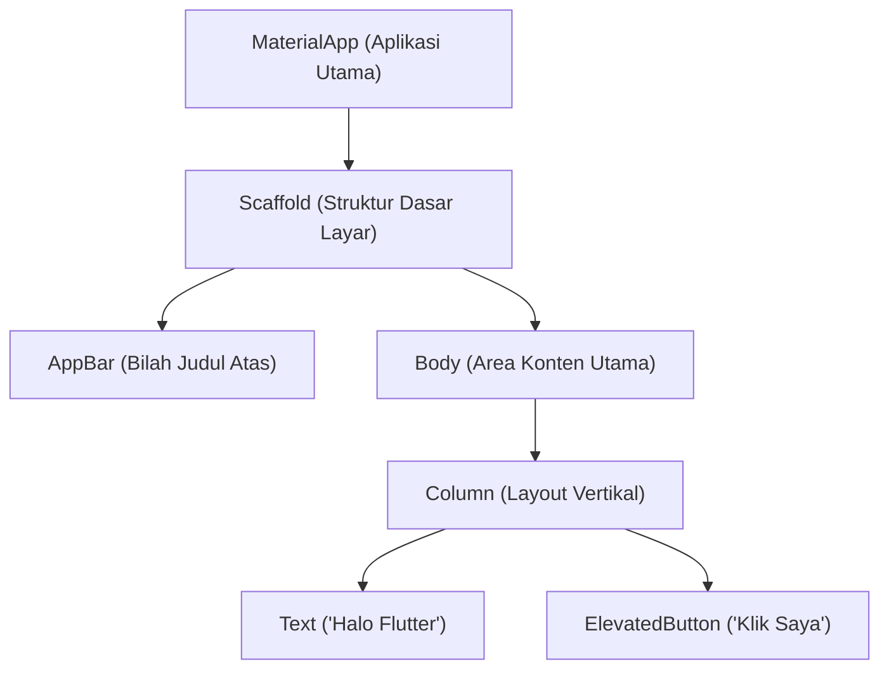

# 4. Pengembangan Aplikasi Hybrid: Platform No-Code Thunkable dan Framework Flutter

Navigasi: Modul Sebelumnya: [[03_Komponen_UI_Activity_View_dan_RecyclerView]] | [[Konsep_Pengembangan_Aplikasi_Bergerak]] | Modul Berikutnya: [[05_Arsitektur_Android_Jetpack_dan_Komponen_Navigasi]]

---

Dalam pengembangan aplikasi mobile, pengembang dapat memilih tiga pendekatan utama berdasarkan arsitekturnya:

| Karakteristik | Native App | Hybrid App | Mobile Web App |
| :--- | :--- | :--- | :--- |
| **Bahasa Utama** | Kotlin/Java (Android), Swift (iOS) | Dart (Flutter), JS/TS (React Native/Ionic) | HTML5, CSS3, JavaScript |
| **Kinerja / Performa**| ⚡ Maksimal (Akses Hardware Langsung) | 🚀 Sangat Baik (Kompilasi ke Native / Canvas) | 🐢 Terbatas di dalam Browser |
| **Efisiensi Biaya** | Membutuhkan dua tim terpisah (Android & iOS) | **1 Codebase untuk Android & iOS sekaligus** | 1 Codebase untuk seluruh Web Browser |
| **Akses Hardware** | Akses Penuh (Kamera, Bluetooth, Sensor) | Akses Penuh via Plugin / Bridge | Terbatas sesuai standar peramban |

---

## 4.1. Membuat Aplikasi Tanpa Koding (*No-Code*) dengan Thunkable

[Thunkable](https://thunkable.com/) adalah platform pengembang aplikasi mobile lintas platform (*cross-platform*) berbasis **No-Code / Drag-and-Drop** yang memungkinkan siapapun membuat aplikasi iOS dan Android tanpa perlu menulis baris kode pemrograman konvensional.



### 🌟 Fitur dan Komponen Utama Thunkable:
- **Visual Drag-and-Drop UI Designer**: Menyusun komponen antarmuka dengan menggeser elemen seperti tombol, masukan teks, daftar, pemutar media, hingga peta lokasi.
- **Block-Based Logic Programming**: Mengatur alur kerja logika aplikasi menggunakan blok visual interaktif (mirip Scratch/App Inventor) untuk menangani event, manipulasi variabel, dan perhitungan.
- **Integrasi Komponen & API**: Mendukung koneksi ke basis data cloud (Airtable, Firebase) serta integrasi REST API eksternal via Web API Component.
- **Publishing Lintas Platform**: Mengunduh berkas APK/AAB untuk Google Play Store dan IPA untuk Apple App Store dari satu project yang sama.

---

## 4.2. Pengembangan Aplikasi Lintas Platform dengan Flutter

**Flutter** adalah framework *open-source* buatan Google untuk membangun aplikasi cantik yang dikompilasi secara *native* untuk mobile (Android & iOS), web, dan desktop dari **satu basis kode (*single codebase*)** menggunakan bahasa pemrograman **Dart**.

### 💡 Filosofi Utama Flutter: *"Everything is a Widget"*
Di dalam Flutter, seluruh elemen antarmuka—mulai dari struktur tata letak, teks, warna, hingga padding—adalah sebuah **Widget**.



---

## 4.3. Perbedaan `StatelessWidget` dan `StatefulWidget`

- **`StatelessWidget`**: Widget statis yang tampilan fisiknya **tidak pernah berubah** sepanjang waktu setelah dibuat (misal: Icon, Teks Statis, Logo).
- **`StatefulWidget`**: Widget dinamis yang dapat **mengubah tampilannya secara otomatis** saat terjadi perubahan data/state internal melalui fungsi `setState()`.

---

## 4.4. Contoh Kode Lengkap Aplikasi Flutter

Berikut adalah contoh kode lengkap aplikasi Flutter yang menampilkan daftar data dan melakukan pemrosesan data HTTP API:

```dart
// main.dart
import 'package:flutter/material.dart';

void main() {
  runApp(const MyApp());
}

// 1. Root Widget Aplikasi
class MyApp extends StatelessWidget {
  const MyApp({super.key});

  @override
  Widget build(BuildContext context) {
    return MaterialApp(
      title: 'Aplikasi Flutter Saya',
      theme: ThemeData(
        primarySwatch: Colors.blue,
      ),
      home: const StudentListScreen(),
    );
  }
}

// 2. StatefulWidget untuk Mengelola Tampilan Dinamis
class StudentListScreen extends StatefulWidget {
  const StudentListScreen({super.key});

  @override
  State<StudentListScreen> createState() => _StudentListScreenState();
}

class _StudentListScreenState extends State<StudentListScreen> {
  // Data State awal
  int _counter = 0;
  final List<String> _students = [
    "Budi Santoso (M0520001)",
    "Siti Rahma (M0520002)",
    "Rudi Hermawan (M0520003)",
    "Dewi Lestari (M0520004)"
  ];

  void _incrementCounter() {
    // setState memberi tahu Flutter untuk merender ulang UI
    setState(() {
      _counter++;
    });
  }

  @override
  Widget build(BuildContext context) {
    return Scaffold(
      appBar: AppBar(
        title: const Text('Daftar Mahasiswa Flutter'),
        backgroundColor: Colors.blueAccent,
      ),
      body: Column(
        children: [
          Container(
            padding: const EdgeInsets.all(16.0),
            color: Colors.blue.shade50,
            child: Row(
              mainAxisAlignment: MainAxisAlignment.spaceBetween,
              children: [
                Text('Total Klik: $_counter', style: const TextStyle(fontSize: 18)),
                ElevatedButton(
                  onPressed: _incrementCounter,
                  child: const Text('Tambah Klik'),
                ),
              ],
            ),
          ),
          Expanded(
            // ListView.builder untuk render daftar data efisien
            child: ListView.builder(
              itemCount: _students.length,
              itemBuilder: (context, index) {
                return Card(
                  margin: const EdgeInsets.symmetric(horizontal: 10, vertical: 5),
                  child: ListTile(
                    leading: CircleAvatar(child: Text('${index + 1}')),
                    title: Text(_students[index]),
                    subtitle: const Text('Status: Aktif'),
                    trailing: const Icon(Icons.chevron_right),
                    onTap: () {
                      ScaffoldMessenger.of(context).showSnackBar(
                        SnackBar(content: Text('Memilih: ${_students[index]}')),
                      );
                    },
                  ),
                );
              },
            ),
          ),
        ],
      ),
    );
  }
}
```

---

Navigasi: Modul Sebelumnya: [[03_Komponen_UI_Activity_View_dan_RecyclerView]] | [[Konsep_Pengembangan_Aplikasi_Bergerak]] | Modul Berikutnya: [[05_Arsitektur_Android_Jetpack_dan_Komponen_Navigasi]]
