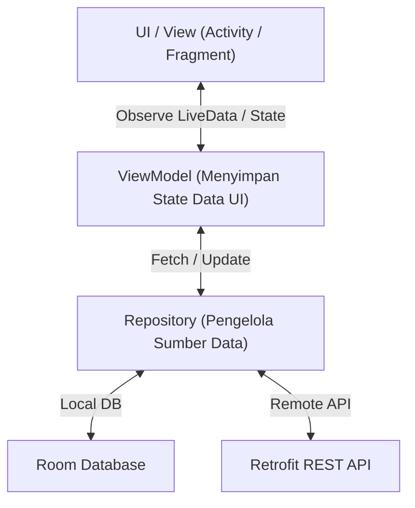

# 5. Arsitektur Android Jetpack dan Komponen Navigasi (Navigation Component)

Navigasi: Modul Sebelumnya: [[04_Pengembangan_Aplikasi_Hybrid_Thunkable_dan_Flutter]] | [[Konsep_Pengembangan_Aplikasi_Bergerak]] | Modul Berikutnya: [[06_Penyimpanan_Data_Shared_File_dan_SQLite_Room]]

---

**Android Jetpack** adalah sekumpulan pustaka (*libraries*), alat (*tools*), dan panduan arsitektur buatan Google yang dirancang untuk membantu pengembang membangun aplikasi Android berkualitas tinggi secara konsisten, aman, dan kompatibel antar berbagai versi OS.

---

## 5.1. Komponen Arsitektur Jetpack Utama

Android Jetpack mengadopsi pola arsitektur **MVVM (Model-View-ViewModel)**:



### 1. ViewModel
Menyimpan dan mengelola data terkait UI dengan **kesadaran siklus hidup (*lifecycle-aware*)**. Data di dalam `ViewModel` tetap aman dan tidak akan hilang saat terjadi rotasi layar (*screen rotation*).

### 2. LiveData / StateFlow
Wadah pemegang data terobservasi (*observable data holder*). View akan mendaftarkan pengamat (*observer*) dan otomatis merender ulang UI saat nilai `LiveData` diperbarui.

```kotlin
// MainViewModel.kt
class MainViewModel : ViewModel() {
    private val _score = MutableLiveData<Int>(0)
    val score: LiveData<Int> get() = _score

    fun addScore() {
        _score.value = (_score.value ?: 0) + 1
    }
}
```

---

## 5.2. Komponen Navigasi Jetpack (Jetpack Navigation Component)

**Jetpack Navigation** adalah kerangka kerja bawaan Android Jetpack yang menyederhanakan pengimplementasian navigasi antar layar (Fragment/Destination) di dalam aplikasi.

### 🧩 3 Pilar Utama Komponen Navigasi:

1. **Navigation Graph (`res/navigation/nav_graph.xml`)**: Berkas XML tersentralisasi yang memetakan seluruh tujuan layar (*destinations*) dan alur perpindahan (*actions*).
2. **`NavHost` / `NavHostFragment`**: Container kosong di dalam layout Activity tempat Fragment tujuan ditampilkan secara bergantian.
3. **`NavController`**: Objek pengeksekusi yang mengatur instruksi perpindahan layar (misal: `findNavController().navigate(R.id.action_to_detail)`).

```xml
<!-- res/navigation/nav_graph.xml -->
<navigation xmlns:android="http://schemas.android.com/apk/res/android"
    xmlns:app="http://schemas.android.com/apk/res-auto"
    android:id="@+id/nav_graph"
    app:startDestination="@id/homeFragment">

    <fragment
        android:id="@+id/homeFragment"
        android:name="com.example.myapp.HomeFragment"
        android:label="Halaman Utama">
        <action
            android:id="@+id/action_home_to_detail"
            app:destination="@id/detailFragment" />
    </fragment>

    <fragment
        android:id="@+id/detailFragment"
        android:name="com.example.myapp.DetailFragment"
        android:label="Detail Mahasiswa" />
</navigation>
```

---

## 5.3. Pengiriman Argumen Aman dengan SafeArgs

**SafeArgs** adalah plugin Gradle yang secara otomatis menghasilkan kelas pembantu untuk mengirimkan argumen antar Fragment secara **type-safe** (mencegah kesalahan tipe data saat runtime).

```kotlin
// 1. Mengirim Argumen dari HomeFragment
val action = HomeFragmentDirections.actionHomeToDetail(studentId = 101)
findNavController().navigate(action)

// 2. Menerima Argumen di DetailFragment
val args: DetailFragmentArgs by navArgs()
val studentId = args.studentId
```

---

## 5.4. Navigasi pada Jetpack Compose (Declarative UI)

Bagi aplikasi Android modern yang menggunakan **Jetpack Compose** (UI deklaratif tanpa XML), navigasi dikelola menggunakan pustaka `navigation-compose`:

```kotlin
import androidx.compose.runtime.Composable
import androidx.navigation.compose.NavHost
import androidx.navigation.compose.composable
import androidx.navigation.compose.rememberNavController

@Composable
fun AppNavigation() {
    val navController = rememberNavController()

    // NavHost mendefinisikan rute string sederhana
    NavHost(navController = navController, startDestination = "home") {
        composable("home") {
            HomeScreen(onNavigateToDetail = { id ->
                navController.navigate("detail/$id")
            })
        }
        composable("detail/{id}") { backStackEntry ->
            val id = backStackEntry.arguments?.getString("id")
            DetailScreen(studentId = id)
        }
    }
}
```

---

Navigasi: Modul Sebelumnya: [[04_Pengembangan_Aplikasi_Hybrid_Thunkable_dan_Flutter]] | [[Konsep_Pengembangan_Aplikasi_Bergerak]] | Modul Berikutnya: [[06_Penyimpanan_Data_Shared_File_dan_SQLite_Room]]
