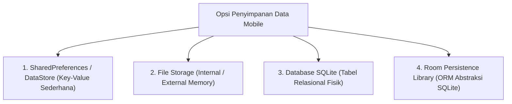
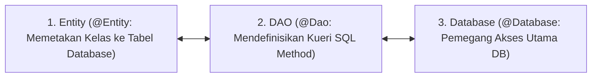

# 6. Penyimpanan Data Mobile: SharedPreferences, Files, SQLite, dan Room ORM

Navigasi: Modul Sebelumnya: [[05_Arsitektur_Android_Jetpack_dan_Komponen_Navigasi]] | [[Konsep_Pengembangan_Aplikasi_Bergerak]] | Modul Berikutnya: [[07_Integrasi_REST_API_Retrofit_dan_Public_API]]

---

Aplikasi mobile membutuhkan mekanisme penyimpanan data (*data persistence*) agar data pengguna tidak hilang saat aplikasi ditutup atau perangkat dimatikan.

---

## 6.1. Empat Pilihan Penyimpanan Data di Android



| Opsi Penyimpanan | Jenis Data | Karakteristik & Penggunaan |
| :--- | :--- | :--- |
| **SharedPreferences** | Pasangan Key-Value | Sesuai untuk menyimpan preferensi pengguna (Tema, Login State, Setting). |
| **Jetpack DataStore** | Key-Value / Proto Data | Pengganti SharedPreferences modern yang mendukung pemrosesan asinkronus (Coroutines). |
| **Internal File Storage**| Berkas (TXT, JSON, PDF)| Penyimpanan berkas privat yang hanya dapat diakses oleh aplikasi terkait. |
| **External File Storage**| Berkas Publik (Foto/Video)| Penyimpanan berkas publik yang dapat diakses pengguna via File Manager. |
| **Room Database (SQLite)**| Data Relasional Terstruktur| Sesuai untuk menyimpan data terstruktur berskala besar (Tabel, Kueri Complex, Caching). |

---

## 6.2. Implementasi SharedPreferences

```kotlin
import android.content.Context

// 1. Menyimpan Data Preferensi
fun simpanUserToken(context: Context, token: String) {
    val sharedPref = context.getSharedPreferences("AppPrefs", Context.MODE_PRIVATE)
    with(sharedPref.edit()) {
        putString("USER_TOKEN", token)
        putBoolean("IS_LOGGED_IN", true)
        apply() // Menyimpan secara asinkronus
    }
}

// 2. Membaca Data Preferensi
fun ambilUserToken(context: Context): String? {
    val sharedPref = context.getSharedPreferences("AppPrefs", Context.MODE_PRIVATE)
    return sharedPref.getString("USER_TOKEN", null)
}
```

---

## 6.3. Internal dan External File Storage

Android menerapkan **Scoped Storage** untuk membatasi akses berkas demi keamanan:

```kotlin
import java.io.File

// Menyimpan Teks ke Internal Storage Privat
fun simpanBerkasInternal(context: Context, namaFile: String, konten: String) {
    val file = File(context.filesDir, namaFile)
    file.writeText(konten)
}

// Membaca Teks dari Internal Storage
fun bacaBerkasInternal(context: Context, namaFile: String): String {
    val file = File(context.filesDir, namaFile)
    return if (file.exists()) file.readText() else ""
}
```

---

## 6.4. Room Persistence Library (Abstraksi SQLite Modern)

**Room** adalah pustaka ORM resmi buatan Google di atas SQLite. Room menyediakan pengecekan kueri SQL pada saat *compile-time* dan memetakan objek secara langsung.

### 🧩 3 Komponen Utama Room:



### Implementasi Lengkap Room DB:

```kotlin
import androidx.room.*

// 1. Entity: Mendefinisikan Struktur Tabel 'students'
@Entity(tableName = "students")
data class StudentEntity(
    @PrimaryKey(autoGenerate = true) val id: Int = 0,
    @ColumnInfo(name = "nim") val nim: String,
    @ColumnInfo(name = "nama") val nama: String
)

// 2. DAO (Data Access Object): Kueri SQL
@Dao
interface StudentDao {
    @Query("SELECT * FROM students ORDER BY nama ASC")
    fun getAllStudents(): List<StudentEntity>

    @Insert(onConflict = OnConflictStrategy.REPLACE)
    fun insertStudent(student: StudentEntity)

    @Delete
    fun deleteStudent(student: StudentEntity)
}

// 3. Database Class
@Database(entities = [StudentEntity::class], version = 1)
abstract class AppDatabase : RoomDatabase() {
    abstract fun studentDao(): StudentDao

    companion object {
        @Volatile
        private var INSTANCE: AppDatabase? = null

        fun getDatabase(context: android.content.Context): AppDatabase {
            return INSTANCE ?: synchronized(this) {
                val instance = Room.databaseBuilder(
                    context.applicationContext,
                    AppDatabase::class.java,
                    "student_database"
                ).build()
                INSTANCE = instance
                instance
            }
        }
    }
}
```

---

Navigasi: Modul Sebelumnya: [[05_Arsitektur_Android_Jetpack_dan_Komponen_Navigasi]] | [[Konsep_Pengembangan_Aplikasi_Bergerak]] | Modul Berikutnya: [[07_Integrasi_REST_API_Retrofit_dan_Public_API]]
