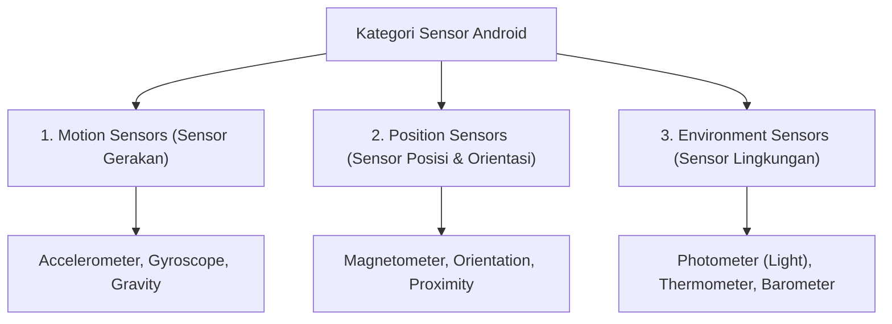

# 8. Sensor Perangkat dan Integrasi Fitur Hardware

Navigasi: Modul Sebelumnya: [[07_Integrasi_REST_API_Retrofit_dan_Public_API]] | [[Konsep_Pengembangan_Aplikasi_Bergerak]] | Modul Berikutnya: [[09_Izin_Akses_Pengujian_Testing_dan_Debugging]]

---

Perangkat smartphone modern memiliki berbagai sensor fisik terpasang (*built-in sensors*) yang memungkinkan aplikasi mengukur gerakan, orientasi posisi, dan kondisi lingkungan sekitar.

---

## 8.1. Tiga Kategori Utama Sensor Android



| Kategori Sensor | Parameter yang Diukur | Penggunaan Utama |
| :--- | :--- | :--- |
| **Motion Sensors** | Mengukur kekuatan akselerasi dan rotasi sepanjang 3 sumbu ($X, Y, Z$). | Deteksi langkah kaki (*pedometer*), kontrol game balap, gesture shake. |
| **Position Sensors** | Mengukur posisi fisik dan kemiringan perangkat terhadap bumi. | Kompas digital, auto-rotate layar, pematikan layar saat panggilan telpon (*Proximity*). |
| **Environment Sensors** | Mengukur parameter lingkungan fisik sekitar perangkat. | Penyesuaian kecerahan layar otomatis (*Light*), cuaca & tekanan (*Barometer*). |

---

## 8.2. Arsitektur Komponen Sensor Framework

Pengelolaan sensor di Android dikendalikan melalui empat komponen utama dalam `android.hardware`:

1. **`SensorManager`**: Layanan sistem untuk mengakses dan merestutusi daftar sensor.
2. **`Sensor`**: Kelas yang merepresentasikan spesifikasi sensor fisik tertentu.
3. **`SensorEventListener`**: Antarmuka callback untuk menerima notifikasi saat terjadi pembaruan nilai sensor.
4. **`SensorEvent`**: Objek data yang memuat pembacaan nilai sensor (misal: array sumbu $X, Y, Z$).

---

## 8.3. Contoh Kode Implementasi Sensor Accelerometer

Berikut adalah contoh membaca data kemiringan akselerasi perangkat:

```kotlin
import android.content.Context
import android.hardware.*
import android.os.Bundle
import android.widget.TextView
import androidx.appcompat.app.AppCompatActivity

class SensorActivity : AppCompatActivity(), SensorEventListener {

    private lateinit var sensorManager: SensorManager
    private var accelerometer: Sensor? = null
    private lateinit var tvSensorValues: TextView

    override fun onCreate(savedInstanceState: Bundle?) {
        super.onCreate(savedInstanceState)
        setContentView(R.layout.activity_sensor)

        tvSensorValues = findViewById(R.id.tvSensorValues)

        // 1. Inisialisasi SensorManager sistem
        sensorManager = getSystemService(Context.SENSOR_SERVICE) as SensorManager

        // 2. Ambil sensor Accelerometer
        accelerometer = sensorManager.getDefaultSensor(Sensor.TYPE_ACCELEROMETER)
    }

    override fun onResume() {
        super.onResume()
        // 3. Daftarkan Listener saat Activity aktif
        accelerometer?.let {
            sensorManager.registerListener(this, it, SensorManager.SENSOR_DELAY_NORMAL)
        }
    }

    override fun onPause() {
        super.onPause()
        // 4. Hentikan Listener saat Activity pause untuk menghemat baterai
        sensorManager.unregisterListener(this)
    }

    // 5. Callback saat terjadi perubahan nilai sensor
    override fun onSensorChanged(event: SensorEvent?) {
        if (event?.sensor?.type == Sensor.TYPE_ACCELEROMETER) {
            val x = event.values[0]
            val y = event.values[1]
            val z = event.values[2]

            tvSensorValues.text = "Sumbu X: $x\nSumbu Y: $y\nSumbu Z: $z"
        }
    }

    override fun onAccuracyChanged(sensor: Sensor?, accuracy: Int) {
        // Dipanggil jika akurasi sensor berubah
    }
}
```

---

Navigasi: Modul Sebelumnya: [[07_Integrasi_REST_API_Retrofit_dan_Public_API]] | [[Konsep_Pengembangan_Aplikasi_Bergerak]] | Modul Berikutnya: [[09_Izin_Akses_Pengujian_Testing_dan_Debugging]]
