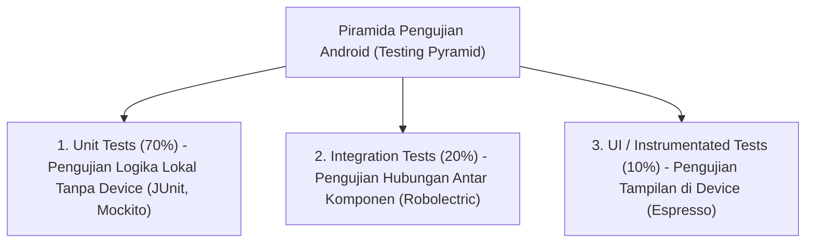

# 9. Izin Akses, Testing (Pengujian), dan Debugging Aplikasi Mobile

Navigasi: Modul Sebelumnya: [[08_Sensor_dan_Fitur_Perangkat_Hardware]] | [[Konsep_Pengembangan_Aplikasi_Bergerak]] | Modul Berikutnya: [[10_Keamanan_Kinerja_dan_Publikasi_Google_Play]]

---

## 9.1. Manajemen Izin Akses Android (Android Permissions)

Android memproteksi privasi pengguna dengan membatasi akses aplikasi terhadap data sensitif dan fitur hardware fisik (seperti Kamera, Lokasi GPS, Kontak, dan Mikrofon).

### 🛡️ Klasifikasi Izin Akses:
1. **Normal Permissions**: Izin yang tidak berisiko terhadap privasi pengguna (seperti akses Internet atau Bluetooth). Izin ini cukup dideklarasikan di `AndroidManifest.xml` dan disetujui otomatis saat instalasi.
2. **Dangerous Permissions**: Izin sensitif yang dapat mengakses data pribadi pengguna (seperti `CAMERA`, `FINE_LOCATION`, `READ_CONTACTS`). Sejak Android 6.0 (API 23), izin ini **WAJIB diminta persetujuannya secara eksplisit saat aplikasi berjalan (*Runtime Permissions*)**.

```kotlin
import android.Manifest
import android.content.pm.PackageManager
import androidx.core.app.ActivityCompat
import androidx.core.content.ContextCompat

// Memeriksa dan Meminta Runtime Permission Kamera
fun mintaIzinKamera(activity: AppCompatActivity) {
    if (ContextCompat.checkSelfPermission(activity, Manifest.permission.CAMERA)
        != PackageManager.PERMISSION_GRANTED) {
        
        // Minta Izin ke Pengguna saat Runtime
        ActivityCompat.requestPermissions(
            activity,
            arrayOf(Manifest.permission.CAMERA),
            1001 // Request Code
        )
    } else {
        // Izin Sudah Diberikan: Buka Kamera
    }
}
```

---

## 9.2. Debugging Aplikasi Android

**Debugging** adalah proses mengidentifikasi, mengisolasi, dan memperbaiki galat (*bugs*) atau perilaku tak diinginkan pada aplikasi.

### 🛠️ Peralatan Debugging Utama:
- **Logcat**: Jendela pemantauan sistem yang menampilkan log eksekusi secara real-time (`Log.d()`, `Log.e()`, `Log.i()`).
- **Breakpoints & Debugger**: Menghentikan eksekusi kode pada baris tertentu untuk menginspeksi nilai variabel di dalam memory stack.
- **Android Profiler**: Memantau penggunaan CPU, Memori RAM, Trafik Network, dan Konsumsi Daya Baterai secara visual.

```kotlin
import android.util.Log

// Praktik Terbaik Penggunaan Logcat
Log.d("DEBUG_TAG", "Nilai Counter: $counter")   // Debug Info
Log.e("ERROR_TAG", "Gagal Membaca File: $msg") // Error Critical
```

---

## 9.3. Pengujian Aplikasi (Android Testing)

Pengujian memastikan bahwa aplikasi memenuhi kualitas yang ditentukan dan tidak mengalami *crash* saat dijalankan pengguna.



### A. Local Unit Test dengan JUnit (`src/test/java/`)
Pengujian logika murni yang dieksekusi dengan cepat di komputer pengembang tanpa perlu menjalankan emulator/device.

```kotlin
import org.junit.Test
import org.junit.Assert.*

class KalkulatorTest {

    @Test
    fun tambah_DuaAngka_HasilBenar() {
        val hasil = 10 + 5
        assertEquals(15, hasil)
    }
}
```

### B. UI Instrumented Test dengan Espresso (`src/androidTest/java/`)
Pengujian antarmuka otomatis yang mensimulasikan klik tombol dan pengetikan teks pada emulator/device fisik.

```kotlin
import androidx.test.ext.junit.runners.AndroidJUnit4
import androidx.test.espresso.Espresso.onView
import androidx.test.espresso.action.ViewActions.*
import androidx.test.espresso.matcher.ViewMatchers.*
import org.junit.Test
import org.junit.runner.RunWith

@RunWith(AndroidJUnit4::class)
class LoginUITest {

    @Test
    fun loginFlow_Berhasil() {
        // 1. Ketik username
        onView(withId(R.id.etUsername)).perform(typeText("budi"), closeSoftKeyboard())

        // 2. Klik tombol login
        onView(withId(R.id.btnLogin)).perform(click())

        // 3. Pastikan teks selamat datang muncul
        onView(withId(R.id.tvWelcome)).check(matches(withText("Selamat Datang, budi")))
    }
}
```

---

Navigasi: Modul Sebelumnya: [[08_Sensor_dan_Fitur_Perangkat_Hardware]] | [[Konsep_Pengembangan_Aplikasi_Bergerak]] | Modul Berikutnya: [[10_Keamanan_Kinerja_dan_Publikasi_Google_Play]]
