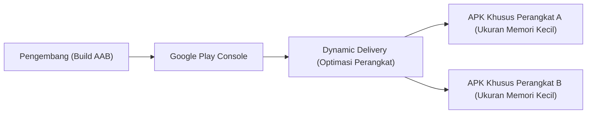
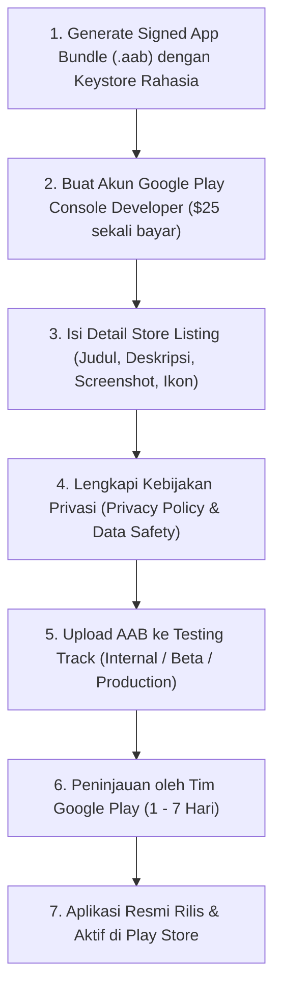

# 10. Keamanan Aplikasi, Optimasi Kinerja, dan Publikasi Google Play Store

Navigasi: Modul Sebelumnya: [[09_Izin_Akses_Pengujian_Testing_dan_Debugging]] | [[Konsep_Pengembangan_Aplikasi_Bergerak]]

---

## 10.1. Keamanan dan Obfuscation Kode (ProGuard / R8)

Sebelum mempublikasikan aplikasi ke publik, kode sumber harus dilindungi dari upaya *Reverse Engineering* (pembongkaran APK oleh peretas).

### 🛡️ Obfuscation dengan R8 / ProGuard:
R8 otomatis menyamarkan nama kelas, variabel, dan method menjadi nama acak yang tidak berarti (misal: `class MainActivity` diubah menjadi `a.b.c`), serta menghapus kode yang tidak terpakai (*Dead Code Elimination*).

```groovy
// build.gradle (Module: app)
android {
    buildTypes {
        release {
            minifyEnabled true      // Mengaktifkan Obfuscation & Shrinking
            shrinkResources true   // Menghapus resource gambar/layout yang tidak terpakai
            proguardFiles getDefaultProguardFile('proguard-android-optimize.txt'), 'proguard-rules.pro'
        }
    }
}
```

---

## 10.2. APK vs Android App Bundle (AAB)

Google menetapkan **Android App Bundle (`.aab`)** sebagai standar resmi publikasi di Google Play Store menggantikan format `.apk` tradisional.



### Keunggulan Format `.aab`:
- **Ukuran Download Lebih Kecil (Hingga 35%)**: Google Play secara otomatis membuatkan berkas APK yang disesuaikan hanya dengan arsitektur CPU dan resolusi layar perangkat masing-masing pengguna.
- **Dynamic Feature Modules**: Memungkinkan pengunggahan modul fitur aplikasi yang baru diunduh saat dibutuhkan saja.

---

## 10.3. Alur Publikasi ke Google Play Store



---

## 10.4. Strategi Monetisasi Aplikasi Mobile

Pengembang dapat memperoleh pendapatan dari aplikasi melalui beberapa model bisnis:

1. **In-App Advertising (Iklan)**: Menampilkan iklan banner, interstitial, atau video reward menggunakan **Google AdMob**.
2. **Freemium / In-App Purchases (IAP)**: Aplikasi dapat diunduh gratis, tetapi fitur tingkat lanjut atau item digital tertentu dijual di dalam aplikasi (menggunakan Google Play Billing API).
3. **Subscriptions (Langganan Berkelanjutan)**: Pembayaran berulang setiap bulan atau tahun (misal: aplikasi streaming, gym, atau produktivitas).
4. **Paid Apps**: Pengguna membayar di awal sebelum dapat mengunduh aplikasi dari Play Store.

---

Navigasi: Modul Sebelumnya: [[09_Izin_Akses_Pengujian_Testing_dan_Debugging]] | [[Konsep_Pengembangan_Aplikasi_Bergerak]]
