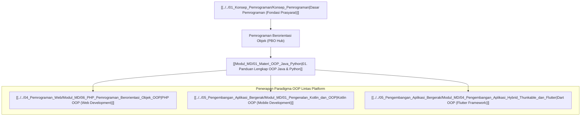

# Panduan Komprehensif Pemrograman Berorientasi Objek (OOP / PBO Hub)

Dokumen ini merupakan berkas utama (*Knowledge Hub*) yang memetakan seluruh modul pembelajaran **Pemrograman Berorientasi Objek (Object-Oriented Programming)** menggunakan bahasa Java dan Python, serta penerapannya pada [[../../04_Pemrograman_Web/Konsep_Pemrograman_Web|PHP OOP & Laravel]], [[../../05_Pengembangan_Aplikasi_Bergerak/Konsep_Pengembangan_Aplikasi_Bergerak|Kotlin OOP & Flutter]], dan [[../../02_Struktur_Data_dan_Algoritma/Konsep_Struktur_Data_dan_Algoritma|Struktur Data]].

> [!NOTE]
> Seluruh modul pada hub ini saling terhubung secara dua arah (*bidirectional links*) menggunakan Obsidian Wiki-Links `[[...]]`. Seluruh berkas dari `vault-teman` **dikecualikan 100%**.

---

## 🗺️ Peta Pembelajaran Pemrograman Berorientasi Objek (Mindmap)

---

## 📚 Modul Pembelajaran Pemrograman Berorientasi Objek

- **[[Modul_MD/01_Materi_OOP_Java_Python|01. Panduan Lengkap Pemrograman Berorientasi Objek (OOP): Java & Python]]**: Penjelasan mendalam mengenai 4 Pilar OOP (*Encapsulation*, *Inheritance*, *Polymorphism*, *Abstraction*), *Class & Object*, Constructor, Modifier Akses (`public`, `protected`, `private`), Interface, dan Abstract Class.

---

## 🔗 Hubungan Antar Berkas Catatan Utama

- 🔗 **[[../../01_Konsep_Pemrograman/Konsep_Pemrograman|Konsep Pemrograman]]**: Mata kuliah prasyarat yang membahas fondasi dasar variabel, tipe data, control flow, dan fungsi sebelum beralih ke objek.
- 🔗 **[[../../04_Pemrograman_Web/Konsep_Pemrograman_Web|Pemrograman Web]]**: Penerapan paradigma OOP pada server-side PHP (PHP OOP) dan arsitektur Model-View-Controller (MVC) framework Laravel.
- 🔗 **[[../../05_Pengembangan_Aplikasi_Bergerak/Konsep_Pengembangan_Aplikasi_Bergerak|Pengembangan Aplikasi Bergerak]]**: Penerapan OOP pada bahasa Kotlin (Android Native) dan Dart (Flutter Framework).
- 🔗 **[[../../02_Struktur_Data_dan_Algoritma/Konsep_Struktur_Data_dan_Algoritma|Struktur Data & Algoritma]]**: Implementasi kelas objek OOP untuk memodelkan struktur data seperti Node pada Linked List, Tree, dan Graph.

---
*Hub catatan ini dapat dipelajari secara bertahap melalui navigasi tautan `[[...]]` pada setiap modul.*
