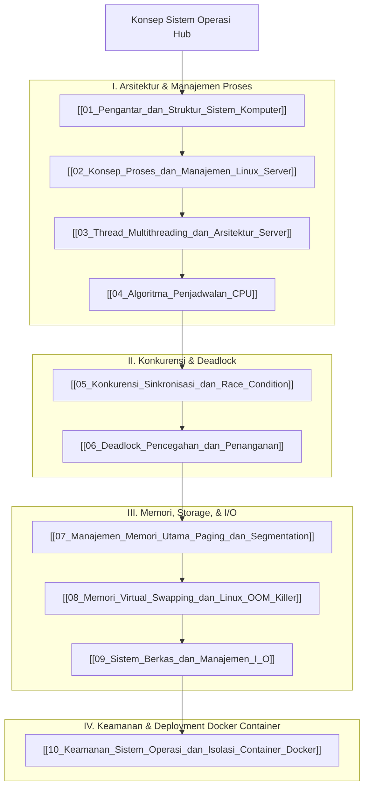

# Panduan Komprehensif Konsep Sistem Operasi (Operating System Hub)

Dokumen ini merupakan berkas utama (*Knowledge Hub*) yang memetakan seluruh modul pembelajaran **Sistem Operasi (Operating Systems)**. Seluruh materi disusun secara sistematis dan dikorelasikan dengan [[../01_Konsep_Pemrograman/Konsep_Pemrograman|Konsep Pemrograman]], [[../04_Pemrograman_Web/Konsep_Pemrograman_Web|Pemrograman Web Server]], [[../05_Pengembangan_Aplikasi_Bergerak/Konsep_Pengembangan_Aplikasi_Bergerak|Pengembangan Aplikasi Bergerak]], serta [[../../Riset_Edge_AI_3T/edge-ai-untuk-3t|Riset Edge AI 3T]].

> [!NOTE]
> Seluruh modul pada hub ini saling terhubung secara dua arah (*bidirectional links*) menggunakan Obsidian Wiki-Links `[[...]]`. Seluruh berkas dari `vault-teman` **dikecualikan 100%**.

---

## 🗺️ Peta Pembelajaran Sistem Operasi (Mindmap)

---

## 📚 Daftar Lengkap Modul Pembelajaran Sistem Operasi

### Part I: Arsitektur & Manajemen Proses
1. **[[01_Pengantar_dan_Struktur_Sistem_Komputer]]**: Peran utama OS, Dual-mode operation (User vs Kernel Mode), System Calls, serta Arsitektur Kernel (Monolithic vs Microkernel).
2. **[[02_Konsep_Proses_dan_Manajemen_Linux_Server]]**: Process Control Block (PCB), Process States, System Call (`fork()`, `exec()`, `wait()`), manajemen proses Linux Server (`ps`, `top`, `htop`, `pstree`, `kill`), PID 1 Init (`systemd`), serta fenomena Zombie & Orphan processes.
3. **[[03_Thread_Multithreading_dan_Arsitektur_Server]]**: Konsep Thread vs Process, Multithreading models (1:1, Many:1, Many:Many), serta perbandingan arsitektur server web (Nginx Event Loop vs Apache Worker vs Node.js vs Java Thread Pool vs Gunicorn).
4. **[[04_Algoritma_Penjadwalan_CPU]]**: Preemptive vs Non-preemptive scheduling, Algoritma FCFS, SJF, Round Robin, Priority Scheduling, Convoy Effect, Starvation, serta Completely Fair Scheduler (CFS) & nilai `nice` Linux.

### Part II: Konkurensi & Deadlock
5. **[[05_Konkurensi_Sinkronisasi_dan_Race_Condition]]**: Critical Section problem, Race Condition, Mutual Exclusion, alat sinkronisasi Mutex Locks & Semaphores (Counting vs Binary).
6. **[[06_Deadlock_Pencegahan_dan_Penanganan]]**: 4 Syarat utama deadlock (Mutual Exclusion, Hold & Wait, No Preemption, Circular Wait), serta penanganan deadlock (Prevention, Avoidance Banker's Algorithm, Detection & Ostrich Algorithm).

### Part III: Memori, Storage, & I/O
7. **[[07_Manajemen_Memori_Utama_Paging_dan_Segmentation]]**: Logical vs Physical address, MMU, Fragmentasi internal & eksternal, skema Paging (Pages, Frames, Page Table), TLB Cache, dan Segmentasi.
8. **[[08_Memori_Virtual_Swapping_dan_Linux_OOM_Killer]]**: Demand Paging, Page Fault handling, Algoritma Page Replacement (FIFO, LRU), tuning Swap space (`vm.swappiness`), pemantauan RAM server (`free -h`, `vmstat`), serta mekanisme **Linux OOM (Out-Of-Memory) Killer**.
9. **[[09_Sistem_Berkas_dan_Manajemen_I_O]]**: Struktur Inode pada Linux (ext4/XFS), Hard link vs Symlink, metode alokasi berkas (Contiguous, Linked, Indexed), serta arsitektur I/O (Polling, Interrupt, DMA).

### Part IV: Keamanan & Deployment Docker Container
10. **[[10_Keamanan_Sistem_Operasi_dan_Isolasi_Container_Docker]]**: Keamanan POSIX permissions (`chmod`/`chown`), arsitektur isolasi **Docker Container** berbasis **Linux Namespaces** (PID, Net, Mnt, User) & **Control Groups (cgroups)** untuk kuota CPU/RAM (`--memory --cpus`), penanganan PID 1 init process, dan best practices deployment server.

---

## 🔗 Hubungan Antar Berkas Catatan Utama

- 🔗 **[[../04_Pemrograman_Web/Konsep_Pemrograman_Web|Pemrograman Web]]**: Pemahaman arsitektur proses/thread Nginx, Apache, PHP-FPM, dan Node.js pada server backend.
- 🔗 **[[../05_Pengembangan_Aplikasi_Bergerak/Konsep_Pengembangan_Aplikasi_Bergerak|Pengembangan Aplikasi Bergerak]]**: Manajemen memori, proses Activity, dan sensor I/O pada perangkat mobile Android (Linux Kernel based).
- 🔗 **[[../../Riset_Edge_AI_3T/edge-ai-untuk-3t|Riset Edge AI 3T]]**: Pengelolaan alokasi memori RAM terbatas, swapping, dan kuota CPU untuk eksekusi model AI portabel di fasilitas kesehatan 3T.

---
*Hub catatan ini dapat dipelajari secara bertahap melalui navigasi tautan `[[...]]` pada setiap modul.*
