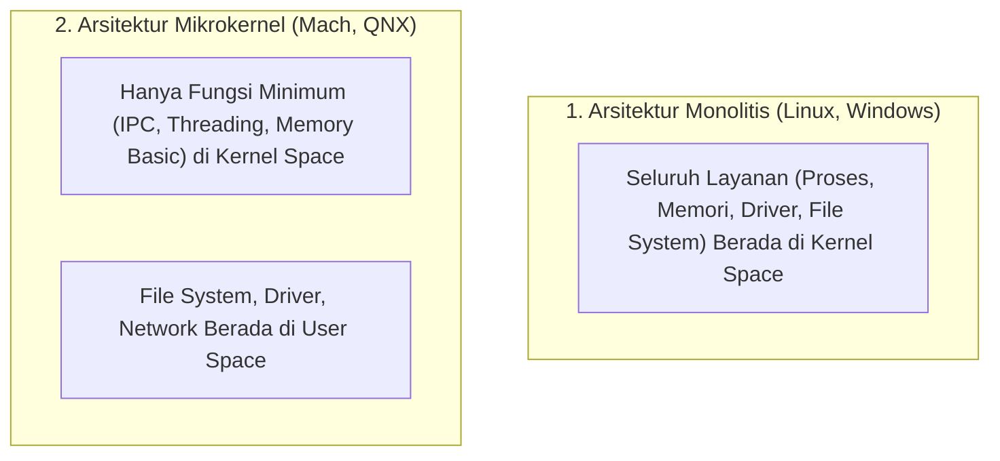

# 1. Pengantar Sistem Operasi dan Arsitektur Sistem Komputer

Navigasi: [[Konsep_Sistem_Operasi]] | Modul Berikutnya: [[02_Konsep_Proses_dan_Manajemen_Linux_Server]]

---

**Sistem Operasi (OS)** adalah perangkat lunak sistem utama yang mengelola sumber daya perangkat keras (*hardware*) komputer dan menyediakan antarmuka layanan umum (*system calls*) bagi perangkat lunak aplikasi.

---

## 1.1. Peran Utama Sistem Operasi

1. **Pengelola Sumber Daya (*Resource Allocator*)**: Mengalokasikan waktu CPU, memori utama (RAM), ruang penyimpanan berkas, dan perangkat I/O secara adil dan efisien antar berbagai aplikasi.
2. **Program Pengontrol (*Control Program*)**: Mencegah kesalahan (*errors*) dan penggunaan komputer yang tidak sah dengan mengawasi eksekusi program pengguna.
3. **Pengabstraksi Hardware (*Abstraction Layer*)**: Menyediakan antarmuka standar (*System Calls*) sehingga pengembang aplikasi tidak perlu menulis kode instruksi fisik ke hardware.

---

## 1.2. Operasi Mode Ganda (Dual-Mode Operation)

Untuk melindungi sistem operasi dari aplikasi pengguna yang bermasalah atau berniat jahat, hardware komputer mendukung dua mode eksekusi utama:

```mermaid
flowchart LR
    UserSpace["User Mode (Mode Pengguna - Mode Bit = 1)"] -->|Memanggil System Call (misal: read/write)| Trap["Trap / Software Interrupt"]
    Trap --> KernelSpace["Kernel Mode (Mode Supervisor - Mode Bit = 0)"]
    KernelSpace -->|Eksekusi Instruksi Proteksi ke Hardware| Return["Kembali ke User Mode"]
```

- **User Mode (Mode Pengguna)**: Lingkungan eksekusi bagi aplikasi pengguna biasa. Instruksi terbatas dan tidak diizinkan mengakses fisik hardware atau memori sistem secara langsung.
- **Kernel Mode (Mode Supervisor/Privileged)**: Lingkungan eksekusi penuh bagi inti sistem operasi (Kernel). Berhak mengeksekusi instruksi khusus (*privileged instructions*) seperti manipulasi tabel memori dan akses I/O.

---

## 1.3. Struktur Arsitektur Kernel Sistem Operasi



| Arsitektur Kernel | Keunggulan | Kekurangan |
| :--- | :--- | :--- |
| **Monolithic Kernel** (Linux, Unix) | ⚡ Kinerja sangat cepat karena komunikasi antar layanan dilakukan langsung di dalam memory kernel. | Jika satu driver crash, seluruh OS berisiko mengalami *Panic/BSOD*. |
| **Microkernel** (Mach, L4) | 🛡️ Sangat stabil dan aman. Layanan yang crash di user space tidak merusak kernel. | 🐢 Kinerja lebih lambat karena tingginya *overhead* komunikasi IPC antar proses. |

---

Navigasi: [[Konsep_Sistem_Operasi]] | Modul Berikutnya: [[02_Konsep_Proses_dan_Manajemen_Linux_Server]]
