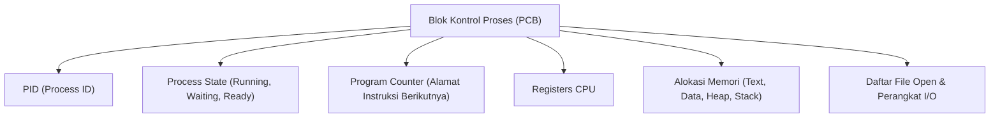
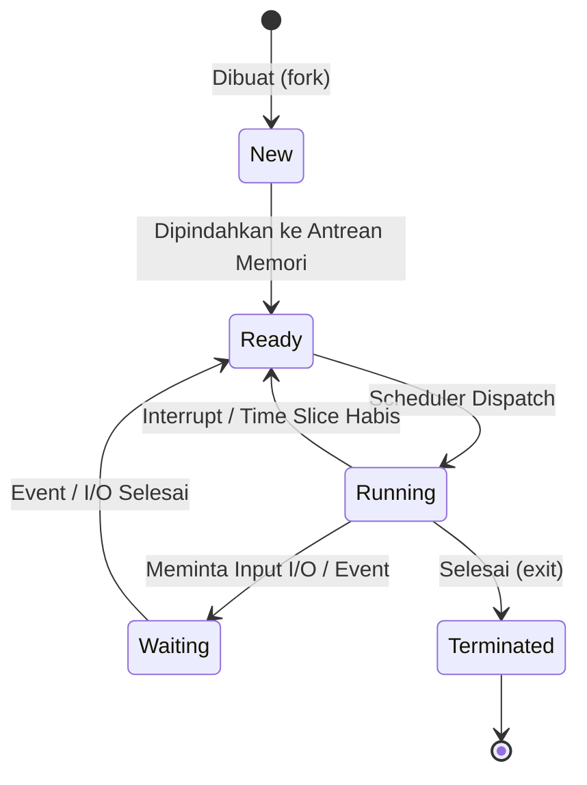
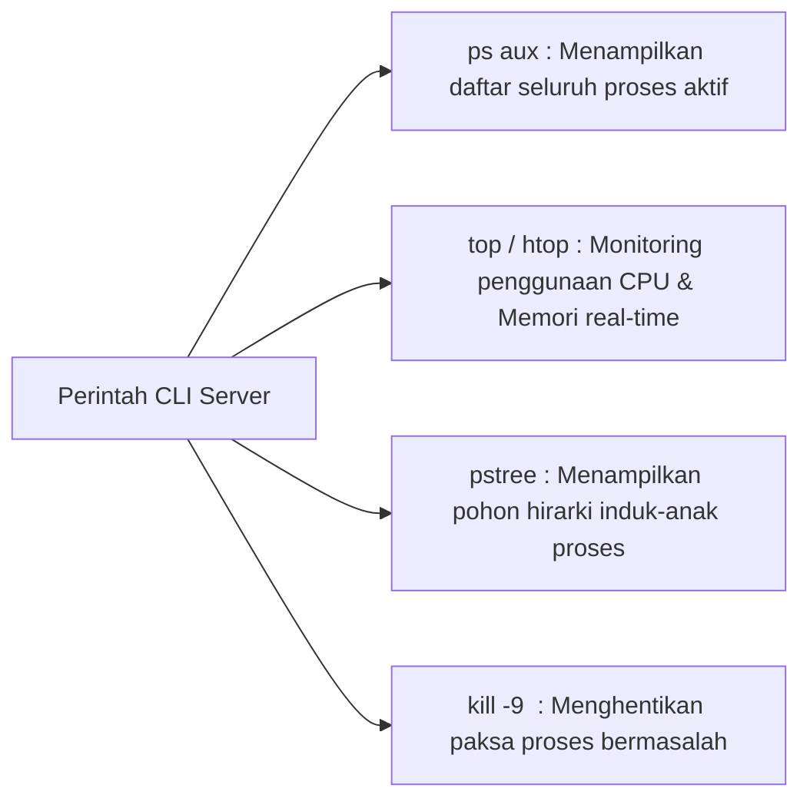

# 2. Konsep Proses dan Manajemen Proses pada Linux Server

Navigasi: Modul Sebelumnya: [[01_Pengantar_dan_Struktur_Sistem_Komputer]] | [[Konsep_Sistem_Operasi]] | Modul Berikutnya: [[03_Thread_Multithreading_dan_Arsitektur_Server]]

---

**Proses** adalah program yang sedang berada dalam status dieksekusi (*program in execution*). Berbeda dengan program yang merupakan entitas pasif (berkas di disk), proses adalah entitas aktif yang memiliki register CPU, memori alamat, dan alokasi sumber daya.

---

## 2.1. Blok Kontrol Proses (Process Control Block - PCB)

Setiap proses diwakili oleh struktur data di dalam kernel yang disebut **PCB**:



---

## 2.2. Siklus Hidup dan Status Proses (Process States)



---

## 2.3. Pembuatan Proses pada Sistem Unix/Linux (`fork()` dan `exec()`)

Pada Linux, proses baru dibuat melalui panggilan sistem (*System Call*):
1. **`fork()`**: Membuplikasi proses induk (*Parent*) untuk membuat proses anak (*Child*) yang identik.
2. **`exec()`**: Mengganti ruang alamat memori proses anak dengan program eksekusi baru.
3. **`wait()`**: Meminta proses induk menunggu hingga proses anak selesai dieksekusi.

```c
// Contoh C System Call fork() di Linux
#include <stdio.h>
#include <unistd.h>
#include <sys/types.h>

int main() {
    pid_t pid = fork();

    if (pid < 0) {
        printf("Gagal membuat proses anak!\n");
    } else if (pid == 0) {
        // Eksekusi pada Proses Anak
        printf("Proses Anak berjalan. PID: %d\n", getpid());
    } else {
        // Eksekusi pada Proses Induk
        printf("Proses Induk berjalan. PID Anak: %d\n", pid);
    }
    return 0;
}
```

---

## 2.4. Manajemen Proses Praktis pada Environment Linux Server

Saat mengelola server Linux, administrator server wajib memantau dan mengontrol proses yang sedang berjalan.



### 🛠️ Perintah Utama Linux Server:

```bash
# 1. Menampilkan seluruh proses aktif beserta PID dan pemiliknya
ps aux | grep nginx

# 2. Monitoring penggunaan CPU dan RAM proses secara interaktif
htop

# 3. Menampilkan pohon hirarki hubungan Parent-Child proses
pstree -p

# 4. Membunuh paksa proses berdasarkan PID (Signal SIGKILL = 9)
kill -9 12345
```

---

## 2.5. Fenomena Zombie dan Orphan Process

- **Zombie Process**: Proses anak yang telah selesai dieksekusi (`exit`), namun entri statusnya masih ada di tabel PCB karena proses induk belum memanggil `wait()`.
- **Orphan Process**: Proses anak yang proses induknya mati terlebih dahulu. Di Linux, proses yatim piatu ini otomatis diangkat oleh **PID 1 (`systemd` / `init`)**.

> [!IMPORTANT]
> **Pentingnya PID 1 pada Server & Docker**: PID 1 bertanggung jawab memanen (*reap*) Zombie Processes. Jika PID 1 di server/container tidak berjalan dengan benar, entri Zombie akan menumpuk dan menghabiskan stok PID sistem.

---

Navigasi: Modul Sebelumnya: [[01_Pengantar_dan_Struktur_Sistem_Komputer]] | [[Konsep_Sistem_Operasi]] | Modul Berikutnya: [[03_Thread_Multithreading_dan_Arsitektur_Server]]
