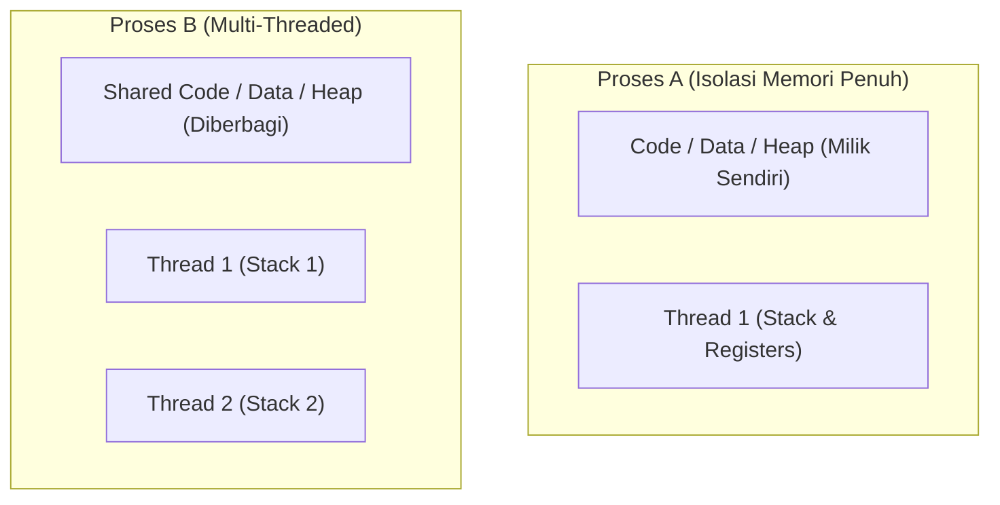
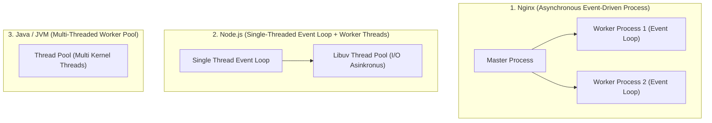

# 3. Thread, Multithreading, dan Arsitektur Server Modern

Navigasi: Modul Sebelumnya: [[02_Konsep_Proses_dan_Manajemen_Linux_Server]] | [[Konsep_Sistem_Operasi]] | Modul Berikutnya: [[04_Algoritma_Penjadwalan_CPU]]

---

**Thread** adalah unit terkecil dari eksekusi CPU di dalam sebuah proses. Thread sering disebut sebagai *Lightweight Process* (LWP) karena beberapa thread di dalam satu proses yang sama **saling berbagi ruang alamat memori (*shared address space*)**, berkas terbuka, dan kode program.

---

## 3.1. Perbandingan Utama: Process vs Thread

| Parameter | Process | Thread |
| :--- | :--- | :--- |
| **Ruang Memori** | Terisolasi penuh dari proses lain. | **Saling berbagi (*shared*)** Heap, Data, & Code antar thread. |
| **Overhead Context Switch**| 🐢 Tinggi (Harus mengganti tabel halaman memori MMU). | ⚡ Sangat Rendah (Hanya mengganti Stack & Register). |
| **Komunikasi** | Membutuhkan IPC (Socket, Shared Memory, Pipe). | Langsung membaca/menulis variabel global yang sama. |
| **Dampak Crash** | Jika 1 proses crash, proses lain tetap aman. | Jika 1 thread mengalami error fatal, **seluruh proses crash**. |

---

## 3.2. Model Multithreading dan Multiprocessing

1. **User Threads**: Dikontrol di tingkat pengguna tanpa keterlibatan kernel OS (misal: Green Threads). Kinerja cepat tetapi jika 1 thread terblokir I/O, seluruh proses ikut terblokir.
2. **Kernel Threads**: Dikontrol langsung oleh Kernel OS. Thread dapat didistribusikan secara fisik ke beberapa inti CPU (*Multi-Core CPU*) secara sejati.

---

## 3.3. Penerapan Arsitektur Thread & Process pada Environment Server Web

Memahami perbedaan thread dan proses sangat krusial saat mengonfigurasi dan mengoptimalkan performa server web (*Web Server Tuning*):

### ⚙️ Perbandingan Arsitektur Server Populer:

- **Nginx (Multi-Process Event-Driven)**: Menggunakan 1 *Master Process* dan beberapa *Worker Processes* (biasanya disesuaikan dengan jumlah core CPU). Sangat hemat memori dan sanggup menangani puluhan ribu koneksi bersamaan (*C10K problem*).
- **Node.js / Express**: Menjalankan *Single-Threaded Event Loop* untuk menangani request I/O, serta menggunakan *Worker Threads* internal untuk tugas berat.
- **Python Gunicorn / Uvicorn**: Menggunakan *Worker Processes* terpisah untuk memintas keterbatasan **GIL (Global Interpreter Lock)** pada Python.
- **Java Spring Boot / Tomcat**: Membuka **Thread Pool** (misal: 200 thread kernel) untuk memproses tiap permintaan HTTP secara berurutan.

---

Navigasi: Modul Sebelumnya: [[02_Konsep_Proses_dan_Manajemen_Linux_Server]] | [[Konsep_Sistem_Operasi]] | Modul Berikutnya: [[04_Algoritma_Penjadwalan_CPU]]
