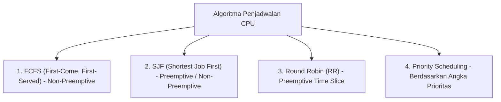

# 4. Algoritma Penjadwalan CPU (CPU Scheduling)

Navigasi: Modul Sebelumnya: [[03_Thread_Multithreading_dan_Arsitektur_Server]] | [[Konsep_Sistem_Operasi]] | Modul Berikutnya: [[05_Konkurensi_Sinkronisasi_dan_Race_Condition]]

---

**Penjadwalan CPU** adalah tugas dasar sistem operasi untuk memilih proses mana di dalam antrean `Ready` yang berhak mendapatkan jatah eksekusi eksekusi eksekusi waktu CPU.

---

## 4.1. Kategori Penjadwalan: Preemptive vs Non-Preemptive

- **Non-Preemptive (Koorperatif)**: Sekali CPU dialokasikan ke suatu proses, proses tersebut akan memegang CPU hingga selesai (*terminate*) atau secara sukarela melepaskan CPU untuk meminta I/O.
- **Preemptive**: OS berhak menghentikan secara paksa (*interrupt*) proses yang sedang berjalan di tengah eksekusi untuk mengalihkan CPU ke proses lain yang memiliki prioritas lebih tinggi atau saat *time quantum* habis.

---

## 4.2. Algoritma Penjadwalan Utama



| Algoritma | Mekanisme | Kelebihan | Kelemahan |
| :--- | :--- | :--- | :--- |
| **FCFS** | Proses dieksekusi sesuai urutan kedatangan. | Sangat sederhana. | **Convoy Effect**: Proses pendek tertahan lama di belakang proses panjang. |
| **SJF** | Memprioritaskan proses dengan durasi *CPU burst* terpendek. | **Waktu tunggu rata-rata (*Average Waiting Time*) paling optimal.** | Sulit memprediksi durasi burst proses secara pasti. |
| **Round Robin (RR)**| Setiap proses mendapat jataan waktu kecil (*Time Quantum / Quantum Slice* $\approx 10-100\text{ ms}$). | Sangat responsif untuk sistem *time-sharing* multi-user. | Jika quantum terlalu kecil, *overhead context switch* membengkak. |
| **Priority** | CPU diberikan ke proses dengan angka prioritas tertinggi. | Mendukung pemrosesan tugas *critical*. | **Starvation**: Proses berprioritas rendah bisa tidak pernah dieksekusi. |

---

## 4.3. Penjadwalan Linux Modern: Completely Fair Scheduler (CFS)

Sistem operasi Linux modern (mulai kernel 2.6.23) menggunakan algoritma **Completely Fair Scheduler (CFS)**.

- **Prinsip Kerja CFS**: Tidak menggunakan antrean *Queue* konvensional, melainkan struktur data **Red-Black Tree** untuk membagi waktu CPU secara adil secara matematis berdasarkan variabel `vruntime` (*virtual runtime*).
- **Nilai Nice (`nice`)**: Di Linux, prioritas proses diatur melalui nilai `nice` berkisar dari `-20` (Prioritas paling tinggi) hingga `19` (Prioritas paling rendah).

```bash
# Menjalankan script Python dengan prioritas lebih tinggi (nilai nice -10)
nice -n -10 python script.py

# Mengubah nilai nice proses yang sedang berjalan (PID: 5432)
renice -n 5 -p 5432
```

---

Navigasi: Modul Sebelumnya: [[03_Thread_Multithreading_dan_Arsitektur_Server]] | [[Konsep_Sistem_Operasi]] | Modul Berikutnya: [[05_Konkurensi_Sinkronisasi_dan_Race_Condition]]
