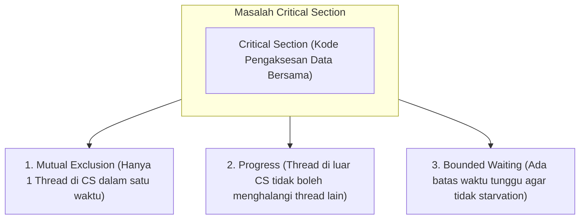

# 5. Konkurensi, Sinkronisasi, dan Race Condition

Navigasi: Modul Sebelumnya: [[04_Algoritma_Penjadwalan_CPU]] | [[Konsep_Sistem_Operasi]] | Modul Berikutnya: [[06_Deadlock_Pencegahan_dan_Penanganan]]

---

Dalam lingkungan *multithreading* atau *multiprocessing*, beberapa thread/proses dapat mengeksekusi instruksi secara bersamaan (*konkurensi*). Tanpa mekanisme sinkronisasi yang tepat, pengaksesan memori secara bersamaan dapat menyebabkan korupsi data.

---

## 5.1. Masalah Race Condition dan Critical Section

- **Race Condition**: Kondisi di mana hasil akhir eksekusi tergantung pada urutan atau waktu mengeksekusi beberapa thread yang mengakses variabel bersama (*shared variable*).
- **Critical Section**: Bagian kode program yang melakukan manipulasi atau penulisan data ke dalam variabel/sumber daya bersama.



---

## 5.2. Alat Sinkronisasi (Synchronization Tools)

### 1. Mutex (Mutual Exclusion Lock)
Mekanisme penguncian sederhana berbasis kunci (*Lock*). Thread wajib mengambil kunci (`lock()`) sebelum memasuki Critical Section dan melepasnya (`unlock()`) setelah selesai.

### 2. Semaphores (Counting & Binary)
Variabel integer khusus yang diakses melalui dua operasi atomik: `wait()` (P) dan `signal()` (V).
- **Binary Semaphore**: Sama seperti Mutex (nilai 0 atau 1).
- **Counting Semaphore**: Digunakan untuk membatasi akses ke sekumpulan $N$ sumber daya identik (misal: membatasi maksimal 10 koneksi database bersamaan).

```c
// Contoh Penggunaan Mutex di C (POSIX Threads)
#include <pthread.h>

pthread_mutex_t lock;
int counter = 0;

void* incrementCounter(void* arg) {
    pthread_mutex_lock(&lock);   // Enter Critical Section (Acquire Lock)
    counter++;                   // Safe Operation
    pthread_mutex_unlock(&lock); // Exit Critical Section (Release Lock)
    return NULL;
}
```

---

Navigasi: Modul Sebelumnya: [[04_Algoritma_Penjadwalan_CPU]] | [[Konsep_Sistem_Operasi]] | Modul Berikutnya: [[06_Deadlock_Pencegahan_dan_Penanganan]]
