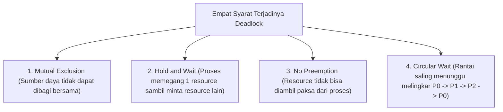

# 6. Deadlock: Syarat Karakteristik, Pencegahan, dan Penanganan

Navigasi: Modul Sebelumnya: [[05_Konkurensi_Sinkronisasi_dan_Race_Condition]] | [[Konsep_Sistem_Operasi]] | Modul Berikutnya: [[07_Manajemen_Memori_Utama_Paging_dan_Segmentation]]

---

**Deadlock** adalah situasi di mana sekumpulan proses terhenti (*blocked*) secara permanen karena setiap proses memegang sumber daya dan menunggu sumber daya lain yang sedang dipegang oleh proses lain dalam kelompok tersebut.

---

## 6.1. Empat Syarat Utama Karakteristik Deadlock (Coffman Conditions)

Deadlock **hanya dapat terjadi** jika keempat kondisi berikut terpenuhi secara bersamaan:

---

## 6.2. Strategi Penanganan Deadlock

1. **Deadlock Prevention (Pencegahan)**: Memastikan setidaknya salah satu dari 4 kondisi Coffman tidak pernah terjadi dalam arsitektur sistem.
2. **Deadlock Avoidance (Penghindaran)**: Memeriksa setiap permintaan alokasi secara dinamis menggunakan **Algoritma Banker (*Banker's Algorithm*)** untuk memastikan sistem selalu berada dalam status aman (*Safe State*).
3. **Deadlock Detection & Recovery**: Membiarkan deadlock terjadi, mendeteksinya secara berkala melalui *Resource Allocation Graph*, dan mengatasinya dengan membatalkan (*kill*) proses yang terlibat.
4. **Ostrich Algorithm (Abaikan)**: Menyeburkan kepala ke tanah dan berpura-pura deadlock tidak pernah terjadi. Digunakan oleh mayoritas OS umum (Linux, Windows) karena biaya overhead pencegahan deadlock lebih mahal dibanding frekuensi terjadinya.

---

Navigasi: Modul Sebelumnya: [[05_Konkurensi_Sinkronisasi_dan_Race_Condition]] | [[Konsep_Sistem_Operasi]] | Modul Berikutnya: [[07_Manajemen_Memori_Utama_Paging_dan_Segmentation]]
