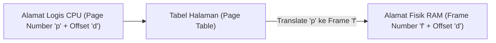

# 7. Manajemen Memori Utama: Alokasi, Paging, dan Segmentasi

Navigasi: Modul Sebelumnya: [[06_Deadlock_Pencegahan_dan_Penanganan]] | [[Konsep_Sistem_Operasi]] | Modul Berikutnya: [[08_Memori_Virtual_Swapping_dan_Linux_OOM_Killer]]

---

Memori utama (RAM) adalah pusat operasi komputer modern. CPU hanya dapat mengeksekusi instruksi dan membaca data yang berada di dalam memori utama.

---

## 7.1. Alamat Logis vs Alamat Fisik (MMU)

- **Alamat Logis (Logical/Virtual Address)**: Alamat memori yang dihasilkan oleh CPU saat mengeksekusi instruksi program.
- **Alamat Fisik (Physical Address)**: Alamat fisik sebenarnya yang dimuat pada modul perangkat keras RAM.
- **Memory Management Unit (MMU)**: Komponen hardware yang menerjemahkan alamat logis menjadi alamat fisik secara *real-time*.

---

## 7.2. Masalah Fragmentasi Memori

1. **Fragmentasi Eksternal**: Jumlah total ruang memori bebas cukup untuk memenuhi permintaan alokasi, namun ruang tersebut terpecah-pecah menjadi potongan-potongan kecil yang tidak berurutan (*non-contiguous*).
2. **Fragmentasi Internal**: Memori dialokasikan dalam ukuran blok tetap. Jika proses membutuhkan ruang lebih kecil dari ukuran blok, sisa memori di dalam blok tersebut terbuang sia-sia.

---

## 7.3. Skema Paging (Solusi Non-Contiguous Memory)

**Paging** adalah skema manajemen memori yang memungkinkan ruang alamat fisik suatu proses disimpan secara acak dan tidak berurutan (*non-contiguous*).

### Key Terms:
- **Pages**: Blok-blok memori alamat logis berukuran tetap (misal: 4 KB).
- **Frames**: Blok-blok memori RAM fisik yang ukurannya persis sama dengan ukuran Page.
- **TLB (Translation Lookaside Buffer)**: Cache memori khusus berkecepatan sangat tinggi di dalam CPU untuk mempercepat penerjemahan alamat tanpa perlu membaca Page Table di RAM berulang kali.

---

Navigasi: Modul Sebelumnya: [[06_Deadlock_Pencegahan_dan_Penanganan]] | [[Konsep_Sistem_Operasi]] | Modul Berikutnya: [[08_Memori_Virtual_Swapping_dan_Linux_OOM_Killer]]
