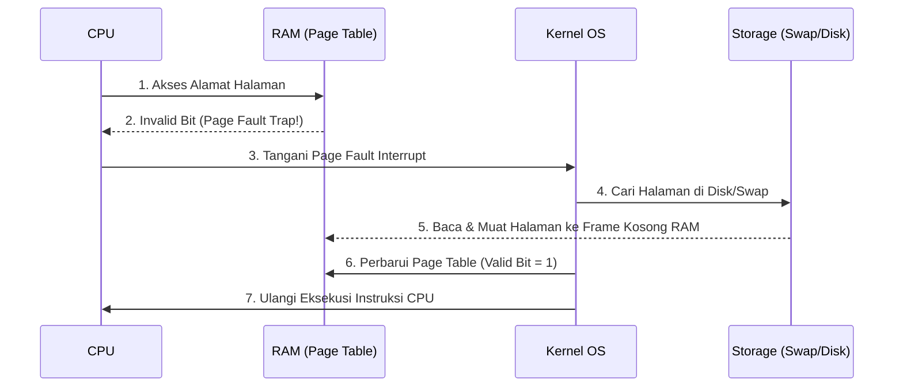
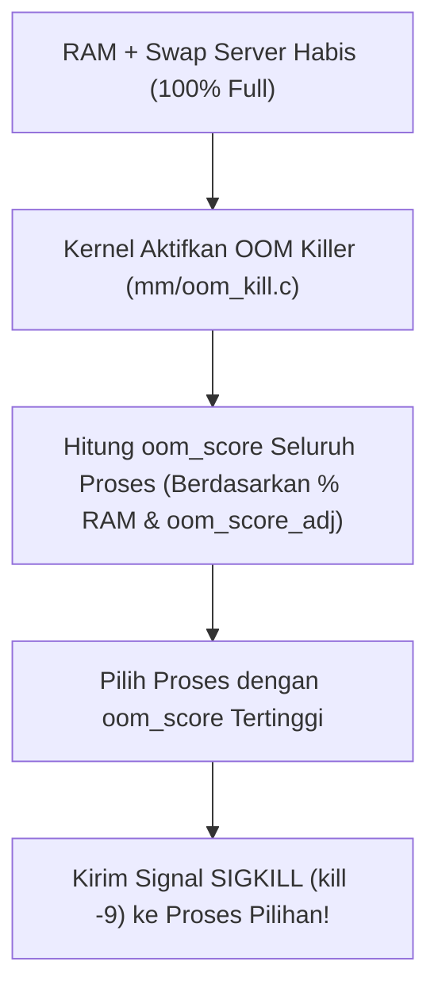

# 8. Memori Virtual, Swapping, dan Linux OOM (Out-Of-Memory) Killer

Navigasi: Modul Sebelumnya: [[07_Manajemen_Memori_Utama_Paging_dan_Segmentation]] | [[Konsep_Sistem_Operasi]] | Modul Berikutnya: [[09_Sistem_Berkas_dan_Manajemen_I_O]]

---

**Memori Virtual** adalah teknik manajemen memori yang memisahkan memori logis pengguna dari memori fisik RAM. Teknik ini memungkinkan eksekusi proses yang ukurannya **jauh lebih besar dibandingkan kapasitas RAM fisik yang tersedia**.

---

## 8.1. Demand Paging dan Page Fault Handling

Dalam skema **Demand Paging**, halaman (*pages*) hanya dimuat ke RAM fisik saat benar-benar dibutuhkan selama eksekusi program.



---

## 8.2. Algoritma Penggantian Halaman (Page Replacement)

Saat RAM penuh dan terjadi Page Fault, OS harus memilih halaman di RAM yang akan dikeluarkan (*swapped out*) ke disk.

- **FIFO (First-In, First-Out)**: Mengeluarkan halaman yang paling pertama dimuat ke RAM. Mengalami **Belady's Anomaly** (Page Fault bisa meningkat meski kapasitas RAM diperbesar).
- **LRU (Least Recently Used)**: Mengeluarkan halaman yang paling lama tidak diakses/digunakan oleh CPU. Diterapkan secara luas karena efisien dan mendekati hasil optimal.

---

## 8.3. Manajemen Memori Server Linux: Swap & Kernel Tuning

Pada server Linux production, manajemen memori dikendalikan melalui konfigurasi sysctl kernel:

### 1. Swap Space & Parameter `vm.swappiness`
Swap adalah area di disk (harddisk/SSD) yang digunakan sebagai perpanjangan RAM saat kapasitas RAM penuh.
- `vm.swappiness` (Nilai 0 - 100): Mengatur seberapa agresif Linux memindahkan data dari RAM ke Swap.
  - *Server Database (PostgreSQL/MySQL)*: Disarankan diset ke nilai rendah (`vm.swappiness = 10`) untuk mencegah penurunan performa I/O disk.

```bash
# Memeriksa penggunaan RAM & Swap dalam format human-readable
free -h

# Mengubah parameter swappiness secara live di server
sysctl vm.swappiness=10
```

---

## 8.4. Linux Out-Of-Memory (OOM) Killer

Saat RAM fisik dan Swap server benar-benar **habis 100%**, Linux kernel tidak langsung crash. Kernel akan mengaktifkan mekanisme penyelamat darurat bernama **OOM Killer**.



### 🛡️ Mencegah Server Process Terbunuh OOM Killer:
Daftar proses seperti Database atau Nginx dapat dilindungi dari OOM Killer dengan menaikkan penyesuaian skor (*score adjustment*):

```bash
# Melindungi PID 1234 agar TIDAK BOLEH dibunuh OOM Killer
echo -1000 > /proc/1234/oom_score_adj
```

---

Navigasi: Modul Sebelumnya: [[07_Manajemen_Memori_Utama_Paging_dan_Segmentation]] | [[Konsep_Sistem_Operasi]] | Modul Berikutnya: [[09_Sistem_Berkas_dan_Manajemen_I_O]]
