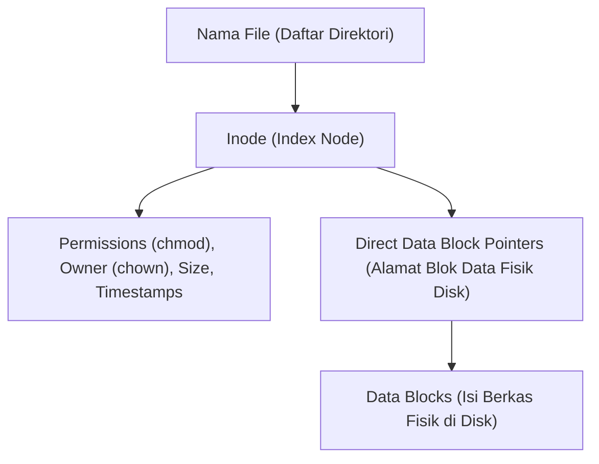

# 9. Sistem Berkas (File System) dan Manajemen Perangkat I/O

Navigasi: Modul Sebelumnya: [[08_Memori_Virtual_Swapping_dan_Linux_OOM_Killer]] | [[Konsep_Sistem_Operasi]] | Modul Berikutnya: [[10_Keamanan_Sistem_Operasi_dan_Isolasi_Container_Docker]]

---

**Sistem Berkas (File System)** menyajikan panduan penyimpanan logis terstruktur (*logical storage view*) bagi pengguna dengan mengabstraksi fisik media penyimpanan (SSD, Harddisk, Flashdisk).

---

## 9.1. Struktur Inode pada Sistem Berkas Linux (ext4 / XFS)

Pada sistem berkas Linux, setiap berkas dan direktori diwakili oleh struktur data metadata bernama **Inode (Index Node)**.

> [!NOTE]
> **Hard Link vs Soft Link (Symlink)**:
> - **Hard Link**: Dua nama berkas merujuk pada **nomor Inode yang sama**.
> - **Soft Link (Symbolic Link)**: Berkas khusus yang berisi string **jalur alamat (*path*)** ke berkas lain.

---

## 9.2. Metode Alokasi Berkas di Disk

1. **Contiguous Allocation**: Berkas disimpan pada blok disk berurutan. Akses sangat cepat tetapi menimbulkan fragmentasi eksternal.
2. **Linked Allocation**: Berkas disimpan pada senarai berantai (*Linked List*) blok disk. Tidak ada fragmentasi, namun akses acak (*random access*) lambat.
3. **Indexed Allocation**: Menggunakan blok indeks khusus (*Inode*) yang menampung pointer ke seluruh blok data berkas. Digunakan oleh sistem berkas modern (ext4, XFS, NTFS).

---

## 9.3. Arsitektur Manajemen I/O (Input/Output)

Manajemen I/O bertugas menangani perangkat fisik yang kecepatannya jauh lebih lambat dibanding CPU:

- **Polling**: CPU secara terus-menerus mengecek status perangkat I/O (*Busy-waiting*). Menghabiskan siklus waktu CPU.
- **Interrupt-Driven I/O**: Perangkat I/O mengirimkan signal *Interrupt* ke CPU hanya saat data siap diproses.
- **Direct Memory Access (DMA)**: Pengontrol khusus (*DMA Controller*) memindahkan data berukuran besar secara langsung antara perangkat I/O dan RAM **tanpa melibatkan beban CPU**.

---

Navigasi: Modul Sebelumnya: [[08_Memori_Virtual_Swapping_dan_Linux_OOM_Killer]] | [[Konsep_Sistem_Operasi]] | Modul Berikutnya: [[10_Keamanan_Sistem_Operasi_dan_Isolasi_Container_Docker]]
