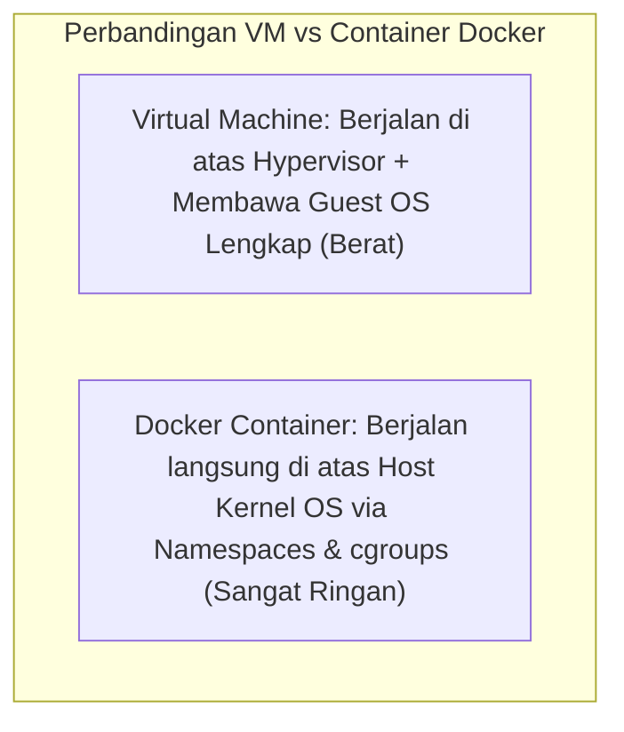
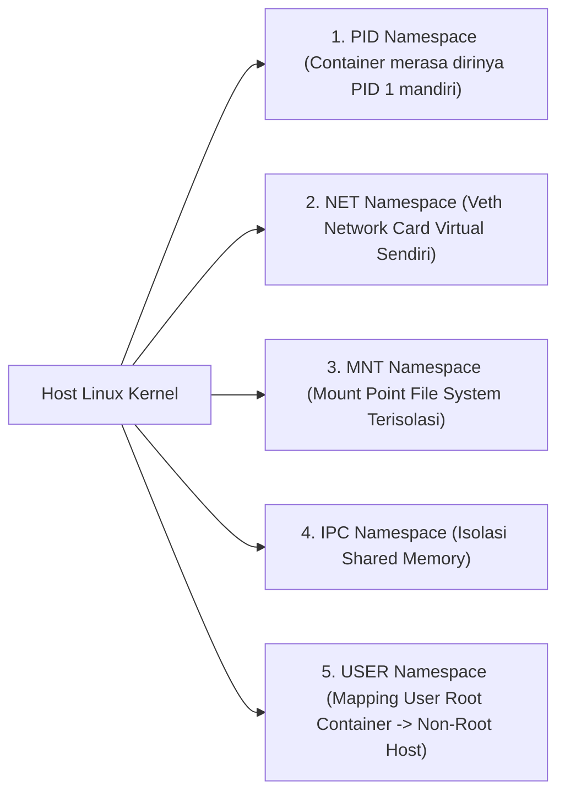
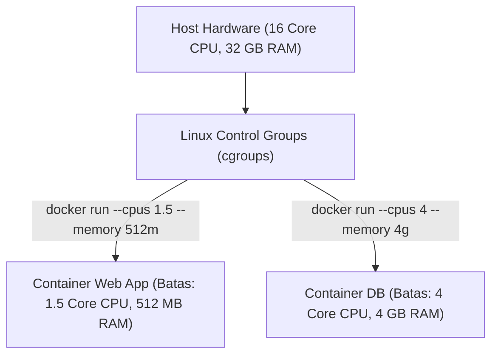

# 10. Keamanan Sistem Operasi dan Teknologi Isolasi Container Docker

Navigasi: Modul Sebelumnya: [[09_Sistem_Berkas_dan_Manajemen_I_O]] | [[Konsep_Sistem_Operasi]]

---

## 10.1. Keamanan Sistem Operasi: Otentikasi dan Hak Akses POSIX

Keamanan sistem operasi bertugas memastikan sumber daya sistem hanya dapat diakses oleh pengguna (*Users*) dan proses yang memiliki wewenang sah.

### 🛡️ Hak Akses File POSIX Linux (`chmod` & `chown`):
Setiap berkas di Linux memiliki 3 tingkatan hak akses: **Owner (u)**, **Group (g)**, dan **Others (o)** dengan izin **Read (4)**, **Write (2)**, dan **Execute (1)**.

```bash
# Menyetel hak akses file script.sh: Owner (rwx=7), Group (r-x=5), Others (r-x=5)
chmod 755 script.sh

# Mengubah pemilik file menjadi user 'www-data' dan group 'www-data'
chown www-data:www-data /var/www/html/index.php
```

---

## 10.2. Fondasi Sistem Operasi di Balik Teknologi Container (Docker)

Banyak pengembang mengira **Docker Container** adalah *Virtual Machine* (VM) yang ringan. Secara arsitektural, Container **bukanlah VM**, melainkan **proses biasa di Linux yang diisolasi** menggunakan dua fitur inti Kernel Linux: **Linux Namespaces** dan **Control Groups (cgroups)**.



---

## 10.3. Isolasi Lingkungan dengan Linux Namespaces

**Linux Namespaces** membatasi apa yang **dapat dilihat (*visibility*)** oleh sebuah proses di dalam container:



---

## 10.4. Pembatasan Alokasi Sumber Daya dengan Linux Control Groups (cgroups)

Jika Namespaces membatasi apa yang dapat *dilihat* oleh container, **cgroups** membatasi berapa banyak **sumber daya (*resource quota*)** yang **dapat dikonsumsi** oleh container.



### 🛠️ Perintah Praktis Docker Deployment:

```bash
# Menjalankan container Nginx dengan batasan kuota RAM 256MB dan 1 Core CPU
docker run -d \
  --name web-server \
  --memory="256m" \
  --cpus="1.0" \
  -p 80:80 \
  nginx:alpine
```

---

## 10.5. Praktik Terbaik Deployment Container di Server

1. **Penanganan PID 1 Init Process**: Aplikasi utama di dalam container yang berjalan sebagai PID 1 harus dapat menangani signal `SIGTERM` dan memanen *Zombie Processes*. Disarankan menggunakan init minimalis seperti `tini` (`docker run --init`).
2. **Pengelolaan Out-Of-Memory (OOM) Container**: Jika container melebihi batas `--memory`, OOM Killer kernel akan membunuh container tersebut tanpa mengganggu container lain di server host yang sama.
3. **Multi-Stage Builds**: Memisahkan stage kompilasi dari stage eksekusi akhir untuk menghasilkan image Docker berukuran sangat kecil dan aman.

---

Navigasi: Modul Sebelumnya: [[09_Sistem_Berkas_dan_Manajemen_I_O]] | [[Konsep_Sistem_Operasi]]
