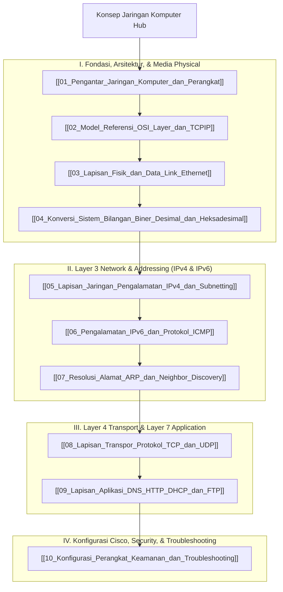

# Panduan Komprehensif Konsep Jaringan Komputer (Computer Networking Hub)

Dokumen ini merupakan berkas utama (*Knowledge Hub*) yang memetakan seluruh modul pembelajaran **Jaringan Komputer (Computer Networks & Cisco CCNA ITN)**. Seluruh materi disusun secara sistematis dan dikorelasikan dengan [[../07_Sistem_Operasi/Konsep_Sistem_Operasi|Sistem Operasi & Linux Server]], [[../04_Pemrograman_Web/Konsep_Pemrograman_Web|Pemrograman Web]], [[../05_Pengembangan_Aplikasi_Bergerak/Konsep_Pengembangan_Aplikasi_Bergerak|Pengembangan Aplikasi Bergerak]], serta [[../../Riset_Edge_AI_3T/edge-ai-untuk-3t|Riset Edge AI 3T]].

> [!NOTE]
> Seluruh modul pada hub ini saling terhubung secara dua arah (*bidirectional links*) menggunakan Obsidian Wiki-Links `[[...]]`. Seluruh berkas dari `vault-teman` **dikecualikan 100%**.

---

## 🗺️ Peta Pembelajaran Jaringan Komputer (Mindmap)

---

## 📚 Daftar Lengkap Modul Pembelajaran Jaringan Komputer

### Part I: Fondasi, Arsitektur, & Media Physical
1. **[[01_Pengantar_Jaringan_Komputer_dan_Perangkat]]**: Pengenalan data networks, komponen jaringan (End devices, Intermediary devices, Media), skala jaringan (LAN, WLAN, WAN, Internet), topologi fisik & logis (Star, Mesh).
2. **[[02_Model_Referensi_OSI_Layer_dan_TCPIP]]**: Perbandingan Model Referensi OSI 7 Layer vs Model TCP/IP 4 Layer, fungsi tiap lapisan, dan proses **Enkapsulasi & Dekapsulasi Data (PDU)**.
3. **[[03_Lapisan_Fisik_dan_Data_Link_Ethernet]]**: Media fisik (Kabel tembaga UTP/STP, Fiber Optic, Wireless), Bandwidth vs Throughput, Sublayer LLC & MAC, struktur Alamat MAC (48-bit), serta kontrol akses CSMA/CD & CSMA/CA.
4. **[[04_Konversi_Sistem_Bilangan_Biner_Desimal_dan_Heksadesimal]]**: Bobot nilai oktet 8-bit ($2^n$), teknik konversi biner ke desimal/sebaliknya (IPv4), serta biner ke heksadesimal/sebaliknya (MAC & IPv6).

### Part II: Layer 3 Network & Addressing (IPv4 & IPv6)
5. **[[05_Lapisan_Jaringan_Pengalamatan_IPv4_dan_Subnetting]]**: Struktur IPv4 32-bit (Network ID vs Host ID), jenis alamat (Unicast, Multicast, Broadcast), Public vs Private IP (RFC 1918), dan **Subnetting IPv4 VLSM & Notasi CIDR** (`/24`, `/26`, `/30`).
6. **[[06_Pengalamatan_IPv6_dan_Protokol_ICMP]]**: Format IPv6 128-bit heksadesimal, aturan penyederhanaan titik dua ganda (`::`), tipe alamat (GUA, LLA, Loopback, Multicast), serta pesan **Protokol ICMP (ICMPv4 & ICMPv6)** untuk `ping` & `traceroute`.
7. **[[07_Resolusi_Alamat_ARP_dan_Neighbor_Discovery]]**: Prinsip kerja **Address Resolution Protocol (ARP)** pada IPv4 (ARP Request broadcast & Reply unicast, tabel ARP, ancaman ARP Poisoning) serta **IPv6 Neighbor Discovery (ND)** berbasis ICMPv6.

### Part III: Layer 4 Transport & Layer 7 Application
8. **[[08_Lapisan_Transpor_Protokol_TCP_dan_UDP]]**: Peran Transport Layer, alokasi Port Numbers (Well-Known, Registered, Dynamic), perbandingan **Protokol TCP** (Connection-oriented, Reliable, Flow control, **TCP 3-Way Handshake**) vs **Protokol UDP** (Connectionless, Fast).
9. **[[09_Lapisan_Aplikasi_DNS_HTTP_DHCP_dan_FTP]]**: Arsitektur Client-Server, **DNS** (Resolusi domain & rekor A/AAAA/CNAME/MX), **HTTP/HTTPS** (Metode GET/POST, SSL/TLS), **DHCP** (Proses DORA: Discover, Offer, Request, Acknowledge), dan Email/FTP.

### Part IV: Konfigurasi Cisco, Security, & Troubleshooting
10. **[[10_Konfigurasi_Perangkat_Keamanan_dan_Troubleshooting]]**: CLI Cisco IOS (User EXEC, Privileged EXEC, Global Config), konfigurasi hostname/password/IP VLAN 1, dasar keamanan jaringan (Firewall, WPA2/WPA3), dan **Perintah Diagnostic Troubleshooting CLI** (`ipconfig`, `ping`, `traceroute`, `nslookup`, `netstat`, `arp`).

---

## 🔗 Hubungan Antar Berkas Catatan Utama

- 🔗 **[[../07_Sistem_Operasi/Konsep_Sistem_Operasi|Sistem Operasi & Linux Server]]**: Konfigurasi antarmuka jaringan Linux, socket TCP/UDP, firewall POSIX, dan komunikasi antar container Docker.
- 🔗 **[[../04_Pemrograman_Web/Konsep_Pemrograman_Web|Pemrograman Web]]**: Protokol lapisan aplikasi HTTP/HTTPS, WebSockets, dan komunikasi REST API.
- 🔗 **[[../05_Pengembangan_Aplikasi_Bergerak/Konsep_Pengembangan_Aplikasi_Bergerak|Pengembangan Aplikasi Bergerak]]**: Komunikasi data nirkabel (Wi-Fi, 4G/5G) dan konsumsi HTTP client API di perangkat mobile.

---
*Hub catatan ini dapat dipelajari secara bertahap melalui navigasi tautan `[[...]]` pada setiap modul.*
