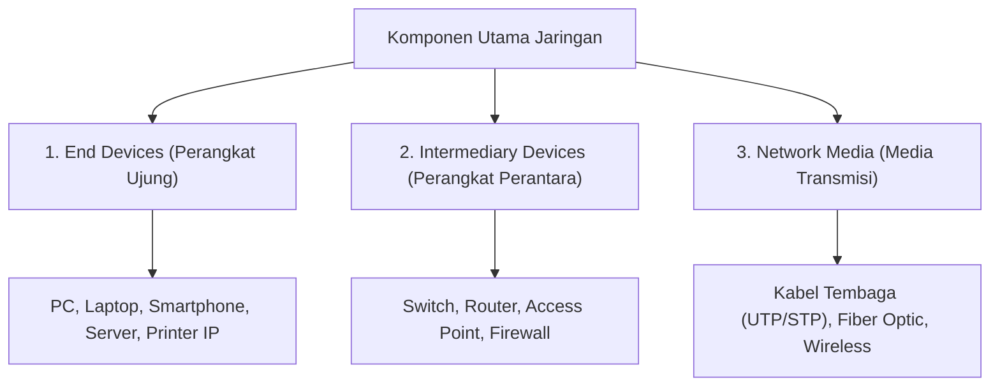
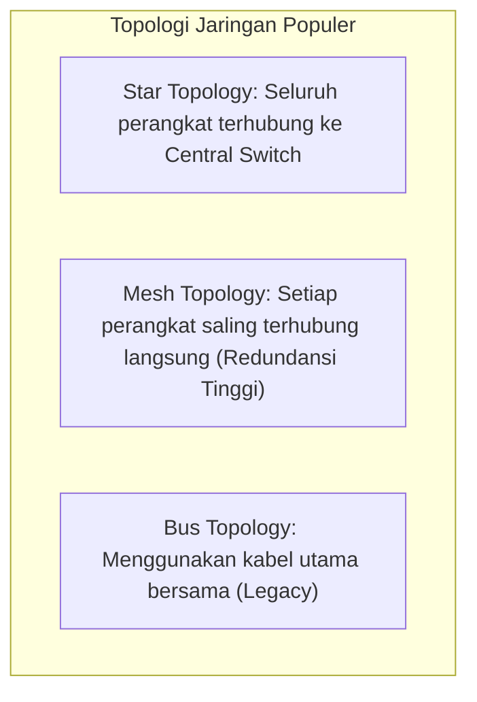

# 1. Pengantar Jaringan Komputer, Topologi, dan Perangkat Jaringan

Navigasi: [[Konsep_Jaringan_Komputer]] | Modul Berikutnya: [[02_Model_Referensi_OSI_Layer_dan_TCPIP]]

---

**Jaringan Komputer (Data Network)** adalah himpunan dua atau lebih perangkat lunak dan keras yang saling terhubung melalui media transmisi untuk saling berbagi sumber daya (*resources*), bertukar data, dan berkomunikasi.

---

## 1.1. Komponen Utama Jaringan Komputer

Setiap sistem jaringan komputer dibangun di atas tiga komponen utama:

---

## 1.2. Klasifikasi Skala Jaringan Komputer

| Tipe Jaringan | Singkatan | Cakupan Geografis & Karakteristik |
| :--- | :--- | :--- |
| **Local Area Network** | **LAN** | Jaringan skala lokal dalam satu ruangan, gedung, atau kampus. Kecepatan transfer sangat tinggi. |
| **Wireless LAN** | **WLAN** | Jaringan LAN tanpa kabel berbasis gelombang radio (Wi-Fi 802.11). |
| **Wide Area Network** | **WAN** | Jaringan skala luas yang menghubungkan antar LAN di wilayah geografis berbeda (antar kota/negara). |
| **The Internet** | **Internet** | Jaringan global publik yang menghubungkan jutaan WAN dan LAN di seluruh dunia. |

---

## 1.3. Topologi Fisik dan Logis Jaringan

### Keunggulan Topologi Star (Standar Modern):
- Mudah ditambahi perangkat baru tanpa mengganggu operasi jaringan yang sedang berjalan.
- Jika satu kabel perangkat putus, perangkat lain di dalam jaringan tetap dapat berkomunikasi secara normal.

---

Navigasi: [[Konsep_Jaringan_Komputer]] | Modul Berikutnya: [[02_Model_Referensi_OSI_Layer_dan_TCPIP]]
