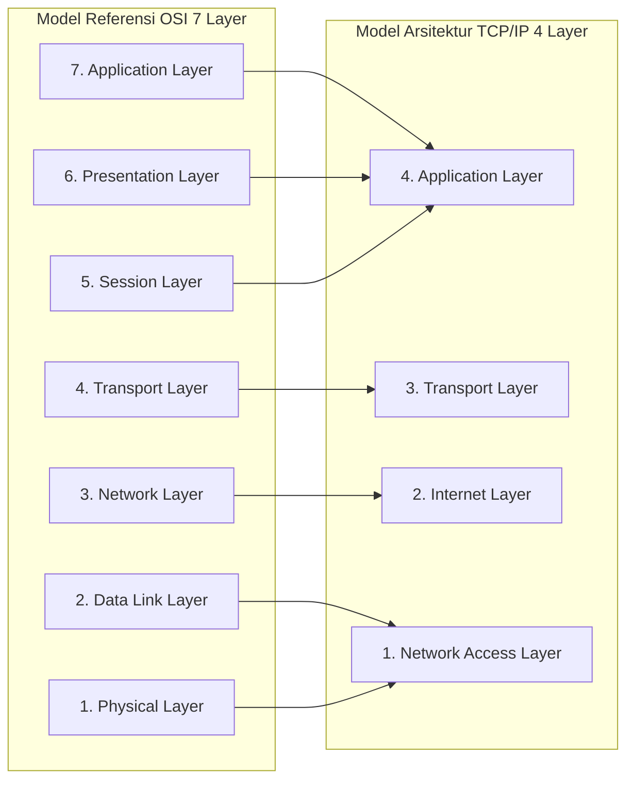
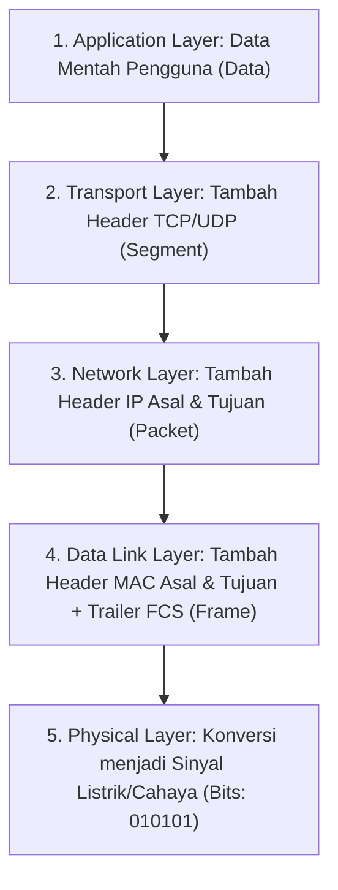

# 2. Model Referensi OSI 7 Layer dan Model TCP/IP 4 Layer

Navigasi: Modul Sebelumnya: [[01_Pengantar_Jaringan_Komputer_dan_Perangkat]] | [[Konsep_Jaringan_Komputer]] | Modul Berikutnya: [[03_Lapisan_Fisik_dan_Data_Link_Ethernet]]

---

Untuk mempermudah pemahaman dan pembuata standar komunikasi jaringan antar produsen (*vendor-neutral*), dikembangkan model arsitektur lapisan (*layered architecture*).

---

## 2.1. Perbandingan Model OSI 7 Layer vs Model TCP/IP 4 Layer

| Layer OSI | Nama Layer | Fungsi dan Peran Utama | Contoh Protokol / Format |
| :--- | :--- | :--- | :--- |
| **7** | **Application** | Antarmuka langsung bagi aplikasi pengguna untuk mengakses layanan jaringan. | HTTP, HTTPS, DNS, DHCP, FTP |
| **6** | **Presentation**| Mengatur format data, enkripsi, dan kompresi data. | SSL/TLS, JPEG, ASCII |
| **5** | **Session** | Mengelola dan mengakhiri sesi dialog antar aplikasi. | NetBIOS, RPC |
| **4** | **Transport** | Mengatur transmisi data end-to-end, segmentasi, dan kontrol aliran data. | **TCP**, **UDP** (Port Numbers) |
| **3** | **Network** | Mengatur pengalamatan logis dan penentuan rute terbaik (*routing*). | **IPv4**, **IPv6**, ICMP |
| **2** | **Data Link** | Mengatur pembingkaian (*framing*) data fisik & pengalamatan MAC fisik. | Ethernet (802.3), Wi-Fi (802.11) |
| **1** | **Physical** | Transmisi bit-bit sinyal mentah melalui media fisik (listrik, cahaya, radio). | Kabel UTP, Fiber Optic, BNC |

---

## 2.2. Proses Enkapsulasi dan Dekapsulasi Data (PDU)

Saat data dikirimkan dari pengirim ke penerima, data bergerak melintasi lapisan model OSI. Setiap lapisan menambahkan header kontrol khusus. Satuan data pada tiap lapisan disebut **Protocol Data Unit (PDU)**.

> [!IMPORTANT]
> - **Enkapsulasi**: Proses membungkus data dari Layer 7 hingga Layer 1 pada sisi **Pengirim**.
> - **Dekapsulasi**: Proses membuka kembali header pembungkus dari Layer 1 hingga Layer 7 pada sisi **Penerima**.

---

Navigasi: Modul Sebelumnya: [[01_Pengantar_Jaringan_Komputer_dan_Perangkat]] | [[Konsep_Jaringan_Komputer]] | Modul Berikutnya: [[03_Lapisan_Fisik_dan_Data_Link_Ethernet]]
