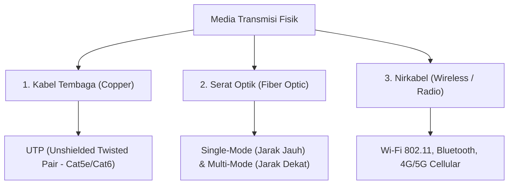

# 3. Lapisan Fisik (Physical) dan Data Link Ethernet

Navigasi: Modul Sebelumnya: [[02_Model_Referensi_OSI_Layer_dan_TCPIP]] | [[Konsep_Jaringan_Komputer]] | Modul Berikutnya: [[04_Konversi_Sistem_Bilangan_Biner_Desimal_dan_Heksadesimal]]

---

## 3.1. Lapisan Fisik (Physical Layer)

Lapisan Fisik bertugas mengonversi bingkai data (*frame*) dari Data Link Layer menjadi sinyal fisik mentah (pulsa listrik, cahaya, atau sinyal radio) yang ditransmisikan melalui media fisik.

### 🔌 Tiga Jenis Utama Media Transmisi Fisik:



### Parameter Ukuran Performa Media:
- **Bandwidth**: Kapasitas teori maksimum transfer data pada media (diukur dalam Mbps/Gbps).
- **Throughput**: Ukuran aktual transfer data riil yang berhasil terkirim dalam periode waktu tertentu.

---

## 3.2. Lapisan Data Link dan Standar Ethernet (IEEE 802.3)

Data Link Layer dibagi oleh standar IEEE 802 menjadi dua sub-layer:

1. **LLC Sublayer (Logical Link Control - 802.2)**: Berkomunikasi dengan Network Layer di atasnya dan mengidentifikasi protokol jaringan yang digunakan.
2. **MAC Sublayer (Media Access Control - 802.3)**: Mengatur pembingkaian data (*framing*), pemeriksaan error (FCS), dan pengalamatan fisik **Alamat MAC (*MAC Address*)**.

---

## 3.3. Struktur Alamat MAC (Media Access Control Address)

Alamat MAC adalah alamat fisik 48-bit (12 digit Heksadesimal) yang ditanamkan secara permanen (*Burned-In Address / BIA*) pada kartu jaringan (**NIC - Network Interface Card**).

```text
Contoh Alamat MAC: 00:1A:2B:3C:4D:5E

|--- 24-bit Pertama ---|--- 24-bit Terakhir ---|
|        OUI           |     Vendor Assigned   |
| (Organizationally    |    (Nomor Seri Unik    |
| Unique Identifier)   |   Perangkat NIC)       |
```

---

## 3.4. Mekanisme Kontrol Akses Media: CSMA/CD dan CSMA/CA

- **CSMA/CD (Carrier Sense Multiple Access with Collision Detection)**: Digunakan pada Ethernet kabel setengah-dupleks (*half-duplex*). Perangkat mendengarkan media sebelum mengirim; jika terjadi tabrakan sinyal (*collision*), pengiriman dihentikan dan diulang setelah waktu acak (*backoff time*).
- **CSMA/CA (Carrier Sense Multiple Access with Collision Avoidance)**: Digunakan pada jaringan wireless (Wi-Fi). Perangkat melakukan pemesanan jalur sebelum mengirim data untuk **mencegah** terjadinya tabrakan.

---

Navigasi: Modul Sebelumnya: [[02_Model_Referensi_OSI_Layer_dan_TCPIP]] | [[Konsep_Jaringan_Komputer]] | Modul Berikutnya: [[04_Konversi_Sistem_Bilangan_Biner_Desimal_dan_Heksadesimal]]
