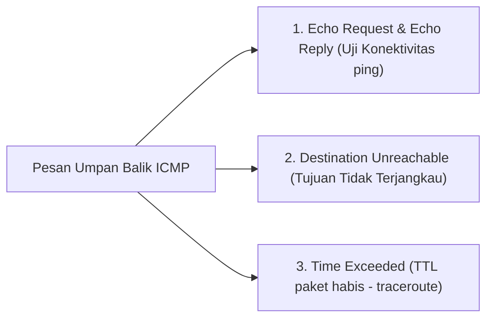

# 6. Pengalamatan IPv6 dan Protokol ICMP (ICMPv4 & ICMPv6)

Navigasi: Modul Sebelumnya: [[05_Lapisan_Jaringan_Pengalamatan_IPv4_dan_Subnetting]] | [[Konsep_Jaringan_Komputer]] | Modul Berikutnya: [[07_Resolusi_Alamat_ARP_dan_Neighbor_Discovery]]

---

## 6.1. Pengenalan Alamat IPv6 (128-bit)

Alamat **IPv6** dikembangkan untuk mengatasi krisis habisnya stok alamat IPv4. IPv6 berukuran 128-bit dan dituliskan dalam 8 blok Heksadesimal (*hextets*) yang dipisahkan oleh titik dua (`:`).

```text
Format Asli IPv6:
2001:0db8:0000:0000:0000:ff00:0042:8329

Aturan Penyederhanaan Penulisan IPv6:
1. Hapus Nol di Depan Hextet (Leading Zeros):
   2001:db8:0:0:0:ff00:42:8329
2. Ganti Blok Nol Berurutan dengan Titik Dua Ganda (::) - Hanya Boleh Digunakan 1 Kali!
   Hasil Akhir Ringkas: 2001:db8::ff00:42:8329
```

---

## 6.2. Kategori Alamat Utama IPv6

| Tipe Alamat IPv6 | Prefix Awalan | Fungsi & Karakteristik |
| :--- | :--- | :--- |
| **Global Unicast Address (GUA)** | `2000::/3` | Alamat publik yang dapat dirouting langsung di Internet global. |
| **Link-Local Address (LLA)** | `fe80::/10` | Alamat lokal yang otomatis dibuat pada NIC untuk komunikasi dalam 1 subnet lokal. |
| **Loopback Address** | `::1/128` | Alamat pengujian internal host lokal (setara dengan `127.0.0.1` pada IPv4). |
| **Multicast Address** | `ff00::/8` | Alamat pengiriman paket satu ke banyak (*one-to-many*). IPv6 tidak menggunakan Broadcast! |

---

## 6.3. Protokol Kontrol Pesan ICMP (ICMPv4 & ICMPv6)

**ICMP (Internet Control Message Protocol)** menyediakan umpan balik (*feedback*) mengenai masalah terkait pengiriman paket IP.



### 🛠️ Perintah Pengujian Jaringan Berbasis ICMP:
- **`ping <IP/Domain>`**: Mengirimkan ICMP Echo Request untuk menguji apakah host tujuan aktif dan berapa durasi respon kueri (*Round-Trip Time / RTT*).
- **`traceroute <IP>`** *(Linux/macOS)* / **`tracert <IP>`** *(Windows)*: Memantau daftar router (*hops*) yang dilewati paket menuju lokasi tujuan memanfaatkan pesan ICMP Time Exceeded.

---

Navigasi: Modul Sebelumnya: [[05_Lapisan_Jaringan_Pengalamatan_IPv4_dan_Subnetting]] | [[Konsep_Jaringan_Komputer]] | Modul Berikutnya: [[07_Resolusi_Alamat_ARP_dan_Neighbor_Discovery]]
