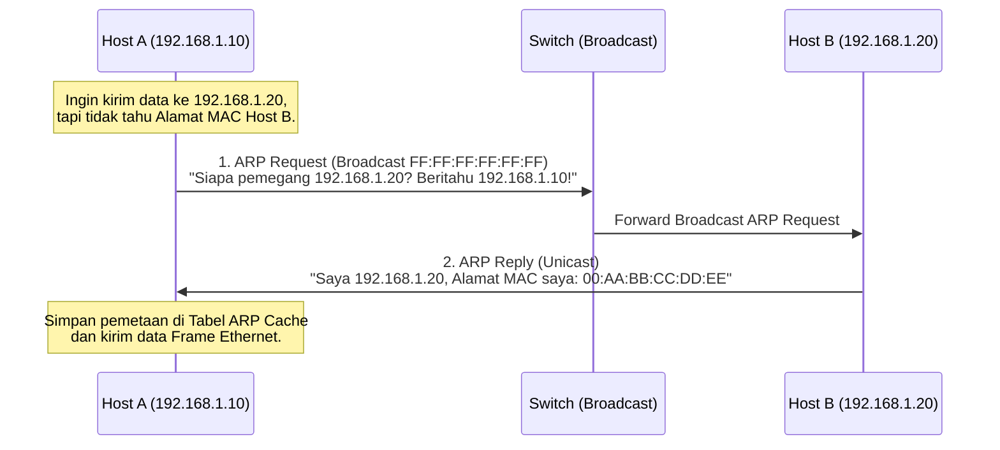

# 7. Resolusi Alamat: ARP IPv4 dan Neighbor Discovery (ND) IPv6

Navigasi: Modul Sebelumnya: [[06_Pengalamatan_IPv6_dan_Protokol_ICMP]] | [[Konsep_Jaringan_Komputer]] | Modul Berikutnya: [[08_Lapisan_Transpor_Protokol_TCP_dan_UDP]]

---

Perangkat pengirim di dalam jaringan lokal (LAN) mengetahui **Alamat IP Tujuan** (Layer 3), tetapi untuk membungkus paket menjadi Ethernet Frame (Layer 2), pengirim wajib mengetahui **Alamat MAC Tujuan** fisik dari host target.

---

## 7.1. Address Resolution Protocol (ARP) pada IPv4

**ARP** adalah protokol yang digunakan untuk memetakan alamat IPv4 (Layer 3) ke Alamat MAC fisik (Layer 2).



### ⚙️ Memeriksa Tabel ARP Cache pada Perintah CLI:
```bash
# Menampilkan daftar pemetaan IP -> MAC yang tersimpan di memori komputer
arp -a
```

---

## 7.2. Kerentanan Keamanan: ARP Spoofing / Poisoning

ARP tidak memiliki mekanisme otentikasi bawaan. Penyerang (*attacker*) dapat mengirimkan pesan **ARP Reply palsu** yang mengaku sebagai Router Default Gateway. Akibatnya, seluruh trafik data dari korban dialihkan melewati komputer penyerang terlebih dahulu (**Man-in-the-Middle Attack**).

---

## 7.3. IPv6 Neighbor Discovery (ND) Protocol

IPv6 tidak lagi menggunakan ARP broadcast. Sebagai gantinya, IPv6 menggunakan **Neighbor Discovery (ND)** berbasis pesan ICMPv6 multicast:

- **Neighbor Solicitation (NS)**: Pesan multicast yang dikirim host untuk menanyakan alamat MAC tetangga.
- **Neighbor Advertisement (NA)**: Pesan reply unicast dari tetangga yang mengembalikan alamat MAC fisiknya.
- **Router Solicitation (RS) & Router Advertisement (RA)**: Digunakan untuk alokasi IP otomatis tanpa server DHCP (**SLAAC - Stateless Address Autoconfiguration**).

---

Navigasi: Modul Sebelumnya: [[06_Pengalamatan_IPv6_dan_Protokol_ICMP]] | [[Konsep_Jaringan_Komputer]] | Modul Berikutnya: [[08_Lapisan_Transpor_Protokol_TCP_dan_UDP]]
