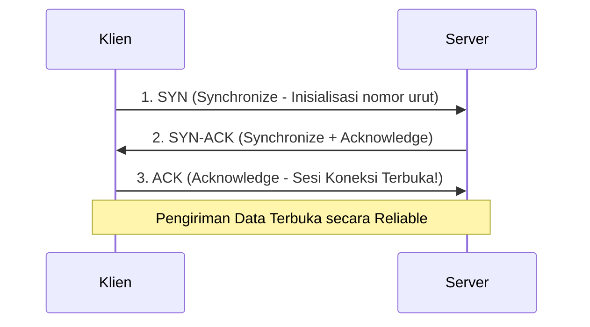

# 8. Lapisan Transpor: Perbandingan Protokol TCP dan UDP

Navigasi: Modul Sebelumnya: [[07_Resolusi_Alamat_ARP_dan_Neighbor_Discovery]] | [[Konsep_Jaringan_Komputer]] | Modul Berikutnya: [[09_Lapisan_Aplikasi_DNS_HTTP_DHCP_dan_FTP]]

---

Transport Layer (Layer 4) bertanggung jawab mengendalikan komunikasi **end-to-end** antar aplikasi yang berjalan di host berbeda menggunakan nomor port (*Port Numbers*).

---

## 8.1. Kategori Nomor Port (Port Numbers)

Nomor port digunakan untuk mengarahkan segmen data ke aplikasi tujuan yang tepat di dalam komputer:

- **Well-Known Ports (0 - 1023)**: Diresmikan untuk protokol standar (misal: HTTP `80`, HTTPS `443`, SSH `22`, DNS `53`).
- **Registered Ports (1024 - 49151)**: Didaftarkan oleh pengembang aplikasi pihak ketiga (misal: MySQL `3306`, Laravel/React Dev `8000/3000`).
- **Dynamic / Private Ports (49152 - 65535)**: Dialokasikan secara dinamis oleh OS sebagai port asal klien (*Ephemeral Ports*).

---

## 8.2. Perbandingan Protokol TCP vs UDP

| Karakteristik | TCP (Transmission Control Protocol) | UDP (User Datagram Protocol) |
| :--- | :--- | :--- |
| **Koneksi** | **Connection-Oriented** (Wajib 3-Way Handshake) | **Connectionless** (Kirim langsung tanpa handshake) |
| **Keandalan** | **Reliable** (Data dijamin sampai & sesuai urutan) | **Unreliable** (Tidak ada garansi pengiriman) |
| **Flow Control** | Terdapat mekanisme *Flow Control* & *Windowing*. | Tidak ada *flow control*. |
| **Overhead** | Header Besar (20 Bytes). Lebih lambat. | Header Kecil (8 Bytes). **Sangat Cepat**. |
| **Penggunaan** | Web (`HTTP/S`), Email (`SMTP`), File (`FTP`), `SSH`. | Streaming Video, Game Online, `DNS`, `DHCP`, `VoIP`. |

---

## 8.3. Jabat Tangan 3 Arah TCP (TCP 3-Way Handshake)

Sebelum data dikirim melalui TCP, sesi koneksi wajib dibangun menggunakan 3 langkah pertukaran sinyal (*Handshake*):

---

Navigasi: Modul Sebelumnya: [[07_Resolusi_Alamat_ARP_dan_Neighbor_Discovery]] | [[Konsep_Jaringan_Komputer]] | Modul Berikutnya: [[09_Lapisan_Aplikasi_DNS_HTTP_DHCP_dan_FTP]]
