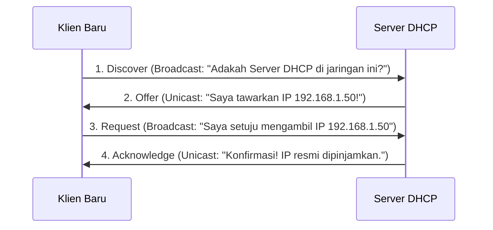

# 9. Lapisan Aplikasi: Protokol DNS, HTTP/HTTPS, DHCP, dan FTP

Navigasi: Modul Sebelumnya: [[08_Lapisan_Transpor_Protokol_TCP_dan_UDP]] | [[Konsep_Jaringan_Komputer]] | Modul Berikutnya: [[10_Konfigurasi_Perangkat_Keamanan_dan_Troubleshooting]]

---

Application Layer (Layer 7) menyediakan antarmuka bagi program aplikasi pengguna untuk bertukar data di atas jaringan.

---

## 9.1. Sistem Nama Domain (Domain Name System - DNS)

**DNS** adalah direktori terdistribusi yang menerjemahkan nama domain yang mudah diingat manusia (misal: `google.com`) menjadi alamat IP numerik yang dipahami oleh router (misal: `142.250.190.46`).

```mermaid
flowchart TD
    Client["Klien (Browser)"] -->|1. Kueri DNS: google.com| Recursive["DNS Recursive Resolver (ISP / 8.8.8.8)"]
    Recursive -->|2. Tanya Root Server| Root["Root Name Server (.)"]
    Recursive -->|3. Tanya TLD Server| TLD["TLD Name Server (.com)"]
    Recursive -->|4. Tanya Authoritative| Auth["Authoritative Name Server (google.com)"]
    Auth -->>|5. Mengembalikan IP: 142.250.190.46| Client
```

### Tipe Rekor DNS Populer:
- **A Record**: Memetakan Nama Domain ke alamat **IPv4**.
- **AAAA Record**: Memetakan Nama Domain ke alamat **IPv6**.
- **CNAME Record**: Memetakan Nama Alias ke Nama Domain resmi lain.
- **MX Record**: Mengarahkan trafik surat elektronik (Email) ke Mail Server.

---

## 9.2. Pengalokasian IP Otomatis dengan DHCP (Proses DORA)

**DHCP (Dynamic Host Configuration Protocol)** mengalokasikan alamat IP, subnet mask, default gateway, dan server DNS secara otomatis kepada klien baru.



---

## 9.3. Protokol Web: HTTP dan HTTPS

Keterkaitan langsung dengan pemrosesan web pada [[04_Pemrograman_Web/Konsep_Pemrograman_Web|Pemrograman Web]]:

- **HTTP (Port 80)**: Mengirimkan teks HTML, gambar, dan data form tanpa enkripsi (teks mentah).
- **HTTPS (Port 443)**: Mengenkripsi seluruh trafik komunikasi HTTP menggunakan sertifikat **TLS/SSL (Transport Layer Security)**.

---

Navigasi: Modul Sebelumnya: [[08_Lapisan_Transpor_Protokol_TCP_dan_UDP]] | [[Konsep_Jaringan_Komputer]] | Modul Berikutnya: [[10_Konfigurasi_Perangkat_Keamanan_dan_Troubleshooting]]
