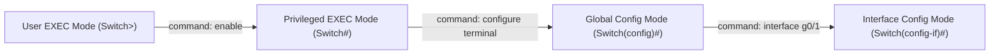

# 10. Konfigurasi Perangkat Cisco, Keamanan, dan Troubleshooting Jaringan

Navigasi: Modul Sebelumnya: [[09_Lapisan_Aplikasi_DNS_HTTP_DHCP_dan_FTP]] | [[Konsep_Jaringan_Komputer]]

---

## 10.1. Dasar Konfigurasi Perangkat Cisco IOS (Switch & Router)

Perangkat Cisco menggunakan sistem operasi **Cisco IOS (Internetwork Operating System)** dengan antarmuka baris perintah (CLI).



### 🛠️ Perintah Konfigurasi Dasar Cisco IOS:

```text
! Masuk ke Mode Konfigurasi Global
Switch> enable
Switch# configure terminal

! 1. Mengubah Nama Perangkat
Switch(config)# hostname Switch-Lantai1

! 2. Mengamankan Akses Privileged EXEC dengan Password Enkripsi
Switch-Lantai1(config)# enable secret RahasiaPassword123

! 3. Mengonfigurasi Alamat IP Management pada Interface VLAN 1
Switch-Lantai1(config)# interface vlan 1
Switch-Lantai1(config-if)# ip address 192.168.1.2 255.255.255.0
Switch-Lantai1(config-if)# no shutdown
Switch-Lantai1(config-if)# exit

! 4. Menyimpan Konfigurasi ke Memori NVRAM (RAM -> NVRAM)
Switch-Lantai1# copy running-config startup-config
```

---

## 10.2. Dasar Keamanan Jaringan Komputer

1. **Firewall**: Perangkat keras atau lunak yang menyaring (*filtering*) paket data masuk dan keluar berdasarkan aturan port/IP (*Access Control Lists - ACL*).
2. **Keamanan Wireless (Wi-Fi)**: Menggunakan enkripsi **WPA2-PSK** atau **WPA3-Enterprise** untuk memproteksi transmisi sinyal radio dari intersepsi data.
3. **Pencegahan Threat**: Melindungi jaringan dari ancaman Malware, Phishing, dan serangan lumpuhnya layanan **DoS / DDoS (Denial of Service)**.

---

## 10.3. Alat Perintah Diagnosis & Troubleshooting Jaringan

Saat terjadi kendala konektivitas di server atau komputer lokal, gunakan alat diagnostik CLI berikut:

```bash
# 1. Memeriksa konfigurasi IP, Subnet Mask, dan Default Gateway
ipconfig /all     # Windows
ifconfig / ip a   # Linux/macOS

# 2. Pengujian konektivitas dasar ICMP ke host tujuan
ping 8.8.8.8

# 3. Menganalisis rute hop router yang dilewati paket data
tracert google.com  # Windows
traceroute google.com # Linux

# 4. Melakukan diagnostik resolusi DNS
nslookup google.com

# 5. Menampilkan seluruh koneksi socket port jaringan aktif
netstat -ano      # Windows
ss -tulpn         # Linux
```

---

Navigasi: Modul Sebelumnya: [[09_Lapisan_Aplikasi_DNS_HTTP_DHCP_dan_FTP]] | [[Konsep_Jaringan_Komputer]]
