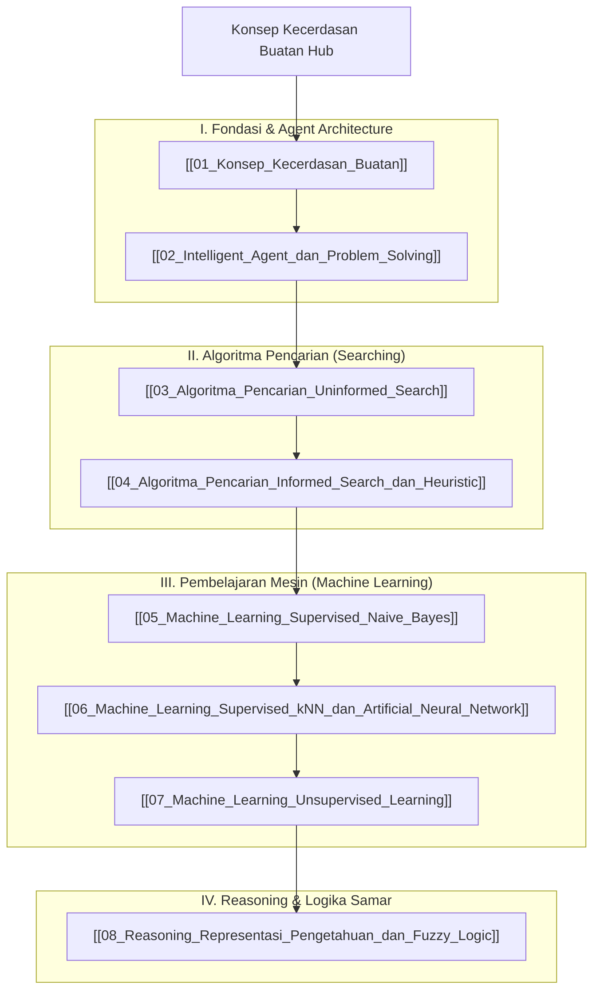

# Panduan Komprehensif Konsep Kecerdasan Buatan (Artificial Intelligence Hub)

Dokumen ini merupakan berkas utama (*Knowledge Hub*) yang memetakan seluruh modul pembelajaran **Kecerdasan Buatan (Artificial Intelligence / AI)**. Seluruh materi disusun secara sistematis dan dikorelasikan dengan [[../../Riset_Edge_AI_3T/edge-ai-untuk-3t|Riset Edge AI 3T]], [[../02_Struktur_Data_dan_Algoritma/Konsep_Struktur_Data_dan_Algoritma|Struktur Data & Algoritma]], [[../01_Konsep_Pemrograman/Konsep_Pemrograman|Konsep Pemrograman]], [[../05_Pengembangan_Aplikasi_Bergerak/Konsep_Pengembangan_Aplikasi_Bergerak|Pengembangan Aplikasi Bergerak]], dan [[../04_Pemrograman_Web/Konsep_Pemrograman_Web|Pemrograman Web]].

> [!NOTE]
> Seluruh modul pada hub ini saling terhubung secara dua arah (*bidirectional links*) menggunakan Obsidian Wiki-Links `[[...]]`. Seluruh berkas dari `vault-teman` **dikecualikan 100%**.

---

## 🗺️ Peta Pembelajaran Kecerdasan Buatan (Mindmap)

---

## 📚 Daftar Lengkap Modul Pembelajaran Kecerdasan Buatan

### Part I: Fondasi & Agent Architecture
1. **[[01_Konsep_Kecerdasan_Buatan]]**: Definisi AI (4 Kuadran), Sejarah AI, Uji Turing (Turing Test), dan bidang aplikasi AI modern.
2. **[[02_Intelligent_Agent_dan_Problem_Solving]]**: Konsep Dasar Agen, Sifat Lingkungan Agen (Observable, Deterministic, Episodic, Dynamic, Discrete), Merancang Agen **PEAS**, Karakteristik & 5 Tipe Arsitektur Agen (Simple Reflex, Model-based, Goal-based, Utility-based, Learning Agent), serta Formulasi Masalah, Ruang Masalah, dan Ruang Keadaan (State Space).

### Part II: Algoritma Pencarian (Searching)
3. **[[03_Algoritma_Pencarian_Uninformed_Search]]**: Algoritma pencarian buta: **Breadth-First Search (BFS)**, **Depth-First Search (DFS)**, **Depth-Limited Search (DLS)**, **Uniform Cost Search (UCS)**, **Iterative-Deepening Search (IDS)**, dan **Bi-Directional Search (BDS)** beserta perbandingan komprehensif kompleksitas waktu & memori.
4. **[[04_Algoritma_Pencarian_Informed_Search_dan_Heuristic]]**: Fungsi Heuristik $h(n)$, Greedy Best-First Search, **A* Search** (Admissible & Consistent Heuristics), Local Search (Hill-Climbing, Simulated Annealing, Genetic Algorithm), serta Adversarial Search (Minimax & Alpha-Beta Pruning).

### Part III: Pembelajaran Mesin (Machine Learning)
5. **[[05_Machine_Learning_Supervised_Naive_Bayes]]**: Konsep Supervised Learning, Teorema Probabilitas Bayes (Prior, Likelihood, Posterior, Evidence), Asumsi Independensi Naive Bayes, Gaussian & Multinomial Naive Bayes, serta kode Python Scikit-Learn.
6. **[[06_Machine_Learning_Supervised_kNN_dan_Artificial_Neural_Network]]**: Algoritma **k-Nearest Neighbors (k-NN)** (Jarak Euclidean/Manhattan, voting $k$), serta **Jaringan Saraf Tiruan (ANN)** (Perceptron, Multilayer Perceptron / MLP, Fungsi Aktivasi Sigmoid/ReLU/Softmax, Forward & Backpropagation, Gradient Descent).
7. **[[07_Machine_Learning_Unsupervised_Learning]]**: Konsep Unsupervised Learning, **K-Means Clustering** (Centroid, Inertia, Metode Elbow), **Hierarchical Clustering** (Dendrogram), dan Reduksi Dimensi **Principal Component Analysis (PCA)**.

### Part IV: Reasoning & Logika Samar
8. **[[08_Reasoning_Representasi_Pengetahuan_dan_Fuzzy_Logic]]**: Representasi Pengetahuan (Propositional & First-Order Logic), Mesin Inferensi (Forward Chaining & Backward Chaining), serta **Logika Samar (Fuzzy Logic)** dan Sistem Inferensi Fuzzy (FIS Metode Tsukamoto, Sugeno, dan Mamdani).

---

## 🔗 Hubungan Antar Berkas Catatan Utama

- 🔗 **[[../../Riset_Edge_AI_3T/edge-ai-untuk-3t|Riset Edge AI 3T]]**: Penerapan kompresi model Machine Learning & Deep Learning (ANN Quantization float32 $\rightarrow$ int8) untuk pemrosesan citra medis pada komputer berkapasitas terbatas di fasilitas kesehatan 3T.
- 🔗 **[[../02_Struktur_Data_dan_Algoritma/Konsep_Struktur_Data_dan_Algoritma|Struktur Data & Algoritma]]**: Landasan struktur data Tree & Graph yang dieksplorasi oleh algoritma pencarian BFS, DFS, UCS, dan A* Search.
- 🔗 **[[../05_Pengembangan_Aplikasi_Bergerak/Konsep_Pengembangan_Aplikasi_Bergerak|Pengembangan Aplikasi Bergerak]]**: Integrasi model AI (TFLite / ONNX) ke dalam aplikasi mobile Android/Flutter.

---
*Hub catatan ini dapat dipelajari secara bertahap melalui navigasi tautan `[[...]]` pada setiap modul.*
